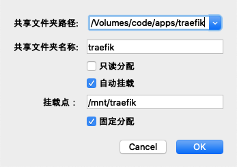

# virtualbox共享文件夹

## 安装

* virtualbox菜单->设备->安装增强功能
* 挂载cdrom

```shell
mkdir /mnt/cdrom
mount /dev/cdrom /mnt/cdrom
```

* 执行命令

```shell
dnf install gcc*
dnf install kernel-headers
dnf install kernel-devel
```

* 安装VBoxLinuxAdditions.run

```shell
cd /mnt/cdrom
./VBoxLinuxAdditions.run
```

* 重启系统
* 设置vbox共享文件夹



## 挂载

```shell
mkdir /mnt/traefik
mount -t vboxsf traefik /mnt/traefik
```

## 设置开机自动挂载

```shell
vi /etc/rc.local
mount -t vboxsf traefik /mnt/traefik
chmod +x rc.local
```
