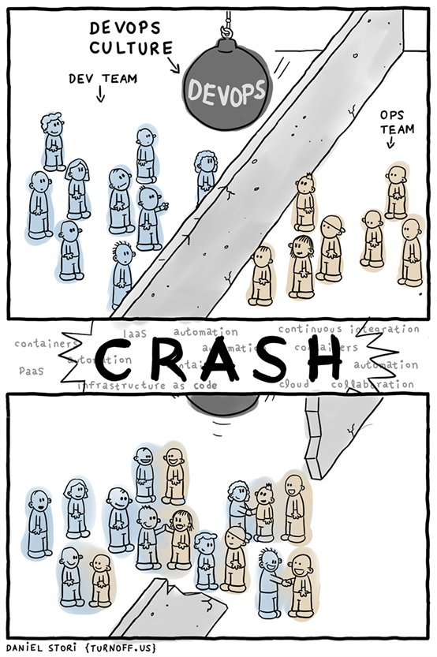
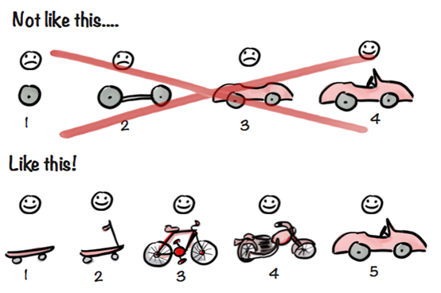

# DevOps、CI、CD都是什么鬼？

## ==第一部分==


### DevOps

DevOps是`Development`和`Operations`的组合，是一种方法论，是一组过程、方法与系统的统称，用于促进应用开发、应用运维和质量保障（QA）部门之间的沟通、协作与整合。以期打破传统开发和运营之间的壁垒和鸿沟。



DevOps是一种重视“软件开发人员（Dev）”和“IT运维技术人员（Ops）”之间沟通合作的文化、运动或惯例。通过自动化“软件交付”和“架构变更”的流程，来使得构建、测试、发布软件能够更加地快捷、频繁和可靠。具体来说，就是在软件交付和部署过程中提高沟通与协作的效率，旨在更快、更可靠的的发布更高质量的产品。

也就是说DevOps是一组过程和方法的统称，并不指代某一特定的软件工具或软件工具组合。各种工具软件或软件组合可以实现DevOps的概念方法。其本质是一整套的方法论，而不是指某种或某些工具集合，与软件开发中设计到的`OOP`、`AOP`、`IOC`（或DI）等类似，是一种理论或过程或方法的抽象或代称。

### CI

CI的英文名称是`Continuous Integration`，中文翻译为：持续集成。


CI中，开发人员将会频繁地向主干提交代码，这些新提交的代码在最终合并到主干前，需要经过编译和自动化测试流进行验证。

持续集成（CI）是在源代码变更后自动检测、拉取、构建和（在大多数情况下）进行单元测试的过程。持续集成的目标是快速确保开发人员新提交的变更是好的，并且适合在代码库中进一步使用。CI的流程执行和理论实践让我们可以确定新代码和原有代码能否正确地集成在一起。

### CD

CD可对应多个英文名称，持续交付`Continuous Delivery`和持续部署`Continuous Deployment` ，一下分别介绍。

查了一些资料，关于持续交互和持续部署的概念比较混乱，以下的概念总结按大部分的资料总结而来。

#### 持续交付

完成 CI 中构建及单元测试和集成测试的自动化流程后，持续交付可自动将已验证的代码发布到存储库。为了实现高效的持续交付流程，务必要确保 CI 已内置于开发管道。持续交付的目标是拥有一个可随时部署到生产环境的代码库。


在持续交付中，每个阶段（从代码更改的合并，到生产就绪型构建版本的交付）都涉及测试自动化和代码发布自动化。在流程结束时，运维团队可以快速、轻松地将应用部署到生产环境中或发布给最终使用的用户。

#### 持续部署

对于一个成熟的CI/CD管道（Pipeline）来说，最后的阶段是持续部署。作为持续交付——自动将生产就绪型构建版本发布到代码存储库——的延伸，持续部署可以自动将应用发布到生产环境。


持续部署意味着所有的变更都会被自动部署到生产环境中。持续交付意味着所有的变更都可以被部署到生产环境中，但是出于业务考虑，可以选择不部署。如果要实施持续部署，必须先实施持续交付。

持续交付并不是指软件每一个改动都要尽快部署到产品环境中，它指的是任何的代码修改都可以在任何时候实施部署。

持续交付表示的是一种能力，而持续部署表示的则一种方式。持续部署是持续交付的最高阶段

### Agile Development

另外一个概念，也就是所谓的敏捷开发，似乎还没有所谓的简称，而且这个称呼似乎在国内被滥用了。敏捷开发着重于一种开发的思路，拥抱变化和快速迭代。如何实现敏捷开发，目前似乎尚没有完善的工具链，更多的是一种概念性，调侃的说法“既想马尔跑得快，又想马儿不吃草”的另外一种说法。



上图揭示了敏捷开发的一些内涵和目标，似乎有点儿一本真经的胡说八道的意思。

### CI、CD、DevOps关系

概念性的内容，每个人的理解都有所不同。就好比`CGI` 这个词，即可以理解成CGI这种协议，也可以理解成实现了CGI协议的软件工具，都没有问题，咬文嚼字过犹不及。留下一图：


---

参考资料：

1、https://www.sohu.com/a/219547745_151779

2、https://blog.csdn.net/sinat_35930259/article/details/79429743

3、https://www.synopsys.com/blogs/software-security/agile-cicd-devops-glossary/

4、https://mp.weixin.qq.com/s/wCFM6Ln-iG_G-Um8cad0aA

5、https://www.redhat.com/zh/topics/devops/what-is-ci-cd

6、https://linux.cn/article-9926-1.html

7、https://www.mabl.com/blog/what-is-cicd

8、https://blog.csdn.net/CrankZ/article/details/81545439

转载自：《[DevOps漫谈之一：DevOps、CI、CD都是什么鬼？](https://blog.jjonline.cn/linux/238.html)》

---

## ==第二部分==

### CI/CD碎碎恋

什么是CI/CD上面文章已经咬文嚼字的介绍过，会意就好，这里再补充两张图。


上图分3个区块，即CI/CD的宏观流程，为了形象呈现这里的两个CD拆分开了，查找了不少资料发现在具体的DevOps实践中将两个CD合并成了1个步骤（节点或要点）来理解更为便捷。整个流程中一直有一个关键词`Automation`，也就是自动。约莫的拿这张图分析下CI/CD

#### 1、左侧为CI（Continuous Integration）的内容

源码和版本控制(`SCM`)下开发者提交代码，并自动触发服务端的源码构建，CI服务器触发Build过程和运行测试（不局限与单元测试，各种代码质量保证的测试均包含）。似乎有点儿绕来绕去的还有专业名词，云里雾里的感jio，简单的描述即开发者提交代码到git或svn上，自动触发源码的构建（`Build`）、集成（`Integration`）及各种测试（`Test`）。这里的`SCM`即`Software Configuration Management`的简写，一直以来我以为SCM指的是`Source Code/Control Management`，其实也差不多啦，就是源码、版本控制工具，例如：`svn`、`git`都是SCM的一种（蔬菜是SCM，胡萝卜是git、白萝卜是svn来理解啦，是那么个意思就好）；这里的`Build`和`Integration`不同的编程语言里可以理解成各自不同的动作，传统的C/C++项目乃至java项目均有Build过程，大致理解是那个意思即可，就是从源码构造成二进制程序或源码与二进制文件之间的中间形式文件的过程，PHP项目是不需要Build过程的，不过可以借用Build这种概念做一些准备性的“构建”动作。

#### 2、中间CD持续交付（Continuous Delivery）的内容

CI之后`Release`（释出、推出、生成）可发布的软件或包，交付给客户或将可执行程序`deploy`到各种环境中，这里的deploy很让人迷惑，若要咬文嚼字的话理解成“部署”是不够精确的，若真要较留一段英文解释吧，这个靠悟性了。

```
To deploy (from the French deployer) is "to spread out or arrange strategically." Long used in the context of military strategy, it has now gained currency in information technology. In its IT context, deployment encompasses all the processes involved in getting new software or hardware up and running properly in its environment, including installation, configuration, running, testing, and making necessary changes. The word implementation is sometimes used to mean the same thing.
-----
谷歌的半吊子翻译如下：部署（来自法语中的deployer）是“分散或策略性地安排”。 它长期用于军事战略，现在已经在信息技术方面获得了成功。 在IT领域中，部署包括在其环境中正常启动和运行新软件或硬件所涉及的所有过程，包括安装，配置，运行，测试和进行必要的更改。 实施这个词有时用来表示同样的事情。
```

#### 3、右边CD持续部署（Continuous Deployment）的内容

这个就不难理解了，自动化的部署到预发、生产环境，或发布给公共开放的用户们使用。因为持续部署的概念中突出了部署到正式环境中，很多时候对持续交付的理解就成了持续交付给内部的非开发团队，譬如质量保障、QA等做内部测试用。所以很多时候说CI/CD的时候，里面的CD是不会做详细的进一步区分的，就是持续交付和持续部署两个词的含义。

另外一张图，里面的CD就没有再进一步区分了，看看就好。


---

参考资料：

1、https://dzone.com/articles/learn-how-to-setup-a-cicd-pipeline-from-scratch

2、https://blog.docker.com/2018/02/ci-cd-with-docker-ee/

3、https://ithelp.ithome.com.tw/articles/10204538

4、https://gblogs.cisco.com/ch-tech/how-to-build-devops-cloud-agnostic-cicd-pipeline-prospect/

5、https://gblogs.cisco.com/ch-tech/cloud-agnostic-cicd-pipeline-for-devops-building-blocks/

6、https://gblogs.cisco.com/ch-tech/how-to-devops-cloud-agnostic-cicd-pipeline-process-steps/

7、http://www.zhujinhe.com/archives/31

转载自：《[DevOps漫谈之二：PHP项目中应用CI/CD的思考](https://blog.jjonline.cn/linux/239.html)》