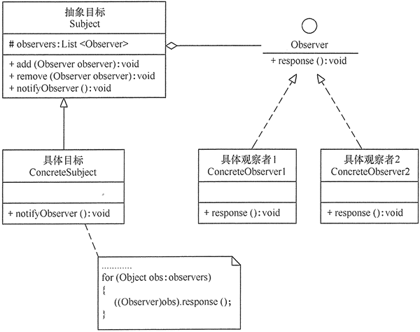
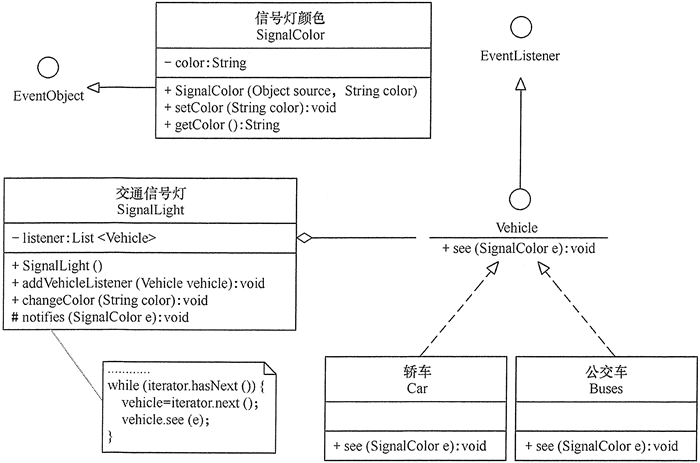

## 行为型模式应用实验

行为型模式（Behavioral Pattern）是对在不同的对象之间划分责任和算法的抽象化，它是 GoF [设计模式](https://gitlab.com/superxzl/way-api/wikis/设计模式/设计模式)中最为庞大的一类模式，包含以下 11 种：模板方法（Template Method）模式、策略（Strategy）模式、命令（Command）模式、职责链（Chain of Responsibility）模式、状态（State）模式、观察者（Observer）模式、中介者（Mediator）模式、迭代器（Iterator）模式、访问者（Visitor）模式、备忘录（Memento)模式、解释器（Interpreter）模式。

#### 实验目的

本实验的主要目的如下。

* 了解 11 种“行为型模式”的定义、特点和工作原理。
* 理解 11 种“行为型模式”的结构、实现和应用场景。
* 学会应用 11 种“行为型模式”进行软件开发。
  
  #### 实验原理

##### 1. 行为型模式的工作原理

行为型模式用于描述程序在运行时复杂的流程控制，即描述多个类或对象之间怎样相互协作共同完成单个对象无法单独完成的任务，它涉及算法与对象间职责的分配。

按照其显示方式的不同，行为型模式可分为类行为模式和对象行为模式，其中类行为型模式使用继承关系在几个类之间分配行为，主要通过多态等方式来分配父类与子类的职责；对象行为型模式则使用对象的组合或聚合关联关系来分配行为，主要是通过对象关联等方式来分配两个或多个类的职责。

由于组合关系或聚合关系比继承关系耦合度低，满足“合成复用原则”所以对象行为模式比类行为模式具有更大的灵活性。

如果按目的来分，行为型模式共 11 种，每种模式的工作原理在前面的教程中都有详细的介绍，每种模式的实验大概要花 2 个学时，大家可以根据实验计划来选做若干个实验。下面以观察者模式为例，介绍其实验过程。

##### 2. 观察者模式的工作原理

观察者模式是一种对象行为型模式，用于解决多个对象间存在的一对多的依赖关系。在现实世界中，许多对象并不是独立存在的，其中一个对象的状态发生改变可能会导致一个或者多个其他对象也发生改变，如物价与消费者、股价与股民、天气预报与农民、警察与小偷、事件源与事件处理 者等。这种模式有时又称作发布-订阅模式、模型-视图模式，其结构图如图 1 所示。

  
图1 观察者模式的结构图

观察者模式包含如下角色。

1. 抽象主题/目标（Subject）角色：提供了一个用于保存观察者对象的聚集类和一个管理观察者对象的接口，它包含了增加、删除和通知所有观察者的抽象方法。
2. 具体主题/目标（Concrete Subject）角色：实现抽象目标中的方法，当具体目标的内部状态发生改变时，通知所有注册过的观察者对象。
3. 抽象观察者（Observer）角色：定义一个更新接口，它包含了一个更新自己的抽象方法。
4. 具体观察者（Concrete Observer）角色：实现抽象观察者定义的更新接口，以便在得到目标更改通知时更新自身的状态。
   
   #### 实验内容

(1) 用观察者模式设计一个交通信号灯的事件处理程序。

分析：“交通信号灯”是事件源和目标，各种“车”是事件监听器和具体观察者，“信号灯颜色” 是事件类。

(2) 按照以上要求设计类图和编写 Java 源程序。

#### 实验要求

所设计的实验程序要满足以下两点。

1. 体现“观察者模式”的工作原理。
2. 符合面向对象中的“开闭原则”。
   
   #### 实验步骤

(1) 用 UML 设计“交通信号灯事件处理程序”的结构图。

“交通信号灯事件处理程序”的结构图如图 2 所示。

  
图2 交通信号灯事件处理程序的结构图

(2) 根据结构图写出“交通信号灯事件处理程序”的源代码。交通信号灯事件处理程序的源代码如下。

```java
package observer;
import java.util.*;
public class SignalLightEvent
{
    public static void main(String[] args)
    {
        SignalLight light=new SignalLight();//交通信号灯（事件源）    
        light.addVehicleListener(new Car());  //注册监听器（轿车）
        light.addVehicleListener(new Buses());//注册监听器（公交车）
        light.changeColor("红色");
        System.out.println("------------");   
        light.changeColor("绿色");
    }
}
//信号灯颜色
class SignalColor extends EventObject
{   
    private String color; //"红色"和"绿色"
    public SignalColor(Object source,String color)
    {
        super(source);
        this.color=color;
    }
    public void setColor(String color)
    {
          this.color=color;
    }
    public String getColor()
    {
        return this.color;
    }
}
//目标类：事件源，交通信号灯
class SignalLight
{    
    private List<Vehicle> listener; //监听器容器
    public SignalLight()
    {
        listener=new ArrayList<Vehicle>();        
    }
    //给事件源绑定监听器 
    public void addVehicleListener(Vehicle vehicle)
    { 
        listener.add(vehicle); 
    }
    //事件触发器：信号灯改变颜色。
    public void changeColor(String color)
    {
        System.out.println(color+"信号灯亮...");
        SignalColor event=new SignalColor(this, color);   
        notifies(event);    //通知注册在该事件源上的所有监听器           
    }   
    //当事件发生时,通知绑定在该事件源上的所有监听器做出反应（调用事件处理方法）
    protected void notifies(SignalColor e)
    {
        Vehicle vehicle=null; 
        Iterator<Vehicle> iterator=listener.iterator(); 
        while(iterator.hasNext())
        {
            vehicle=iterator.next(); 
            vehicle.see(e); 
        } 
    }
}
//抽象观察者类：车
interface  Vehicle extends EventListener
{
    //事件处理方法，看见
    public void see(SignalColor e);
}
//具体观察者类：轿车
class Car implements Vehicle
{
    public void see(SignalColor e)
    {        
        if("红色".equals(e.getColor()))
        {
            System.out.println("红灯亮，轿车停！");           
        }
        else
        {
            System.out.println("绿灯亮，轿车行！");   
        }          
    }
}
//具体观察者类： 公交车
class Buses implements Vehicle
{
    public void see(SignalColor e)
    {        
        if("红色".equals(e.getColor()))
        {
            System.out.println("红灯亮，公交车停！");           
        }
        else
        {
            System.out.println("绿灯亮，公交车行！");   
        }          
    }
}
```

(3)上机测试程序，写出运行结果。

交通信号灯事件处理程序的运行结果如下：

```
红色信号灯亮...
红灯亮，轿车停！
红灯亮，公交车停！
------------
绿色信号灯亮...
绿灯亮，轿车行！
绿灯亮，公交车行！
```

(4)按同样的步骤设计其他“观察者模式”的程序实例。

(5)写出实验心得。