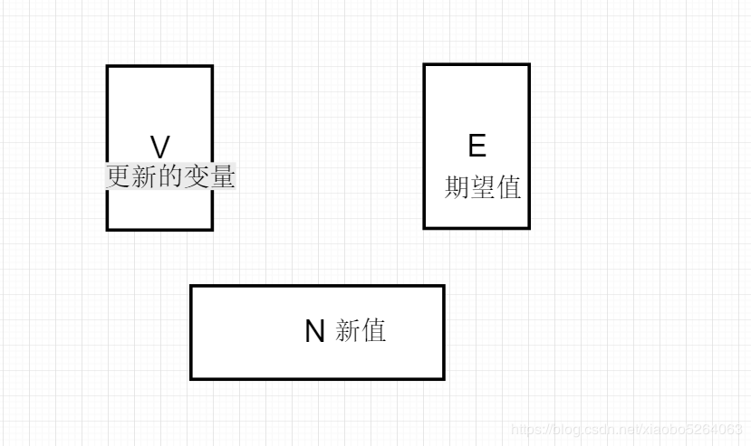

## [java常用锁基础](https://blog.csdn.net/xiaobo5264063/article/details/90272499)

- **重入锁**

1. 什么叫重入锁: 在方法嵌套了锁，也叫递归锁
   比如：A方法加了synchronize，B方法也加了synchronized，A方法调用了B方法，他们的锁是可以传递的，B直接用A传递来的锁。不会产生死锁------**非重入锁**: 如果A和B锁不一样，且互斥，就会产生死锁。

2. synchronized(重量级锁)和lock(轻量级锁)，他们的锁是可以传递的，都属于重入锁

   synchronized重入锁

   ```
   
   /**
    * 重入锁
    * Create by wangxb
    * 2019-05-16 22:39
    */
   
   class Thread08 implements Runnable{
   
       @Override
       public void run() {
           index();
       }
   
       public synchronized  void get(){
           System.out.println(1);
       }
       public synchronized void index(){
           System.out.println(2);
           get();
       }
   }
   public class Test {
   
       public static void main(String[] args) {
           
       }
   }
   
   
   ```

   Lock重入锁

   ```
   /**
    * 重入锁
    * Create by wangxb
    * 2019-05-16 22:39
    */
   
   class Thread09 implements Runnable{
   
       Lock lock = new ReentrantLock();
       @Override
       public void run() {
           index();
       }
       public void index(){
           lock.lock();
           System.out.println(2);
           get();
           lock.unlock();
       }
       public void get(){
           lock.lock(); // 使用index()方法传递过来的锁
           System.out.println(1);
           lock.unlock();
   
       }
   
   }
   public class Test1 {
   
       public static void main(String[] args) {
           Thread08 thread08 = new Thread08();
           Thread thread = new Thread(thread08);
           thread.start();
       }
   }
   ```

    

- **读写锁  -** ReentrantReadWriteLock

1. 什么是读写锁：
   两个线程同时读一个资源没有任何问题，所以应该允许多个线程能在同时读取共享资源。但是如果有一个线程想去写这些共享资源，就不应该再有其它线程对该资源进行读或写
   就是说一个线程在读的时候，写的线程是不可以操作的，一个线程在写的时候，读的线程也是不可以操作的

2. static ReentrantReadWriteLock rwl = new ReentrantReadWriteLock();

   static Lock r = rwl.readLock();

   static Lock w = rwl.writeLock(); 如下图: 

   ```
   public class Cache {
   	static Map<String, Object> map = new HashMap<String, Object>();
   	static ReentrantReadWriteLock rwl = new ReentrantReadWriteLock();
   	static Lock r = rwl.readLock();
   	static Lock w = rwl.writeLock();
   
   	// 获取一个key对应的value
   	public static final Object get(String key) {
   		r.lock();
   		try {
   			System.out.println("正在做读的操作,key:" + key + " 开始");
   			Thread.sleep(100);
   			Object object = map.get(key);
   			System.out.println("正在做读的操作,key:" + key + " 结束");
   			System.out.println();
   			return object;
   		} catch (InterruptedException e) {
   
   		} finally {
   			r.unlock();
   		}
   		return key;
   	}
   
   	// 设置key对应的value，并返回旧有的value
   	public static final Object put(String key, Object value) {
   		w.lock();
   		try {
   
   			System.out.println("正在做写的操作,key:" + key + ",value:" + value + "开始.");
   			Thread.sleep(100);
   			Object object = map.put(key, value);
   			System.out.println("正在做写的操作,key:" + key + ",value:" + value + "结束.");
   			System.out.println();
   			return object;
   		} catch (InterruptedException e) {
   
   		} finally {
   			w.unlock();
   		}
   		return value;
   	}
   
   	// 清空所有的内容
   	public static final void clear() {
   		w.lock();
   		try {
   			map.clear();
   		} finally {
   			w.unlock();
   		}
   	}
   
   	public static void main(String[] args) {
   		new Thread(new Runnable() {
   
   			@Override
   			public void run() {
   				for (int i = 0; i < 10; i++) {
   					Cache.put(i + "", i + "");
   				}
   
   			}
   		}).start();
   		new Thread(new Runnable() {
   
   			@Override
   			public void run() {
   				for (int i = 0; i < 10; i++) {
   					Cache.get(i + "");
   				}
   
   			}
   		}).start();
   	}
   }
   ```

    

- ### **乐观锁和悲观锁**

- 乐观锁

1. 本质没有锁，效率高，无阻赛，无等待
2. 经常用于数据数库的update和delete操作,  在设计表的时候加个version字段，用于更新、删除时的判断条件
3. select number, version from table;  // 先拿到数据和版本号
   update table set number = 123, version = version+1 where id = #{id} and version = #{version}; // 更新时加上判断
   上述问题 ：若果有2个线程都拿到了同样的版本号，来做update时，就看谁走的看谁先执行。先执行的同时修改version。

- 悲观锁 

1. 总是假设最坏的情况，每次去拿数据的时候都认为别人会修改，所以每次在拿数据的时候都会上锁，这样别人想拿这个数据就会阻塞直到它拿到锁。传统的关系型数据库里边就用到了很多这种锁机制，比如行锁，表锁等，读锁，写锁、synchronized关键字等，每次只让一个链接访问。

2. for update

   的使用，比如，当我们在查询某些记录的过程中，不希望其他用户对查询的记录进行更新操作，则可以发出这样的语句。selec * from table for update 

   如果当前select发现自己的结果集中有一条或者多条数据正在被修改（如有其他的语句提前for update了等），那么再执行此语句就会一直等待

   ```
   ######begin#####
   select * from order where id=123 and status=0;
   update order set status=1 where id=123;
   update money set number = number+100 where orderId = 123;
   ######commit#####
   
   修改为
   
   ######begin#####
   select * from order where id=123 and status=0 for update;
   update order set status=1 where id=123;
   update money set number = number+100 where orderId = 123;
   ######commit#####
   ```

- **AtumicInteger**

1. 是一个乐观锁，提供原子性的访问和更新操作。其原子性的操作是基于CAS实现的
   典型的应用场景是计数。比如我们要统计并发插入10万条数据的耗时，我们需要对插入的数据计数，普通的int变量在多线程环境下的++操作，是线程不安全的，前一个操作可能会被后一个操作所覆盖，所以统计的技术往往小于准确值。这时候就可以使用AtomaticInteger。

2. ```
   /**
    * AtomicInteger使用
    * Create by wangxb
    * 2019-05-17 7:41
    */
   class Thread01 implements Runnable{
       public static  AtomicInteger count = new AtomicInteger();
       @Override
       public void run() {
           while (true){
               System.out.println(Thread.currentThread().getName()+"----"+set());
   
           }
       }
       public int set(){
           try {
               Thread.sleep(500);
           } catch (Exception e) {
               e.printStackTrace();
           }
           // 每次加1   == count++
           return count.incrementAndGet();
       }
   }
   public class Test {
   
   
       public static void main(String[] args) {
           Thread01 thread01 = new Thread01();
           Thread th1 = new Thread(thread01);
           Thread th2 = new Thread(thread01);
           th1.start();
           th2.start();
       }
   }
   ```

    

- **CAS无锁机制**

1. Compare and Swap，即比较再交换。也是乐观锁

2. CAS算法的原理:  

   

   它包含三个参数CAS(V,E,N):  V表示要更新的变量，E表示预期值，N表示新值。
   1、如果E=V, 更新的变量=预期值，说明没被修改过，将V的值设为N

   2、如果E!=V, 更新的变量!=预期值，说明修改过，当前就不做修改操作，CAS会返回当前V的真实值，重新在比较。

3. 因为其本身无锁，所以具备以下优点 
    由于其非阻塞性，不会出现死锁。
    性能高，在高并发的情况下，它比有锁的程序拥有更好的性能

4. 缺点： 
    如果在这段期间曾经被改成V，然后又改回E，那CAS操作就会误认为它从来没有被修改过。针对这种情况，java并发包中提供了一个带有标记的原子引用类AtomicStampedReference，它可以通过控制变量值的版本来保证CAS的正确性。

5. CAS操作是抱着乐观的态度进行的，它总是认为自己可以成功完成操作。当多个线程同时使用CAS操作一个变量时，只有一个会胜出，并成功更新，其余均会失败。失败的线程不会被挂起，仅是被告知失败，并且允许再次尝试，当然也允许失败的线程放弃操作。基于这样的原理，CAS操作即使没有锁，也可以发现其他线程对当前线程的干扰，并进行恰当的处理。

- **自旋锁**

1. 指当一个线程在获取锁的时候，如果锁已经被其它线程获取，那么该线程将循环等待，然后不断的判断锁是否能够被成功获取，直到获取到锁才会退出循环。

2.  

   ```
   	private AtomicReference<Thread> sign =new AtomicReference<>();
   	public void lock() {
   		Thread current = Thread.currentThread();
   		while (!sign.compareAndSet(null, current)) {
             }
   	}
   	public void unlock() {
   		Thread current = Thread.currentThread();
   		sign.compareAndSet(current, null);
   	}
   
   public class Test implements Runnable {
   	static int sum;
   	private SpinLock lock;
   
   	public Test(SpinLock lock) {
   		this.lock = lock;
   	}
   
   	/**
   	 * @param args
   	 * @throws InterruptedException
   	 */
   	public static void main(String[] args) throws InterruptedException {
   		SpinLock lock = new SpinLock();
   		for (int i = 0; i < 100; i++) {
   			Test test = new Test(lock);
   			Thread t = new Thread(test);
   			t.start();
   		}
   
   		Thread.currentThread().sleep(1000);
   		System.out.println(sum);
   	}
   
   	@Override
   	public void run() {
   		this.lock.lock();
   		this.lock.lock();
   		sum++;
   		this.lock.unlock();
   		this.lock.unlock();
   	}
   
   }
   ```

   当一个线程 调用这个不可重入的自旋锁去加锁的时候没问题，当再次调用lock()的时候，因为自旋锁的持有引用已经不为空了，该线程对象会误认为是别人的线程持有了自旋锁
    使用了CAS原子操作，lock函数将owner设置为当前线程，并且预测原来的值为空。unlock函数将owner设置为null，并且预测值为当前线程。
   
    当有第二个线程调用lock操作时由于owner值不为空，导致循环一直被执行，直至第一个线程调用unlock函数将owner设置为null，第二个线程才能进入临界区。
   
    由于自旋锁只是将当前线程不停地执行循环体，不进行线程状态的改变，所以响应速度更快。但当线程数不停增加时，性能下降明显，因为每个线程都需要执行，占用CPU时间。如果线程竞争不激烈，并且保持锁的时间段。适合使用自旋锁。

3. 自旋锁缺点 
   如果某个线程持有锁的时间过长，就会导致其它等待获取锁的线程进入循环等待，消耗CPU。使用不当会造成CPU使用率极高。
   上面Java实现的自旋锁不是公平的，即无法满足等待时间最长的线程优先获取锁。不公平的锁就会存在“线程饥饿”问题。

4. 自旋锁优点 
    自旋锁不会使线程状态发生切换，一直处于用户态，即线程一直都是active的；不会使线程进入阻塞状态，减少了不必要的上下文切换，执行速度快
   非自旋锁在获取不到锁的时候会进入阻塞状态，从而进入内核态，当获取到锁的时候需要从内核态恢复，需要线程上下文切换。 线程被阻塞后便进入内核（Linux）调度状态，这个会导致系统在用户态与内核态之间来回切换，严重影响锁的性能）
