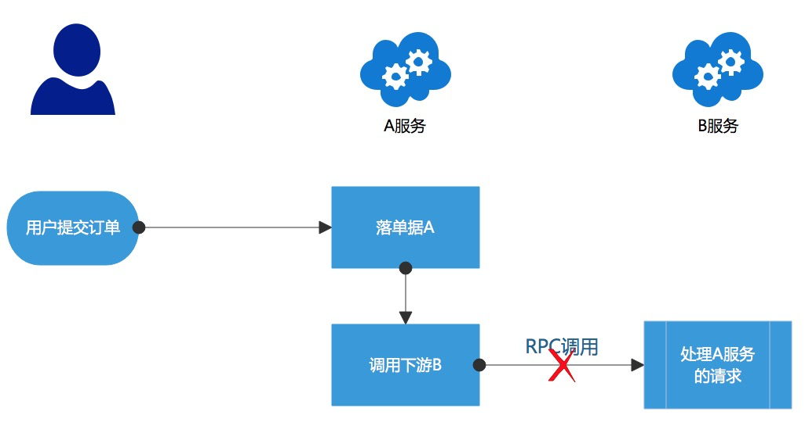
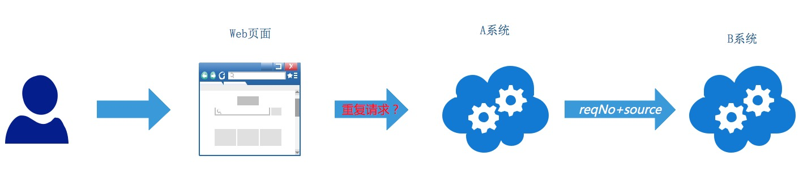
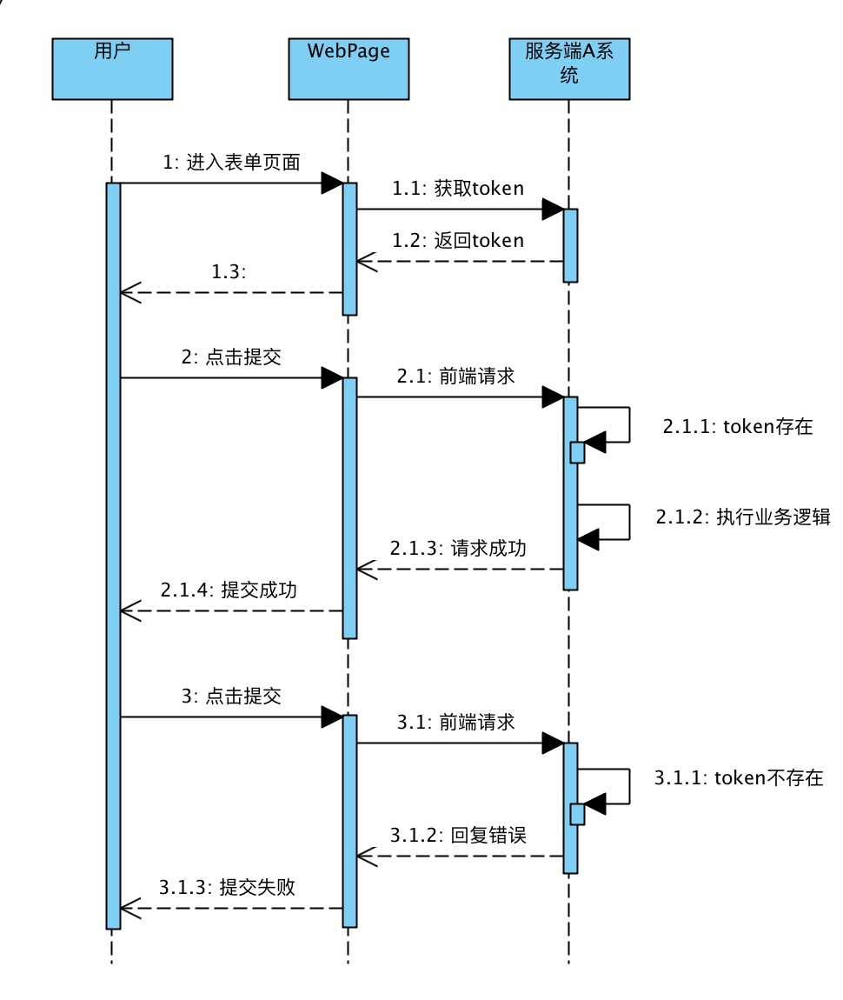
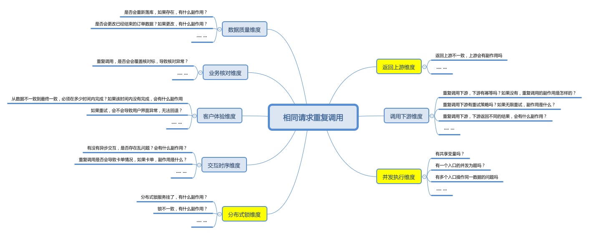
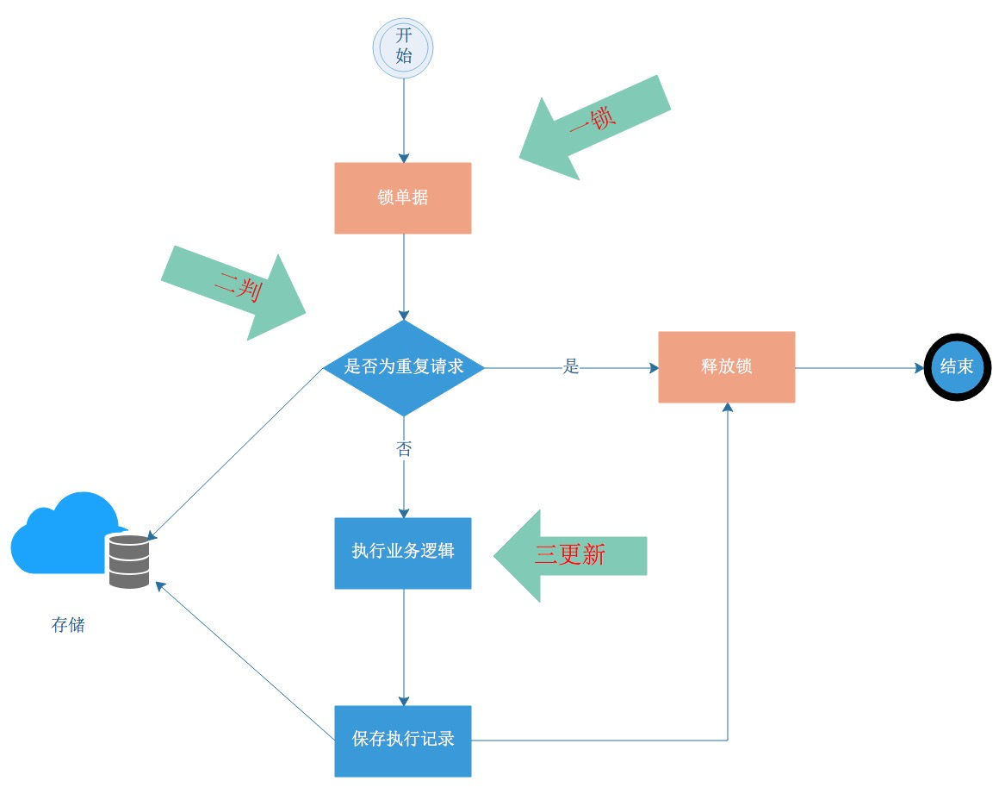
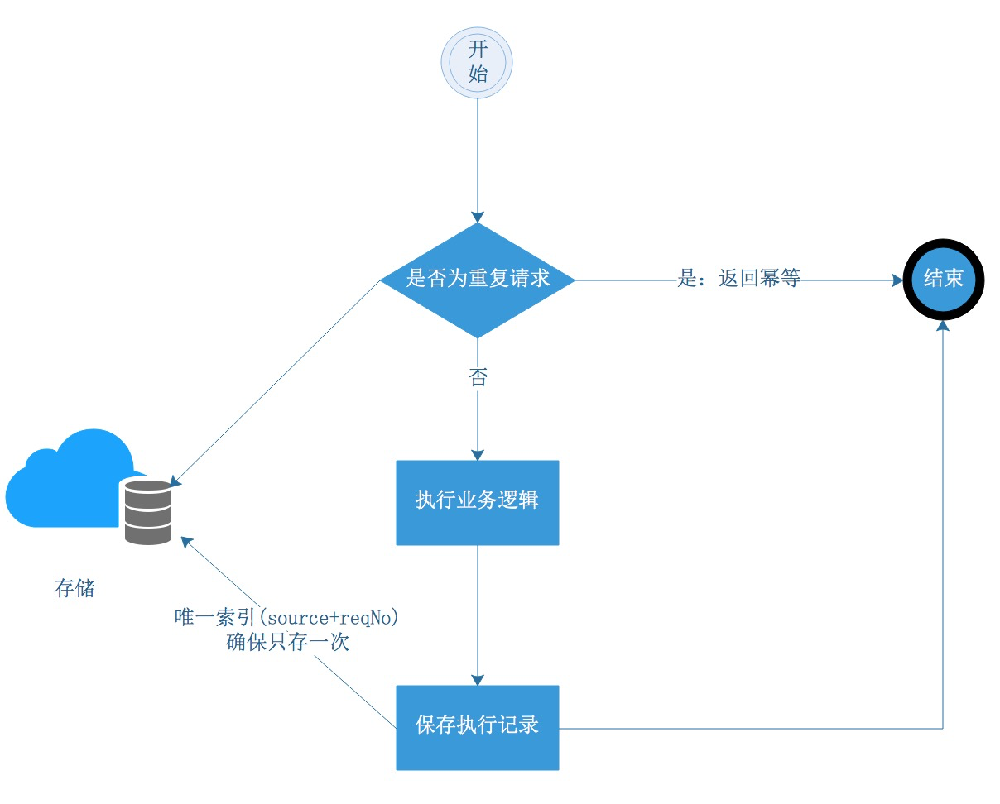
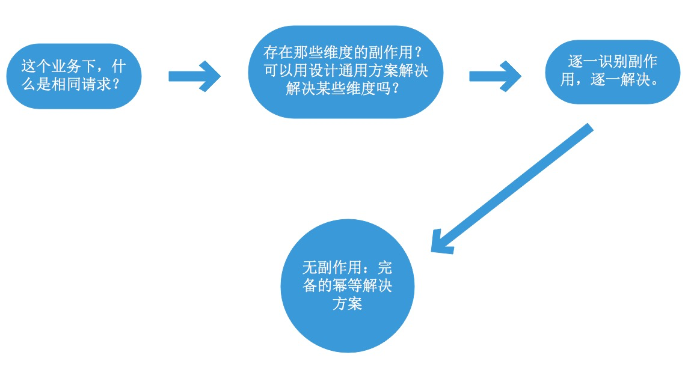

## [分布式幂等问题解决方案三部曲](https://www.cnblogs.com/404p/p/11334825.html)

# 纲要

**文章目的**：本文旨在提炼一套分布式幂等问题的思考框架，而非解决某个具体的分布式幂等问题。在这个框架体系内，会有一些方案举例说明。
**文章目标**：希望读者能通过这套思考框架设计出符合自己业务的完备的幂等解决方案。
**文章内容**：
（1）背景介绍，为什么会有幂等。
（2）什么是幂等，这个定义非常重要，决定了整个思考框架。
（3）解决幂等问题的三部曲，也是作者的思考框架。
（4）总结

# 一 背景

分布式系统由众多微服务组成，微服务之间必然存在大量的网络调用。下图是一个服务间调用异常的例子，用户提交订单之后，请求到A服务，A服务落单之后，开始调用B服务，但是在A调用B的过程中，存在很多不确定性，例如B服务执行超时了，RPC直接返回A请求超时了，然后A返回给用户一些错误提示，但实际情况是B有可能执行是成功的，只是执行时间过长而已。



用户看到错误提示之后，往往会选择在界面上重复点击，导致重复调用，如果B是个支付服务的话，用户重复点击可能导致同一个订单被扣多次钱。不仅仅是用户可能触发重复调用，定时任务、消息投递和机器重新启动都可能会出现重复执行的情况。在分布式系统里，服务调用出现各种异常的情况是很常见的，这些异常情况往往会使得系统间的状态不一致，所以需要容错补偿设计，最常见的方法就是调用方实现合理的重试策略，被调用方实现应对重试的幂等策略。

# 二 什么是幂等

对于幂等，有一个很常见的描述是：对于相同的请求应该返回相同的结果，所以查询类接口是天然的幂等性接口。举个例子：如果有一个查询接口是查询订单的状态，状态是会随着时间发生变化的，那么在两次不同时间的查询请求中，可能返回不一样的订单状态，这个查询接口还是幂等接口吗？

幂等的定义直接决定了我们如何去设计幂等方案，如果幂等的含义是相同请求返回相同结果，那实际上只需要缓存第一次的返回结果，即可在后续重复请求时实现幂等了。但问题真的有这么简单吗？

笔者更赞同这种定义：幂等指的是相同请求（identical request）执行一次或者多次所带来的副作用（side-effects）是一样的。

> 引自：[https://developer.mozilla.org/en-US/docs/Glossary/Idempotent](https://links.jianshu.com/go?to=https%3A%2F%2Fdeveloper.mozilla.org%2Fen-US%2Fdocs%2FGlossary%2FIdempotent)
> An HTTP method is idempotent if an identical request can be made once or several times in a row with the same effect while leaving the server in the same state. In other words, an idempotent method should not have any side-effects (except for keeping statistics).

这个定义有一定的抽象，概括性比较强，在设计幂等方案时，其实就是将抽象部分具化。例如：什么是相同的请求？哪些情况会有副作用？该如何避免副作用？且看三部曲。

# 三 解决方案三部曲

不少关于幂等的文章都称自己的方案是通用解决方案，但笔者却认为，不同的业务场景下，相同请求和副作用都是有差异性的，不同的副作用需要不同的方案来解决，不存在完全通用的解决方案。而三部曲旨在提炼出一种思考模式，并举例说明，在该思考模式下，更容易设计出符合业务场景的幂等解决方案。

## 第一部曲：识别相同请求

幂等是为了解决重复执行同一请求的问题，那如何识别一个请求有没有和之前的请求重复呢？有的方案是通过请求中的某个流水号字段来识别的，同一个流水号表示同一个请求。也有的方案是通过请求中某几个字段甚至全部字段进行比较，从而来识别是否为同一个请求。所以在方案设计时，明确定义具体业务场景下什么是相同请求，这是第一部曲。

### 方案举例：token机制识别前端重复请求

在一条调用链路的后端系统中，一般都可以通过上游系统传递的reqNo+source来识别是否是为重复的请求。如下图，B系统是依赖于A系统传递的reqNo+source来识别相同请求的，但是A系统是直接和前端页面交互的系统，如何识别用户发起的请求是相同的呢？比如用户在支付界面上点击了多次，A系统怎么识别这是一次重复操作呢？



前端可以在第一次点击完成时，将按钮设置为disable，这样用户无法在界面上重复点击第二次，但这只是提升体验的前端解决方案，不是真正安全的解决方案。

常见的服务端解决方案是采用token机制来实现防重复提交。如下图，



（1）当用户进入到表单页面的时候，前端会从服务端申请到一个token，并保存在前端。
（2）当用户第一次点击提交的时候，会将该token和表单数据一并提交到服务端，服务端判断该token是否存在，如果存在则执行业务逻辑。
（3）当用户第二次点击提交的时候，会将该token和表单数据一并提交到服务端，服务端判断该token是否存在，如果不存在则返回错误，前端显示提交失败。

这个方案结合前后端，从前端视角，这是用于防止重复请求，从服务端视角，这个用于识别前端相同请求。服务端往往基于类似于redis之类的分布式缓存来实现，保证生成token的唯一性和操作token时的原子性即可。核心逻辑如下。

```
// SETNX keyName value: 如果key存在,则返回0，如果不存在，则返回1

// step1. 申请token
String token = generateUniqueToken();

// step2. 校验token是否存在
if(redis.setNx(token, 1) == 1){
  // do business
} else {
 // 幂等逻辑
}
```

## 第二部曲：列出并减少副作用的分析维度

相同的请求重复执行业务逻辑，如果处理不当，会给系统带来副作用。那什么是副作用？就是业务无法接受的非预期结果。最常见的有重复入库、数据被错误变更等，大多数幂等方案就是围绕解决这类问题来设计的。而系统往往可能在多个维度都存在副作用，例如：
（1）调用下游维度：重复调用下游会怎样？如果下游没有幂等，重复调用会带来什么副作用？
（2）返回上游维度：例如第一次返回上游异常，第二次返回上游被幂等了？会给上游带来什么副作用？
（3）并发执行维度：并发重复执行会怎样？会有什么副作用？
（4）分布式锁维度：引入分布式锁来防止并发执行？但是如果锁出现不一致性，会有什么副作用？
（5）交互时序维度：有没有异步交互，是否存在时序问题？会有什么副作用？
（6）客户体验维度：从数据不一致到最终一致，必须在多少时间内完成？如果该时间内没有完成，会有什么副作用？例如大量客诉（秉承客户第一的原则，在支付宝，客诉量太大会定级为生产环境故障）。
（7）业务核对维度：重复调用是否存在覆盖核对标识的情况，带来无法正常核对的副作用？在金融系统中，资金链路无法核对是无法接受的。
（8）数据质量维度：是否存在重复记录？如果存在会有什么副作用？



上面是一些常见的分析维度，不同行业的系统中会存在不一样的维度，尽可能地总结出这些维度，并列入系统分析时的checklist中，能够更好地完善幂等解决方案。没有副作用才算是完备的幂等解决方案，但是副作用的维度太多，会提高幂等方案的复杂度。所以在能够达成业务的前提下，减少一些分析维度，能够使得幂等方案实现起来更加经济有效。例如：如果有专门的幂等表存储返回给上游的幂等结果，第（2）维度不用考虑了，如果用锁来防止并发，第（3）个维度不考虑了，如果用单机锁代替分布式锁，第（4）个维度不考虑了。

这是解决幂等问题的第二部曲：列出并减少副作用的分析维度。在这部曲中，涉及的解决方案往往是解决某一个维度的副作用问题，适合以通用组件的形式存在，作为团队内部的一个公共技术套路。

### 方案举例：加锁避免并发重复执行

很多幂等解决方案都和防并发有关，那么幂等和并发到底有什么关联呢？两者的联系是：幂等解决的是重复执行的问题，重复执行既有串行重复执行（例如定时任务），也有并发重复执行。如果重复执行的业务逻辑没有共享变量和数据变更操作时，并发重复执行是没有副作用的，可以不考虑并发的问题。对于包含共享变量、涉及变更操作的服务（实际上这类服务居多），并发问题可能导致乱序读写共享变量，重复插入数据等问题。特别是并发读写共享变量，往往都是发生生产故障后才被感知到。

所以在并发执行的维度，将并发重复执行变成串行重复执行是最好的幂等解决方案。支付宝最常见的方法就是：一锁二判三更新，如下图。当一个请求过来之后：一锁，锁住要操作的资源；二判，识别是否为重复请求（第一部曲要定义的问题）、判断业务状态是否正常；三更新：执行业务逻辑。



> Q&A
> 小A：锁可能造成性能影响，先判后锁再执行，可以提升效能。
> 大明：这样可能会失去防并发的效果。还记得double check实现单例模式吗？在加锁前判断了下，那加锁后为啥还要判断下？实际上第二次check才是必须的。想想看？
> 小A画图思考中...
> 小A：明白了，一锁二判三更新，锁和判的顺序是不能变的，如果锁冲突比较高，可以在锁之前判断下，提高效率，所以称之为double check。
> 大明：是的，聪明。这两个场景不一样，但并发思路是一样的。

```
private volatile static Girl theOnlyGirl;

// 实现单例时做了 double check
public static Girl getTheOnlyGirl() {

    if (theOnlyGirl == null) {   // 加锁前check
        synchronized (Girl.class) {
            if (theOnlyGirl == null) {  // 加锁后check
                theOnlyGirl = new Girl();    // 变更执行
            }
        }
    }

    return theOnlyGirl;
}
```

锁的实现可以是分布式锁，也是可以是数据库锁。分布式锁本身会带来锁的一致性问题，需要根据业务对系统稳定性的要求来考量。支付宝的很多系统是通过在业务数据库中新建一个锁记录表来实现业务锁组件，其分表逻辑和业务表的分表逻辑一致，就可以实现单机数据库锁。如果没有锁组件，悲观锁锁住业务单据也是可以满足条件的，悲观锁要在事务中用select for update来实现，要注意死锁问题，且where条件中必须命中索引，否则会锁表，不锁记录。

并发维度几乎是一个分布式幂等的通用分析维度，所以一个通用的锁组件是很有必要的。但这也只是解决了并发这一个维度的副作用。虽然没有了并发重复执行的情况，但串行重复执行的情况依旧存在，重复执行才是幂等核心要解决的问题，重复执行如果还存在其它副作用，幂等问题就是没有解决掉。

加锁后业务的性能会降低，这个怎么解决？笔者认为，大多数情况下架构的稳定性比系统性能的优先级更高，况且对于性能的优化有太多地方可以去实现，减少坏代码、去除慢SQL、优化业务架构、水平扩展数据库资源等方式。通过系统压测来实现一个满足SLA的服务才是评估全链路性能的正确方法。

## 第三部：识别细粒度副作用，针对性设计解决方案

在解决了部分维度的副作用之后，就需要针对单个粒度的副作用进行逐一识别并解决了。在数据质量维度上，最大的一个副作用是重复数据。在交互维度上，最大的一个副作用是业务乱序执行。一般这类问题不设计成通用组件，可以开发人员自由发挥。本节用两个常见方案做为例子。

### 方案举例1：唯一性约束避免重复落库

在数据表设计时，设计两个字段：source、reqNo，source表示调用方，seqNo表示调用方发送过来的请求号。source和reqNo设置为组合唯一索引，保证单据不会重复落两次。如果调用方没有source和reqNo这两个字段，可以根据业务实际情况将请求中的某几个业务参数生成一个md5作为唯一性字段落到唯一性字段中来避免重复落库。



核心逻辑如下：

```
try {
    dao.insert(entity);    
    // do business
} catch (DuplicateKeyException e) {
    dao.select(param);
    // 幂等返回
}
```

这里直接insert单据，若果成功则表示没请求过，举行执行业务逻辑，如果抛出DuplicateKeyException异常，则表示已经执行过，做幂等返回，简单的服务通过这种方式也可以识别是否为重复请求（第一部曲）。

利用数据库唯一索引来避免重复记录，需要注意以下几个问题：
（1）因为存在读写分离的设计，有可能insert操作的是主库，但select查询的却是从库，如果主备同步不及时，有可能select查出来也是空的。
（2）在数据库有Failover机制的情况下，如果一个城市出现自然灾害，很可能切换到另外一个城市的备用库，那么唯一性约束可能就会出现失效的情况，比如并发场景下第一次insert是在杭州的库，然后此时failover将库切到上海了，再一次同样的请求insert也是成功的。
（3）数据库扩容场景下，因为分库规则发生变化，有可能第一次insert操作是在A库，第二次insert操作是在B库，唯一索引同样不起作用。
（4）有的系统catch的是SQLIntegrityConstraintViolationException，这个是完整性约束，包含了唯一性约束，如果未给一个必填字段设值，也会抛这个异常，所以应该catch键重复异常DuplicateKeyException。
对于第（1）个问题，将insert 和select放在同一个事务中即可解决，对于（2）和（3），支付宝内部为了应对容量暴涨和FO，设计了一套基于数据复制技术的分布式数据平台，这个case笔者了解不深，后续有机会再讨论。

> 小A：如果我用唯一性约束来保证不会落重复数据，是不是可以不加锁防并发了？
> 大明：两者没有直接关系，加锁防并发解决的是并发维度的副作用问题，唯一性约束只是解决重复数据这单个副作用的问题。如果没有唯一性约束，串行重复执行也会导致insert重复落数据的问题，唯一性约束本质上解决的是重复数据问题，不是并发问题。

### 方案举例2：状态机约束解决乱序问题

一个业务的生命周期往往存在不同的状态，用状态机来控制业务流程中的状态转换是不二之选。在实际业务中单向的状态机是比较常用的，当状态机处于下一个状态时，是不能回到前面的状态的。以下场景经常会用到状态机做校验：
（1）调用方调用超时重试。
（2）消息投递超时重试。
（3）业务系统发起多个任务，但是期待按照发起顺序有序返回。

对于这种类问题，一般是在处理前先判断状态是否符合预期，如果符合预期再执行业务。当业务执行完成后，变更状态时还会采取类似于于乐观锁的方式兜底校验，例如，M状态只能从N状态转换而来，那么更新单据时，会在sql中做状态校验。

```
update apply set status = 'M' where status = 'N'
```

如果状态被设计成可逆的，就有可能产生ABA问题。即在update之前，状态有可能做过这样的变更：N -> M -> N。所以状态机设成单向流转是比较合理的。

# 四 总结

本文首先引出了幂等的定义：相同请求无副作用，然后提出了设计幂等方案的三部曲，并举例说明。设计者要能够清晰地定义相同请求，并且采用通用组件减少一些副作用的分析维度，再针对具体的副作用设计相应的解决方案，直至没有任何副作用，才是真正完备的幂等解决方案。在实际业务中，实现三部曲不一定是严格的先后顺序，但只要按照这三部曲来构思方案，必能开拓思路，化繁为简。

