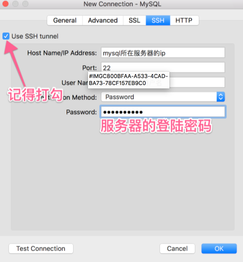
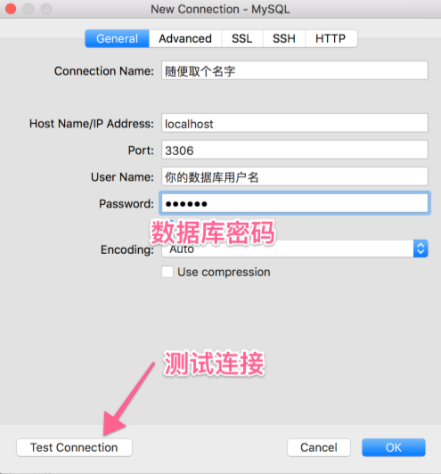

> Secure Shell（缩写为SSH），由IETF的网络工作小组（Network Working Group）所制定；SSH为一项创建在应用层和传输层基础上的安全协议，为计算机上的Shell（壳层）提供安全的传输和使用环境。
> 传统的网络服务程序，如rsh、FTP、POP和Telnet其本质上都是不安全的；因为它们在网络上用明文传送数据、用户帐号和用户口令，很容易受到中间人（man-in-the-middle）攻击方式的攻击。就是存在另一个人或者一台机器冒充真正的服务器接收用户传给服务器的数据，然后再冒充用户把数据传给真正的服务器。
> 而SSH是目前较可靠，专为远程登录会话和其他网络服务提供安全性的协议。利用SSH协议可以有效防止远程管理过程中的信息泄露问题。通过SSH可以对所有传输的数据进行加密，也能够防止DNS欺骗和IP欺骗。
> SSH之另一项优点为其传输的数据可以是经过压缩的，所以可以加快传输的速度。SSH有很多功能，它既可以代替Telnet，又可以为FTP、POP、甚至为PPP提供一个安全的“通道”。

通过ssh连接MySQL数据库，不用对外开放数据库端口（默认3306），也不用另外创建一个允许外部网络连接用户，可以大大提高安全性，当然，前提你是的服务器要开启ssh服务。下文以Mac版的Navicat为例，手把手教你通过SSH连接数据库。（windows版本类似）

1. 新建一个连接，选择SSH标签，设置SSH登录的信息，如下界面：

2. 回到General设置数据库登录信息：

3. 测试通过后，点击OK即可。