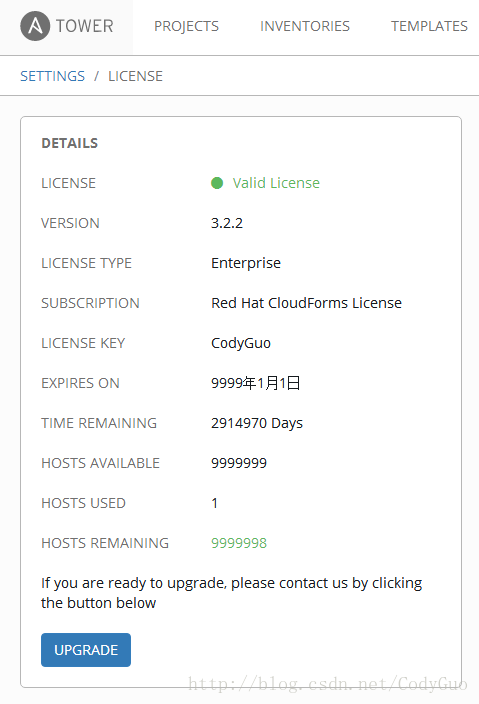

## 安装

* 预览版，数据不持久化
```shell
docker run -d -p 443:443 shawnxlw/cat
```
* 数据持久化（**强烈建议**）
```shell
docker run -d -p 443:443 -v cat_db:/var/lib/postgresql/9.6/main -v cat_license:/etc/tower/license shawnxlw/cat
```
## 可访问，增加hosts
> 以下方法采集于民间，是否可行，先备份bak再执行。
1. 第一种。需要申请试用授权文件

修改license验证
```python
cd /var/lib/awx/venv/awx/lib/python2.7/site-packages/tower_license
vi __init__.py

注释230行，新增两行
available_instances = 1000000 
attrs['license_type'] = 'enterprise'
```
以下摘取license验证部分代码
```python
def validate(self):
    # Return license attributes with additional validation info.
    attrs = copy.deepcopy(self._attrs)
    key = attrs.get('license_key', 'UNLICENSED')
    if not self._check_cloudforms_subscription() and (key == 'UNLICENSED' or key != self._generate_key()):
        attrs.update(dict(valid_key=False, compliant=False))
        return attrs
    attrs['valid_key'] = True
    attrs['deployment_id'] = hashlib.sha1(key).hexdigest()

    if Host:
        current_instances = Host.objects.active_count()
    else:   
        current_instances = 0
    #available_instances = int(attrs.get('instance_count', None) or 0)
    available_instances = 1000000 
    attrs['license_type'] = 'enterprise'
    attrs['current_instances'] = current_instances
    attrs['available_instances'] = available_instances
    attrs['free_instances'] = available_instances - current_instances
```
2. 第二种。无需申请试用授权文件

修改license验证
```python
cd /var/lib/awx/venv/awx/lib/python2.7/site-packages/tower_license
vi __init__.py

新增120行， return True
119     def _check_cloudforms_subscription(self):
120         return True
```
以下摘取license验证部分代码
```python
 def __init__(self, **kwargs):
        self._attrs = dict(
            company_name='',
            instance_count=0,
            license_date=0,
            license_key='UNLICENSED',
        )
        if not kwargs:
            kwargs = getattr(settings, 'LICENSE', None) or {}
        self._attrs.update(kwargs)
        self._attrs['license_date'] = int(self._attrs['license_date'])
        if not self._attrs.get('subscription_name', None):
            self._attrs['subscription_name'] = self._generate_subscription_name()
        if self._check_cloudforms_subscription():
            self._generate_cloudforms_subscription()

    def _generate_cloudforms_subscription(self):
        self._attrs.update(dict(company_name="Red Hat CloudForms License",
                                instance_count=9999999,
                                license_date=253370764800,
                                license_key='CodyGuo',
                                license_type='enterprise',
                                subscription_name='Red Hat CloudForms License'))


    def _check_cloudforms_subscription(self):
        return True
        if os.path.exists('/var/lib/awx/i18n.db'):
            return True
        if os.path.isdir("/opt/rh/cfme-appliance") and os.path.isdir("/opt/rh/cfme-gemset"):
            try:
                has_rpms = subprocess.call(["rpm", "--quiet", "-q", "cfme", "cfme-appliance", "cfme-gemset"])
                if has_rpms == 0:
                    return True
            except OSError:
```
* 编译
```shell
python -m py_compile __init__.py
python -O -m py_compile __init__.py
```
* 重启服务
```shell
ansible-tower-service restart
```
* 验证
打开–settings–VIEW YOUR LICENSE 查看 

3. 第三种（**已验证，可行**）。最暴力最简单最傻瓜方式，root用户登录，执行以下命令：
```shell
echo codyguo > /var/lib/awx/i18n.db
```
刷新页面即可，无需重启服务。
## 参考文献
1. [https://github.com/shawnxlw/containerised-ansible-tower](https://github.com/shawnxlw/containerised-ansible-tower)
2. [Ansible Tower 3.2.x 企业版无限hosts （二）](https://blog.csdn.net/CodyGuo/article/details/78738584)
3. [Ansible Tower 3.x 企业版无限hosts （三）](https://blog.csdn.net/CodyGuo/article/details/84136181)