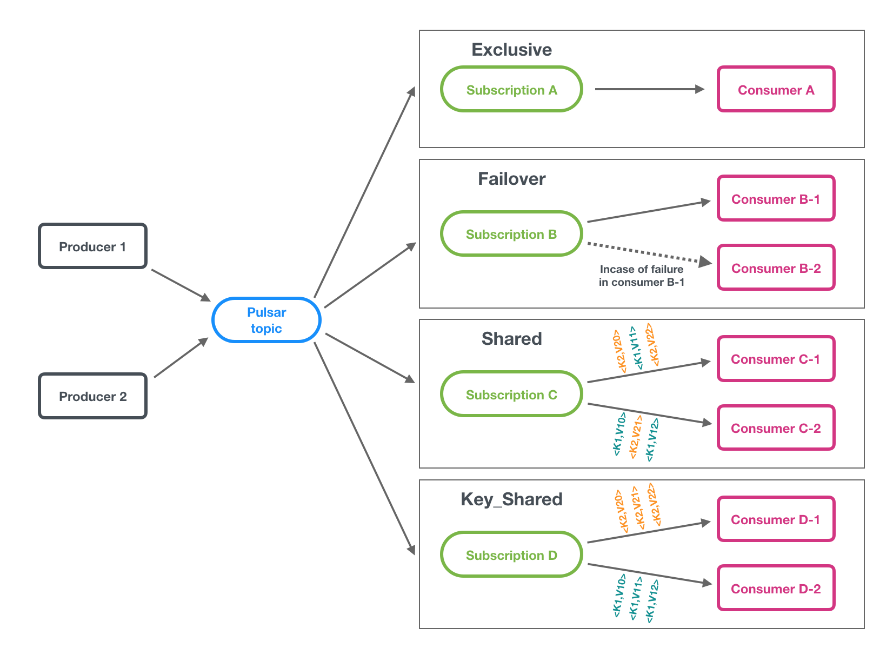
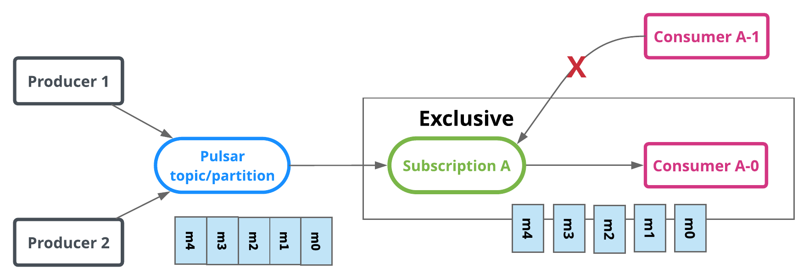
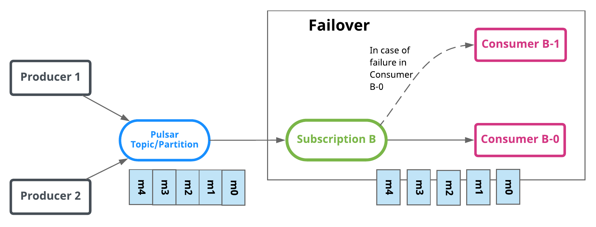
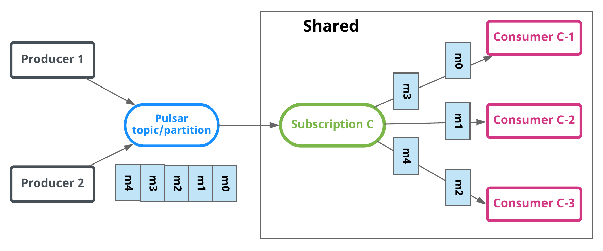
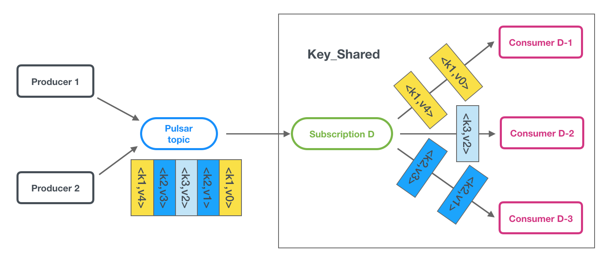
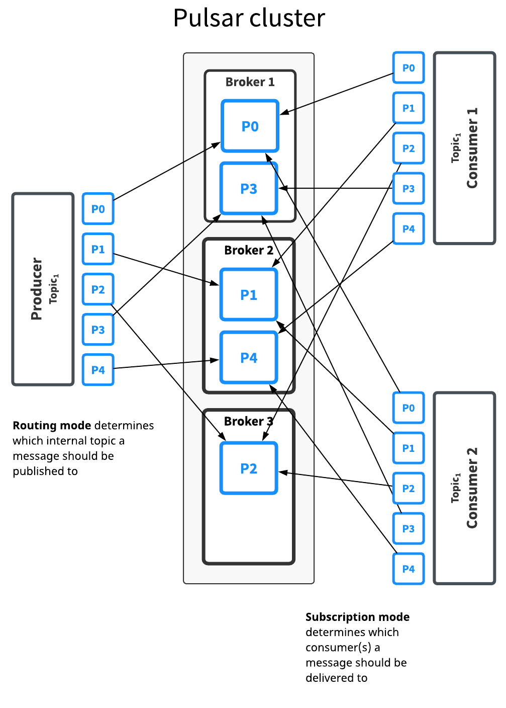
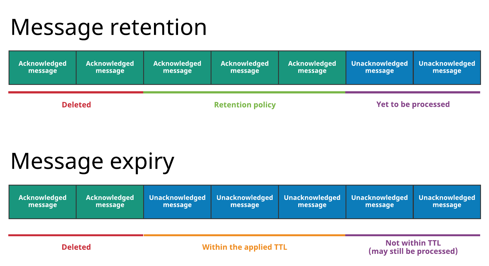
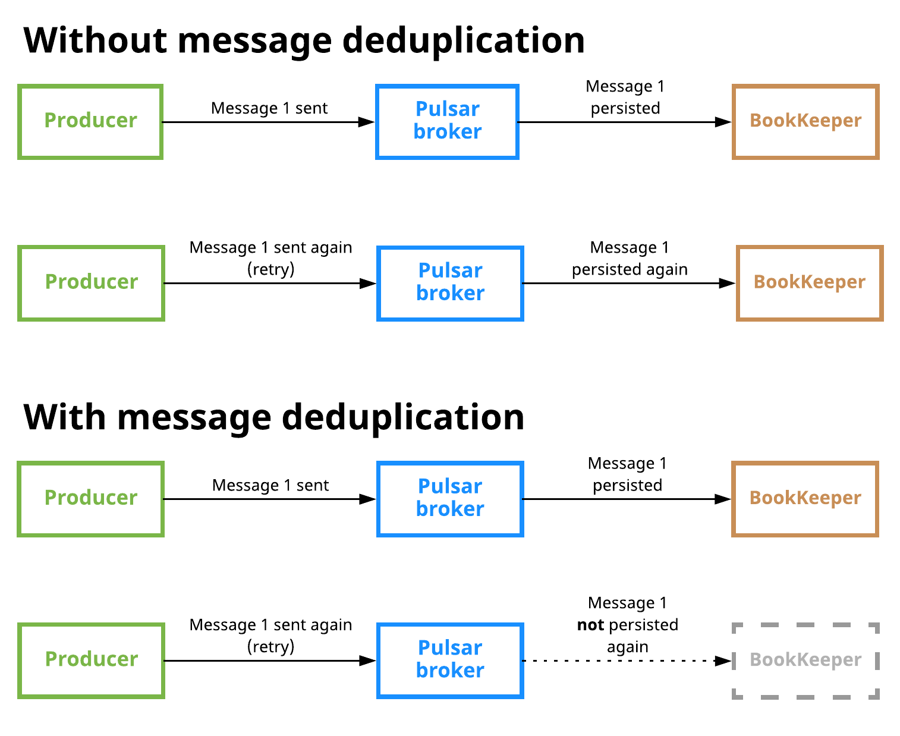

# 10分钟学会Pulsar消息系统概念

### Apache Pulsar

Pulsar是一个支持多租户的、高性能的服务与服务之间消息通讯的解决方案，最初由雅虎开发，现在由Apache软件基金会管理。
Pulsar的主要特性如下:

- Pulsar实例原生支持多集群，能无缝的基于地理位置进行跨集群备份
- 非常低的消息发布和端到端的延迟
- 无缝扩展到超过百万个topic
- 支持Java,Go,Pytho和C++的客户端
- Topic支持多种订阅模式: 独占（exclusive）, 共享（shared）和灾备（failover）
- 通过Apache BookKeeper提供的持久化消息存储机制保证消息的送达
- serverless的轻量级计算框架Pulsar Functions提供了原生的流数据处理
- serverless的连接器框架Pulsar IO构建于 Pulsar Functions之上，能够轻松的将数据从Pulsar中移入和移出
- 当数据老化时，分层存储将数据从热存储卸载到冷存储（如S3和GCS）

目录如下:

- 消息系统概念
- 架构概述
- Pulsar客户端
- 基于地理位置的备份
- 多租户
- 认证和授权
- 消息压缩
- 分层存储
- Schema管理服务

#### 1. 消息系统概念

Pulsar采用了发布订阅的设计模式，也称作pub-sub。该设计模式中，producer发布消息到topic，consumer可以订阅这些topic，处理发布过来的消息，在处理完成后发送确认。 
一旦订阅被创建，所有的消息都将被Pulsar保留，即使consumer断开连接。 只有在consumer确认消息被成功处理后，保留下来的消息才会被丢弃。

#### 1.1 Messages

消息是Pulsar的基础单元。 消息就是producer发给topic的内容，以及consumer从topic消费的内容(消息处理完成后发送确认)。 消息类似于邮政系统中的信件。
消息包含了多个属性:Value(数据),Key(打标签，用来压缩消息),Properties(可选,用户自定义key/value),Producer name(生产者名称,可默认生成,也可指定),Sequence ID(消息的序列id),Publish time(发布时间,生产者自动加上),Event time(消息的可选时间戳)。

#### 1.2 Producers

生产者是关联topic的程序，它发布消息到Pulsar的broker上。
**发送模式**：Producer可以以同步（sync）或者异步（async）的方式发布消息到broker。

- 同步发送：producer发送每条消息后会等待broker的确认，如果没有收到确认信息，producer会认为发送失败
- 异步发送：Producer将会把消息放入blocking队列，然后马上返回。 然后客户端在后台将消息发送给broker。如果队列已满（ 配置的最大数量），根据传入producer的参数，producer可能阻塞或者直接返回失败。

**压缩**：消息在发送过程中可以被压缩来节省带宽，pulsar支持LZ4，ZLIB，ZSTD，SNAPPY类型。
批处理：如果启用了批处理，生产者将在单个请求中发送批量消息。批处理大小由最大消息数和最大发布延迟决定。

#### 1.3 Consumers

消费者是订阅关联topic,然后接收消息的程序。
**接收模式**：消息可以通过同步或者异步的方式从broker接收。

- 同步接收：同步接收将会阻塞，直到消息可用
- 异步接收：异步接收立即返回future值，例如java中的CompletableFuture，一旦新消息可用，它立即完成。

**监听**：客户端库为consumers提供listener的实现，例如Java客户端，提供MesssageListener接口，实现该接口，一旦接受到新的消息，received方法将被调用。

```java
void received(Consumer<T> consumer,Message<T> msg);
```

**确认**:当一个consumer 成功消费掉一条消息后,那么这个consumer会发送一个确认请求到broker,broker会丢弃这条消息,否则保存这条消息。 
消息的确认可以一个接一个，也可以累积一起。 累积确认时，消费者只需要确认最后一条他收到的消息。 所有之前（包含此条）的消息，都不会被再次重发给那个消费者。

> 累积消息确认不能用于共享订阅模式，因为共享模式中，一个订阅会涉及到多个消费者。
> 共享模式中，多条消息可以单独确认。

**否定确认**：当consumer 在一定时间内没有成功消费消息，而想再次消费该条消息，那么这个consumer可以发送一个否定确认到broker，然后broker重发这条消息。消息可以一条接一条的否定确认，也可以累积否定确认，这取决于消费订阅模式。在独占和灾备模式，消费者只能否定确认其接收的最后一条消息。在共享模式，消费者可以独立否定确认。
**确认超时**：当一条消息没有被成功消费，并且您想要触发broker自动重发消息时，您可以采用未确认消息自动重发机制。客户端将在整个AckTimeout时间范围内跟踪未确认的消息，并在指定确认超时时间自动向broker发送重发未确认的消息请求。

> 在确认超时之前使用否定确认。否定确认以更精确的方式控制单个消息的重发，并在消息处理时间超过确认超时时间后，避免无效的重发消息。

**死信(Dead letter)topic**：死信topic使您能够在消费者无法成功消费某些消息时消费新消息。在这种机制中，无法消费的消息存储在单独的topic，称为死信topic。您可以决定如何处理死信topic中的消息。
在Java客户端中,可以使用以下例子处理死信topic:

```java
Consumer<byte[]> consumer = pulsarClient.newConsumer(Schema.BYTES)
  .topic(topic)          
  .subscriptionName("my-subscription")          
  .subscriptionType(SubscriptionType.Shared)          
  .deadLetterPolicy(DeadLetterPolicy.builder()                
  .maxRedeliverCount(maxRedeliveryCount)                
  .build())          
  .subscribe();
```

死信topic依赖于消息的重发。您需要确认消息的重发方法：否定确认或确认超时。在确认超时之前使用否定确认。

> 目前,死信topic仅适用于共享模式。

#### 1.4 Topics

和其他的发布订阅系统一样，Pulsar 中的 topic 是被命名的通道，用做从producer到 consumer传输消息。 Topic的名称是具有明确定义结构的URL:

```java
{persistent|non-persistent}://tenant/namespace/topic
```

**persistent/non-persistent**：topic的类型，包括持久化和非持久化（默认是持久类型）。topic指定持久化后，所有的消息会持久化到硬盘（这意味着多块硬盘，除非是单机模式的broker）。反之，非持久topic的数据不会存储到硬盘上。
**tenant**：topic在实例中的租户，租户对于Pulsar的多租户来说是必不可少的，可以分布在多个集群中。
**namespace**：Topic的管理单元，充当关联topic组的管理机制。 大多数的topic配置在namespace层面生效。 每个tenant可以有多个namespace。
**topic**：topic名称是自由定义的，在pulsar实例中无特殊意义。

##### 1.4.1 namespace

命名空间是租户内部逻辑上的命名术语。 一个租户可以通过admin API创建多个命名空间。 例如，一个对接多个应用的租户，可以为每个应用创建不同的namespace。 Namespace使得程序可以以层级的方式创建和管理topic。 例如："my-tenant/app1" ，它的namespace是app1这个应用，对应的租户是 my-tenant。 你可以在namespace下创建任意数量的topic。

##### 1.4.2 订阅模型

订阅是命名好的配置规则，用于确定如何将消息发给消费者。Pulsar有三种订阅模式：exclusive（独占），shared（共享），failover（灾备）。 下图展示了这三种模式：


###### 1.4.2.1 Exclusive

独占模式，只能有一个消费者订阅topic。 如果多于一个消费者尝试以同样方式去订阅topic，消费者将会收到错误。
上面的图中，只有Consumer A可以消费。

> Exclusive模式为默认订阅模式。



###### 1.4.2.2 Failover

灾备模式，多个consumer可以绑定到同一个订阅。Consumer将会按字典顺序排序，第一个consumer被初始化为唯一接受消息的消费者，这个consumer被称为master consumer。
当master consumer断开时，所有的消息（未被确认和后续进入的）将会被分发给队列中的下一个consumer。
下图中，Consumer B-0是master consumer，当Consumer B-0断开连接时，由于Consumer B-1在队列中下一个位置，那么它将会开始接收消息。


###### 1.4.2.3 Shared

共享模式，多个消费者可以绑定到同一个订阅上。 消息通过round robin轮询机制分发给不同的消费者，并且每个消息仅会被分发给一个消费者。当消费者断开连接，所有被发送给他，但没有被确认的消息将被重新安排，分发给其它存活的消费者。
下图中，topic下有5条消息，m0~m4,消费者有C1/C2/C3,最终m0和m3分配给C1,m1分给C2,m2和m4分给C3,可以说明每个消息仅发给一个消费者。


> **Shared模式的限制**：
> 有两点需注意，1、不保证消息顺序； 2、不能使用累计确认

**Key_shared：**
在Key-shared模式下，多个消费者可以关联到同一订阅。消息以分布式在消费者之间传递，具有相同key/orderingKey 的消息仅传递给一个消费者。无论消息被重发多少次，它都发给同一个消费者。当消费者连接或断开连接时，将导致某些消息的key的消费者变更。


> 该模式限制:消息必须指定key/orderingKey;不能使用累计确认;该模式目前是测试版,可以在broker.config禁用。

#### 1.5 多topic订阅

当consumer订阅pulsar的topic时，它默认指定订阅了一个topic，例如：`persistent://public/default/my-topic`。 从Pulsar的1.23.0-incubating的版本开始，Pulsar消费者可以同时订阅多个topic。 你可以用以下两种方式定义topic的列表：

- 通过最基础的正则表达式（regex），例如 `persistent://public/default/finance-.*`
- 通过明确指定的topic列表

> 通过正则订阅多主题时，所有的主题必须在同一个namespace。

当订阅多主题时，Pulsar客户端会自动调用Pulsar的API来发现匹配表达式或者列表的所有topic，然后全部订阅。 如果此时有暂不存在的topic，那么一旦这些topic被创建，conusmer会自动订阅。

> **不能保证顺序性**
> 当消费者订阅多topic时，Pulsar所提供对单一topic订阅的顺序保证，就hold不住了。 如果你在使用Pulsar的时候，遇到必须保证顺序的需求，强烈建议不要使用此特性。

下面是多主题订阅在java中的例子：

```java
import java.util.regex.Pattern;

import org.apache.pulsar.client.api.Consumer;
import org.apache.pulsar.client.api.PulsarClient;

PulsarClient pulsarClient = // 实例化pulsar客户端

// 订阅一个namespace下的所有topic
Pattern allTopicsInNamespace = Pattern.compile("persistent://public/default/.*");
Consumer<byte[]> allTopicsConsumer = pulsarClient.newConsumer()                
  .topicsPattern(allTopicsInNamespace)                
  .subscriptionName("subscription-1")                
  .subscribe();

// 根据正则订阅一个namespace下的多个topic
Pattern someTopicsInNamespace = Pattern.compile("persistent://public/default/foo.*");
Consumer<byte[]> someTopicsConsumer = pulsarClient.newConsumer()                
  .topicsPattern(someTopicsInNamespace)                
  .subscriptionName("subscription-1")                
  .subscribe();
```

#### 1.6 Partitioned topics(分区topic)

通常一个topic仅被一个broker服务，这限制了topic的最大吞吐量。 分区topic是特殊的topic类型，他可以被多个broker处理，这让topic有更高的吞吐量。
其实在背后，分区的topic通过N个内部topic实现，N是分区的数量。 当向分区的topic发送消息，每条消息被路由到其中一个broker。 Pulsar自动处理跨broker的分区分布。
下图对此做了阐明：

分析上图可知,Topic1有5个分区（P0到P4）,分布在3个broker上。因为分区数量多于broker数量，其中有两个broker每个处理两个分区,第三个broker则只处理一个。（再次强调，分区的分布是Pulsar自动处理的）。
这个topic的消息被广播给两个consumer，路由模式决定哪个broker处理哪个partition，订阅模式决定哪条消息发送到哪个consumer。
大多数境况下，路由和订阅模式可以分开制定。通常来讲，吞吐能力的要求，决定了分区/路 的方式。订阅模式则应该由应用来做决定。
分区topic和普通topic，对于订阅模式如何工作，没有任何不同。分区只是决定了从生产者生产消息到消费者处理及确认消息过程中发生的事情。
分区topic需要通过admin API显式创建，创建topic时可以指定分区数。

##### 1.6.1 路由模式

发布到分区主题时，必须指定路由模式。路由模式决定每个消息应该发布到哪个分区，即哪个内部主题。三种路由模式如下:

- RoundRobinPartition：如果没有key，所有的消息通过轮询方式被路由到不同的分区，以达到最大吞吐量。请注意round-robin并不是作用于每条单独的消息，而是作用于延迟处理的批次边界，以确保批处理有效。 如果为message指定了key，分区的producer会把key做hash，然后分配消息到指定的分区。 这是默认的模式。
- SinglePartition：如果没有key被提供，producer将会随机选择一个分区，把所有的消息发往该分区。 如果为message指定了key，分区的producer会把key做hash，然后分配消息到指定的分区。
- CustomPartition：使用客制化消息路由实现，可以决定特定的消息进入指定的分区。 用户可以创建客制化的路由模式，通过使用 Java client ，实现MessageRouter接口。

#### 1.7 顺序保证

消息的顺序与消息路由模式和消息的key有关。通常，用户需要对每个key分区的消息保证顺序。
当使用 SinglePartition或者RoundRobinPartition模式时，如果消息有key，消息将会被路由到匹配的分区，这是基于ProducerBuilder 中HashingScheme 指定的散列shema。
顺序保证有两种方式：

- 按key分区：所有拥有相同key的消息有序, 并且会被发送至相同的partition。使用SinglePartition或RoundRobinPartition模式, 每条消息都需要有key。
- 按producer：来自于相同producer的消息有序，路由策略为SinglePartition, 且每条消息都没有key。

##### 1.7.1 HashingScheme

HashingScheme 是代表一组标准散列函数的枚举，为一个指定消息选择分区时使用。
有两种可用的散列函数：JavaStringHash 和Murmur3*32Hash，producer 的默认hash函数是JavaStringHash。请注意，当producer可能来自于不同语言客户端时，JavaStringHash是不起作用的。建议使用Murmur3*32Hash。

#### 1.8 非持久topic

默认情况下，Pulsar保存所有没有确认的消息到多个BookKeeper的bookies中（存储节点）。持久topic的消息数据可以在broker重启或者订阅者出问题的情况下存活下来。 因此，持久性topic上的消息数据可以在 broker 重启和订阅者故障转移之后继续存在。
但是，Pulsar还支持非持久性topic，这些topic的消息从不持久化存储到磁盘，只存在于内存中。 Pulsar也提供了非持久topic。非持久topic的消息不会被保存在硬盘上，只存活于内存中。当使用非持久topic分发时，关掉Pulsar的broker或者关闭订阅者，此topic（ non-persistent)）上所有的瞬时消息都会丢失，意味着客户端可能会遇到消息缺失。
非持久性topic具有这种形式的名称(注意名称中的 non-persistent):

```java
non-persistent://tenant/namespace/topic
```

非持久topic中，broker会立即发布消息给所有连接的订阅者，而不会在BookKeeper中存储。 如果有一个订阅者断开连接，broker将无法重发这些瞬时消息，订阅者将永远也不能收到这些消息了。 去掉持久化存储的步骤，在某些情况下，使得非持久topic的消息比持久topic稍微变快。但是同时，Pulsar的一些核心优势也丧失掉了。

> 非持久topic，消息数据仅存活在内存。 如果broker挂掉或者因其他情况不能从内存取到，你的消息数据就可能丢失。 只有在真的确信你的使用场景符合，并且你可以忍受时，才可去使用非持久topic。

默认非持久topic在broker上是开启的。 你可以通过broker的配置关闭。 你可以通过使用pulsar-admin-topics接口管理非持久topic。

##### 1.8.1 性能

非持久消息通常比持久消息更快，因为broker无须持久化消息，当消息被分发给所有订阅者时，会立即发送ack给producer。 非持久topic让producer有更低的发布延迟。

##### 1.8.2 客户端API

Producer和consumer连接持久topic和连接到非持久topic的方式是一样的。非持久的区别在于，topic的名称必须以non-persistent开头。 三种订阅模式--exclusive，shared，failover对于非持久topic都是支持的。
下面是一个非持久topic的java consumer例子：

```java
PulsarClient client = PulsarClient.builder()    
  .serviceUrl("pulsar://localhost:6650")    
  .build();
String npTopic = "non-persistent://public/default/my-topic"; //这里表明是非持久化
String subscriptionName = "my-subscription-name";

Consumer<byte[]> consumer = client.newConsumer()    
  .topic(npTopic)    
  .subscriptionName(subscriptionName)    
  .subscribe();
```

这里还有一个非持久topic的java producer例子:

```java
Producer<byte[]> producer = client.newProducer()            
  .topic(npTopic)            
  .create();
```

#### 1.9 消息保留和到期(retention and expiry)

Pulsar broker默认如下：

- 立即删除所有已经被cunsumer确认过的的消息
- 以消息backlog的形式，持久保存所有的未被确认消息

Pulsar有两个特性，让你可以覆盖上面的默认行为:

- 消息存留让你可以保存consumer确认过的消息
- 消息过期让你可以给未被确认的消息设置存活时长（TTL） 所有消息保留和到期都在namespace级别进行管理。有关操作方法，请参阅Message retention and expiry cookbook。
  下图说明了这两种概念：
  
  图中第一个是消息存留，存留规则会被用于某namespace下所有的topic，指明哪些消息会被持久存储，即使已经被确认过。 没有被留存规则覆盖的消息将会被删除。 没有留存规则的话，所有被确认的消息都会被删除。
  图中第二个是消息过期，有些消息即使还没有被确认，也被删除掉了。因为根据设置在namespace上的TTL，他们已经过期了。（例如，TTL为5分钟，过了十分钟消息还没被确认）

#### 1.10 重复数据消除(Message deduplication)

当消息被Pulsar持久化多于一次的时候，消息就会重复。 消息去重是Pulsar可选的特性，阻止不必要的消息重复，每条消息仅处理一次，即使消息被接收多次。
下图说明了禁用和启用重复数据消除的情况：

上图第一个场景中，消息去重被关闭。 Producer发布消息1到一个topic，消息到达broker后，被持久化到BookKeeper。 然后producer又发送了消息1（可能因为某些重试逻辑），然后消息被接收后又持久化在BookKeeper，这意味着消息重复发生了。
在第二个场景中，producer发送了消息1，消息被broker接收然后持久化，和第一个场景是一样的。 当producer再次发送消息时，broker知道已经收到个消息1，所以不会再持久化消息1。

> 消息重复数据消除是在namespace级别处理的。

##### 1.10.1 生产者幂等

消息去重的另外一种方法是确保每条消息仅生产一次。 这种方法通常被叫做生产者幂等。 这种方式的缺点是，把消息去重的工作推给了应用去做。 在Pulsar中，去重被broker处理的，这意味着你不需要修改你的客户端代码。 你只需要做一些管理上的变化（参考Managing message deduplication ）。

##### 1.10.2 去重和实际一次语义

消息去重，使Pulsar成为与流处理引擎（SPE）或者其他寻求实际一次处理语义的系统连接的完美消息系统。 消息系统若不提供自动消息去重，则需要SPE或者其他系统保证去重。这意味着严格的消息顺序来自于让程序承担额外的去重工作。 使用Pulsar，严格的顺序保证不会带来任何应用层面的代价。

### 结语

由于篇幅有限，本篇文章只讲述Pulsar消息系统的基本概念，下篇文章重点讲解Pulsar的架构和客户端库使用教程。
*参考文档(http://pulsar.apache.org/en/)*

> 原文：[[Pulsar系列] 10分钟学会Pulsar消息系统概念](https://www.bbsmax.com/A/MAzAP6Med9/)
