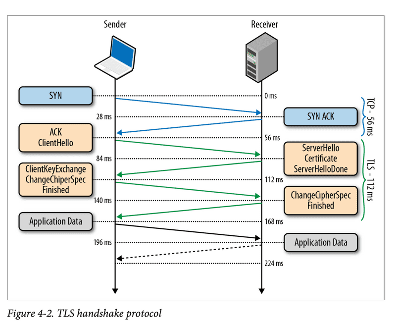
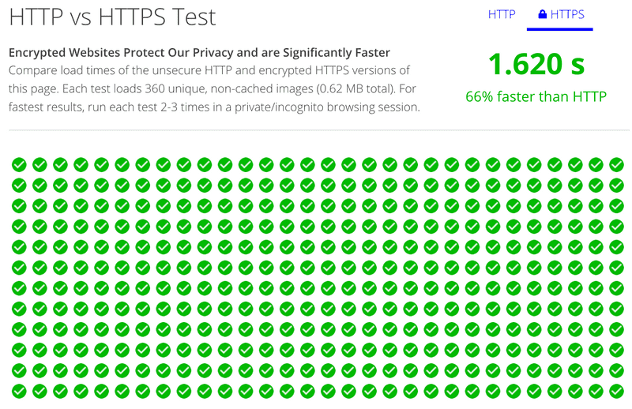
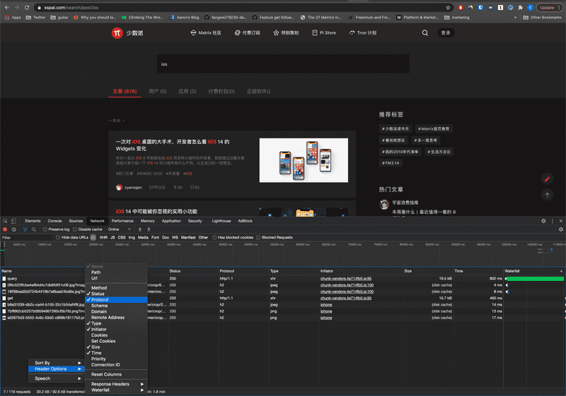
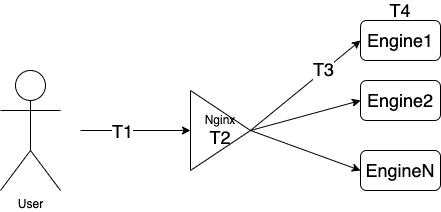
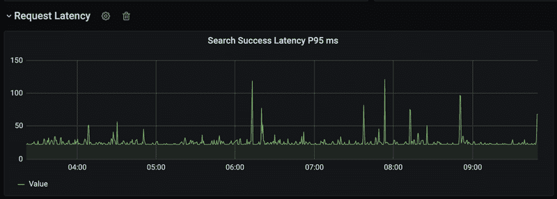
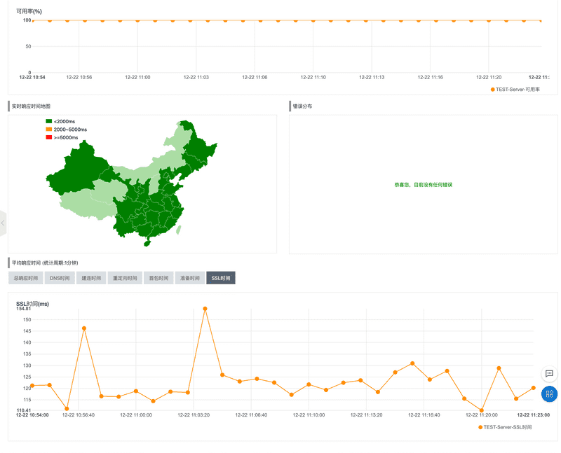

[
](https://kalasearch.cn/static/deb4260f26568dcb97a43ecf8622801f/29007/high-performance-nginx-header.png)让 Nginx 飞起来


## 为什么要优化 Ngin HTTPS 延迟

------

Nginx 常作为最常见的服务器，常被用作负载均衡 (Load Balancer)、反向代理 (Reverse Proxy)，以及网关 (Gateway) 等等。一个配置得当的 Nginx 服务器单机应该可以[期望承受住 50K 到 80K 左右](https://github.com/denji/nginx-tuning)每秒的请求，同时将 CPU 负载在可控范围内。

但在很多时候，负载并不是需要首要优化的重点。比如对于卡拉搜索来说，我们希望用户在每次击键的时候，可以体验即时搜索的感觉，也就是说，**每个搜索请求必须在 100ms - 200ms 的时间**内端对端地返回给用户，才能让用户搜索时没有“卡顿”和“加载”。因此，对于我们来说，优化请求延迟才是最重要的优化方向。

这篇文章中，我们先介绍 Nginx 中的 TLS 设置有哪些与请求延迟可能相关，如何调整才能最大化加速。然后我们用优化[卡拉搜索](https://kalasearch.cn/) Nginx 服务器的实例来分享如何调整 Nginx TLS/SSL 设置，为首次搜索的用户提速 30% 左右。我们会详细讨论每一步我们做了一些什么优化，优化的动机和效果。希望可以对其它遇到类似问题的同学提供帮助。

照例，本文的 Nginx 设置文件放置于 github，欢迎直接使用: [高性能 Nginx HTTPS 调优](https://github.com/Kalasearch/high-performance-nginx-tls-tuning)

## TLS 握手和延迟

------

很多时候开发者会认为：如果不是绝对在意性能，那么了解底层和更细节的优化没有必要。这句话在很多时候是恰当的，因为很多时候复杂的底层逻辑必须包起来，才能让更高层的应用开发复杂度可控。比如说，如果你就只需要开发一个 APP 或者网站，可能并没有必要关注汇编细节，关注编译器如何优化你的代码——毕竟在苹果或者安卓上很多优化在底层就做好了。

那么，了解底层的 TLS 和应用层的 Nginx 延迟优化有什么关系呢？

答案是多数情况下，优化网络延迟其实是在尝试减少用户和服务器之间的数据传输次数，也就是所谓的 roundtrip。由于物理限制，北京到云南的光速传播差不多就是要跑 20 来毫秒，如果你不小心让数据必须多次往返于北京和云南之间，那么必然延迟就上去了。

因此如果你需要优化请求延迟，那么了解一点底层网络的上下文则会大有裨益，很多时候甚至是你是否可以轻松理解一个优化的关键。本文中我们不深入讨论太多 TCP 或者 TLS 机制的细节，如果有兴趣的话请参考 [High Performance Browser Networking](https://hpbn.co/) 一书，可以免费阅读。

举个例子，下图中展示了如果你的服务启用了 HTTPS，在开始传输任何数据之前的数据传输情况。



在传输数据前数据已经跑了好几个来回 roundtrip


可以看到，在你的用户拿到他需要的数据前，底层的数据包就已经在用户和你的服务器之间跑了 3 个来回。

假设每次来回需要 28 毫秒的话，用户已经等了 224 毫秒之后才开始接收数据。

同时这个 28 毫秒其实是非常乐观的假设，在国内电信、联通和移动以及各种复杂的网络状况下，用户与服务器之间的延迟更不可控。另一方面，通常一个网页需要数十个请求，这些请求不一定可以全部并行，因此几十乘以 224 毫秒，页面打开可能就是数秒之后了。

所以，原则上如果可能的话，我们需要尽量减少用户和服务器之间的往返程 (roundtrip)，在下文的设置中，对于每个设置我们会讨论为什么这个设置有可能帮助减少往返程。

## Nginx 中的 TLS 设置


那么在 Nginx 设置中，怎样调整参数会减少延迟呢？

### 开启 HTTP/2

HTTP/2 标准是从 Google 的 SPDY 上进行的改进，比起 HTTP 1.1 提升了不少性能，尤其是需要并行多个请求的时候可以显著减少延迟。在现在的网络上，一个网页平均需要请求几十次，而在 HTTP 1.1 时代浏览器能做的就是多开几个连接（通常是 6 个）进行并行请求，而 HTTP 2 中可以在一个连接中进行并行请求。HTTP 2 原生支持多个并行请求，因此大大减少了顺序执行的请求的往返程，可以首要考虑开启。

如果你想自己看一下 HTTP 1.1 和 HTTP 2.0 的速度差异，可以试一下：https://www.httpvshttps.com/。我的网络测试下来 HTTP/2 比 HTTP 1.1 快了 66%。



HTTP 1.1 与 HTTP 2.0 速度对比


在 Nginx 中开启 HTTP 2.0 非常简单，只需要增加一个 http2 标志即可

```nginx
listen 443 ssl;

# 改为
listen 443 ssl http2;
```

如果你担心你的用户用的是旧的客户端，比如 Python 的 requests，暂时还不支持 HTTP 2 的话，那么其实不用担心。如果用户的客户端不支持 HTTP 2，那么连接会自动降级为 HTTP 1.1，保持了后向兼容。因此，所有使用旧 Client 的用户，仍然不受影响，而新的客户端则可以享受 HTTP/2 的新特性。

### 如何确认你的网站或者 API 开启了 HTTP 2

在 Chrome 中打开开发者工具，点开 `Protocol` 之后在所有的请求中都可以看到请求用的协议了。如果 `protocol` 这列的值是 `h2` 的话，那么用的就是 HTTP 2 了


用 Chrome 确认 HTTP/2 已经打开


当然另一个办法是直接用 `curl` 如果返回的 status 前有 `HTTP/2` 的话自然也就是 HTTP/2 开启了。

```shell
➜  ~ curl --http2 -I https://kalasearch.cn
HTTP/2 403
server: Tengine
content-type: application/xml
content-length: 264
date: Tue, 22 Dec 2020 18:38:46 GMT
x-oss-request-id: 5FE23D363ADDB93430197043
x-oss-cdn-auth: success
x-oss-server-time: 0
x-alicdn-da-ups-status: endOs,0,403
via: cache13.l2et2[148,0], cache10.l2ot7[291,0], cache4.us13[360,0]
timing-allow-origin: *
eagleid: 2ff6169816086623266688093e
```

### 调整 Cipher 优先级

尽量挑选更新更快的 Cipher，有助于[减少延迟](https://stackoverflow.com/questions/36672261/how-to-reduce-ssl-time-of-website):

```nginx
# 手动启用 cipher 列表
ssl_prefer_server_ciphers on;  # prefer a list of ciphers to prevent old and slow ciphers
ssl_ciphers 'EECDH+AESGCM:EDH+AESGCM:AES256+EECDH:AES256+EDH';
```

### 启用 OCSP Stapling

在国内这可能是对使用 Let's Encrypt 证书的服务或网站影响最大的延迟优化了。如果不启用 OCSP Stapling 的话，在用户连接你的服务器的时候，有时候需要去验证证书。而因为一些不可知的原因（这个就不说穿了）[Let's Encrypt 的验证服务器并不是非常通畅](https://juejin.cn/post/6844904135653851150)，因此可以造成有时候[数秒甚至十几秒延迟的问题](https://jhuo.ca/post/ocsp-stapling-letsencrypt/)，这个问题在 iOS 设备上特别严重

解决这个问题的方法有两个：

1. 不使用 Let's Encrypt，可以尝试替换为阿里云提供的免费 DV 证书
2. 开启 OCSP Stapling

开启了 OCSP Stapling 的话，跑到证书验证这一步可以省略掉。省掉一个 roundtrip，特别是网络状况不可控的 roundtrip，可能可以将你的延迟大大减少。

在 Nginx 中启用 OCSP Stapling 也非常简单，只需要设置：

```nginx
ssl_stapling on;
ssl_stapling_verify on;
ssl_trusted_certificate /path/to/full_chain.pem;
```

### 如何检测 OCSP Stapling 是否已经开启？

可以通过以下命令

```shell
openssl s_client -connect test.kalasearch.cn:443 -servername kalasearch.cn -status -tlsextdebug < /dev/null 2>&1 | grep -i "OCSP response"
```

来测试。如果结果为

```shell
OCSP response:
OCSP Response Data:
    OCSP Response Status: successful (0x0)
    Response Type: Basic OCSP Response
```

则表明已经开启。参考 [HTTPS 在 iPhone 上慢的问题](https://www.jianshu.com/p/2fb12a80c33f) 一文

### 调整 `ssl_buffer_size`

ssl*buffer*size 控制在发送数据时的 buffer 大小，默认设置是 16k。这个值越小，则延迟越小，而添加的报头之类会使 overhead 会变大，反之则延迟越大，overhead 越小。

因此如果你的服务是 [REST API](https://kalasearch.cn/blog/rest-api-best-practices/) 或者网站的话，将这个值调小可以减小延迟和 TTFB，但如果你的服务器是用来传输大文件的，那么可以维持 16k。关于这个值的讨论和更通用的 TLS Record Size 的讨论，可以参考： [Best value for nginx's ssl*buffer*size option](https://github.com/igrigorik/istlsfastyet.com/issues/63)

如果是网站或者 REST API，建议值为 4k，但是这个值的最佳取值显然会因为数据的不同而不一样，因此请尝试 2 - 16k 间不同的值。在 Nginx 中调整这个值也非常容易

```nginx
ssl_buffer_size 4k;
```

### 启用 SSL Session 缓存

启用 SSL Session 缓存可以大大减少 TLS 的反复验证，减少 TLS 握手的 roundtrip。虽然 session 缓存会占用一定内存，但是用 1M 的内存就可以缓存 4000 个连接，可以说是非常非常划算的。同时，对于绝大多数网站和服务，要达到 4000 个同时连接本身就需要非常非常大的用户基数，因此可以放心开启。

这里 `ssl_session_cache` 设置为使用 50M 内存，以及 4 小时的连接超时关闭时间 `ssl_session_timeout`

```nginx
# Enable SSL cache to speed up for return visitors
ssl_session_cache   shared:SSL:50m; # speed up first time. 1m ~= 4000 connections
ssl_session_timeout 4h;
```

## 卡拉搜索如何减少 30% 的请求延迟

卡拉搜索是国内的 [Algolia](https://kalasearch.cn/blog/algolia-alternative/)，致力于帮助开发者快速搭建即时搜索功能(instant search)，做国内最快最易用的搜索即服务。

开发者接入后，所有搜索请求通过卡拉 API 即可直接返回给终端用户。为了让用户有即时搜索的体验，我们需要在用户每次击键后极短的时间内（通常是 100ms 到 200ms）将结果返回给用户。因此每次搜索需要可以达到 50 毫秒以内的引擎处理时间和 200 毫秒以内的端对端时间。

> 我们用豆瓣电影的数据做了一个电影搜索的 Demo，如果感兴趣的话欢迎体验一下即时搜索，尝试一下搜索“无间道”或者“大话西游”体验一下速度和相关度：https://movies-demo.kalasearch.cn/

对于每个请求只有 100 到 200 毫秒的延迟预算，我们必须把每一步的延迟都考虑在内。

简化一下，每个搜索请求需要经历的延迟有




卡拉搜索的端对端延迟图示


总延迟 = 用户请求到达服务器(T1) + 反代处理(Nginx T2) + 数据中心延迟(T3) + 服务器处理 (卡拉引擎 T4) + 用户请求返回(T3+T1)

在上述延迟中，T1 只与用户与服务器的物理距离相关，而 T3 非常小（参考[Jeff Dean Number](https://gist.github.com/jboner/2841832))可以忽略不计。

所以我们能控制的大致只有 T2 和 T4，即 Nginx 服务器的处理时间和卡拉的引擎处理时间。

Nginx 在这里作为反向代理，处理一些安全、流量控制和 TLS 的逻辑，而卡拉的引擎则是一个在 Lucene 基础上的倒排引擎。

我们首先考虑的第一个可能性是：延迟是不是来自卡拉引擎呢？

在下图展示的 [Grafana 仪表盘](https://kalasearch.cn/blog/grafana-with-prometheus-tutorial)中，我们看到除了几个时不时的慢查询，搜索的 95% 服务器处理延迟小于 20 毫秒。对比同样的数据集上 benchmark 的 Elastic Search 引擎的 P95 搜索延迟则在 200 毫秒左右，所以排除了引擎速度慢的可能。


Search Grafana


而在阿里云监控中，我们设置了从全国各地向卡拉服务器发送搜索请求。我们终于发现 SSL 处理时间时常会超过 300 毫秒，也就是说在 T2 这一步，光处理 TLS 握手之类的事情，Nginx 已经用掉了我们所有的请求时间预算。

同时检查之后我们发现，在苹果设备上搜索速度格外慢，特别是第一次访问的设备。因此我们大致判断应该是因为我们使用的 Let's Encrypt 证书的问题。

我们按照上文中的步骤对 Nginx 设置进行了调整，并将步骤总结出来写了这篇文章。在调整了 Nginx TLS 的设置后，SSL 时间从平均的 140ms 降低到了 110ms 左右（全国所有省份联通和移动测试点），同时苹果设备上首次访问慢的问题也消失了。


调整后延迟


在调整过后，全国范围内测试的搜索延迟降低到了 150 毫秒左右。

## 总结

调整 Nginx 中的 TLS 设置对于使用 HTTPS 的服务和网站延迟有非常大的影响。本文中总结了 Nginx 中与 TLS 相关的设置，详细讨论各个设置可能对延迟的影响，并给出了调整建议。之后我们会继续讨论 HTTP/2 对比 HTTP 1.x 有哪些具体改进，以及在 REST API 使用 HTTP/2 有哪些优缺点，请继续关注