原创：小姐姐味道（微信公众号ID：xjjdog），欢迎分享，转载请保留出处。

有很多同学微信问我，Linux命令这么多，该怎么从入门到精通？其实，这个事情非常的simple，这篇文章将会带你飞。文章非常的长，要挑一个阳光明媚的sunshine weekend，耐心去搞定。


本文将由一个Linux命令概览开始，说明Linux命令的方方面面。如果你读完这部分还是一头雾水，那么就证明需要按照下面的小白教程去学习了，内容涵盖了：如何挑选Linux发行版、如何安装Linux系统，按照主题学习Linux系统的命令等。

入门后的 **学习方式：多敲多打，用条件反射替代大脑记忆--如果你将来或者现在要用它来吃饭的话。**其中，也有一些难啃的骨头，关注小姐姐味道微信公众号，我们一起用锋利的牙齿，来把它嚼碎。

## 1. Linux命令概览

这部分是给稍微有点Linux经验的同学准备的，如果你是初学者，请跳过此part直接进入第二部分。

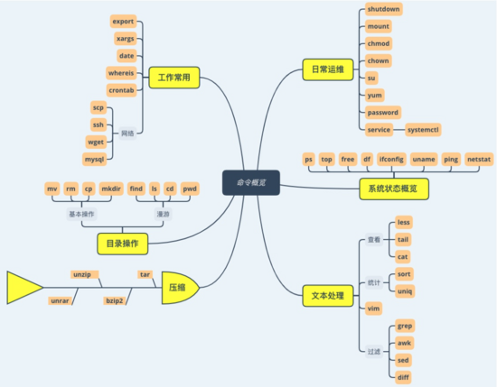

## 1.1目录操作

工作中，最常打交道的就是对目录和文件的操作。linux提供了相应的命令去操作他，并将这些命令抽象、缩写。

### 1.1.1 基本操作

可能是这些命令太常用了，多打一个字符都是罪过。所以它们都很短，不用阿拉伯数字，一个剪刀手就能数过来。


看命令。

mkdir创建目录  make dir **cp** 拷贝文件  copy **mv** 移动文件  move **rm** 删除文件 remove 

例子：

```
# 创建目录和父目录a,b,c,d
mkdir -p a/b/c/d

# 拷贝文件夹a到/tmp目录
cp -rvf a/ /tmp/

# 移动文件a到/tmp目录，并重命名为b
mv -vf a /tmp/b

# 删除机器上的所有文件
rm -rvf /
```

### 1.1.2 漫游

linux上是黑漆漆的命令行，依然要面临人生三问：我是谁？我在哪？我要去何方？

`ls` 命令能够看到当前目录的所有内容。 `ls -l` 能够看到更多信息，判断你是谁。 

`pwd` 命令能够看到当前终端所在的目录。告诉你你在哪。 

`cd` 假如你去错了地方，cd命令能够切换到对的目录。 

`find` find命令通过筛选一些条件，能够找到已经被遗忘的文件。 

至于要去何方，可能就是主宰者的意志了。

## 1.2 文本处理

这是是非常非常加分的技能。get到之后，也能节省更多时间来研究面向对象。小姐姐味道已经输出了“最常用的vim、sed、awk技巧系列”。

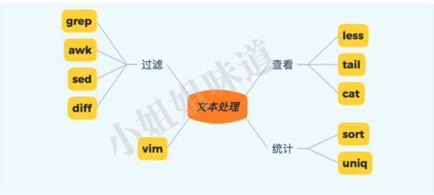

### 1.2.1 查看文件

cat 

最常用的就是 `cat` 命令了，注意，如果文件很大的话，cat命令的输出结果会疯狂在终端上输出，可以多次按 `ctrl+c` 终止。 

```
# 查看文件大小
du -h file

# 查看文件内容
cat file
```

less 

既然cat有这个问题，针对比较大的文件，我们就可以使用 `less` 命令打开某个文件。类似vim，less可以在输入 `/` 后进入查找模式，然后按 `n` (N)向下(上)查找。 

有许多操作，都和vim类似，你可以类比看下。

tail 

大多数做服务端开发的同学，都了解这么命令。比如，查看nginx的滚动日志。

```
tail -f access.log
```

tail命令可以静态的查看某个文件的最后n行，与之对应的，head命令查看文件头n行。但head没有滚动功能，就像尾巴是往外长的，不会反着往里长。

```
tail -n100 access.log
head -n100 access.log
```

### 1.2.1 统计

sort和uniq经常配对使用。sort可以使用 `-t` 指定分隔符，使用 `-k` 指定要排序的列。 

下面这个命令输出nginx日志的ip和每个ip的pv，pv最高的前10

```
# 2019-06-26T10:01:57+08:00|nginx001.server.ops.pro.dc|100.116.222.80|10.31.150.232:41021|0.014|0.011|0.000|200|200|273|-|/visit|sign=91CD1988CE8B313B8A0454A4BBE930DF|-|-|http|POST|112.4.238.213

awk -F"|" '{print $3}' access.log | sort | uniq -c | sort -nk1 -r | head -n10
```

### 1.2.3 其他

grep 

grep用来对内容进行过滤，带上 `--color` 参数，可以在支持的终端可以打印彩色，参数 `n` 则输出具体的行数，用来快速定位。 

比如：查看nginx日志中的POST请求。

```
grep -rn --color POST access.log
```

推荐每次都使用这样的参数。

如果我想要看某个异常前后相关的内容，就可以使用ABC参数。它们是几个单词的缩写，经常被使用。 **A** after  内容后n行 **B** before  内容前n行 **C** count?  内容前后n行 

就像是这样：

```
grep -rn --color Exception -A10 -B2   error.log
```

#### diff

diff命令用来比较两个文件是否的差异。当然，在ide中都提供了这个功能，diff只是命令行下的原始折衷。对了，diff和patch还是一些平台源码的打补丁方式，你要是不用，就pass吧。

## 1.3压缩

为了减小传输文件的大小，一般都开启压缩。linux下常见的压缩文件有tar、bzip2、zip、rar等，7z这种用的相对较少。


.tar使用tar命令压缩或解压 

.bz2使用bzip2命令操作 

.gz使用gzip命令操作 

.zip使用unzip命令解压 

.rar使用unrar命令解压 

最常用的就是 `.tar.gz` 文件格式了。其实是经过了tar打包后，再使用gzip压缩。 

创建压缩文件

```
tar cvfz  archive.tar.gz dir/
```

解压

```
tar xvfz. archive.tar.gz
```

快去弄清楚它们的关系吧。

## 1.4 日常运维

开机是按一下启动按钮，关机总不至于是长按启动按钮吧。对了，是shutdown命令，不过一般也没权限-.-!。passwd命令可以用来修改密码，这个权限还是可以有的。

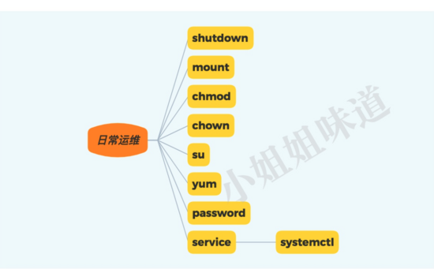

mount 

mount命令可以挂在一些外接设备，比如u盘，比如iso，比如刚申请的ssd。可以放心的看小电影了。

```
mount /dev/sdb1 /xiaodianying
```

chown 

`chown` 用来改变文件的所属用户和所属组。 

`chmod` 用来改变文件的访问权限。 

这两个命令，都和linux的文件权限777有关。

示例：

```
# 毁灭性的命令
chmod 000 -R /

# 修改a目录的用户和组为 xjj
chown -R xjj:xjj a

# 给a.sh文件增加执行权限（这个太常用了)
chmod a+x a.sh
```

yum 

假定你用的是centos，则包管理工具就是yum。如果你的系统没有wget命令，就可以使用如下命令进行安装。

```
yum install wget -y
```

systemctl 

当然，centos管理后台服务也有一些套路。 `service` 命令就是。 `systemctl` 兼容了 `service` 命令，我们看一下怎么重启mysql服务。 推荐用下面这个。 

```
service mysql restart
systemctl restart  mysqld 
```

对于普通的进程，就要使用kill命令进行更加详细的控制了。kill命令有很多信号，如果你在用 `kill -9` ，你一定想要了解 `kill -15` 以及 `kill -3` 的区别和用途。 

su 

su用来切换用户。比如你现在是root，想要用xjj用户做一些勾当，就可以使用su切换。

```
su xjj
su - xjj
```

`-` 可以让你干净纯洁的降临另一个账号，不出意外，推荐。 

## 1.5 系统状态概览

登陆一台linux机器，有些命令能够帮助你快速找到问题。这些命令涵盖内存、cpu、网络、io、磁盘等。


unameuname命令可以输出当前的内核信息，让你了解到用的是什么机器。 

```
uname -a
```

ps 

ps命令能够看到进程/线程状态。和top有些内容重叠，常用。

```
# 找到java进程
ps -ef|grep java
```

top系统状态一览，主要查看。cpu load负载、cpu占用率。使用内存或者cpu最高的一些进程。下面这个命令可以查看某个进程中的线程状态。 

```
top -H -p pid
```

free 

top也能看内存，但不友好，free是专门用来查看内存的。包括物理内存和虚拟内存swap。

df 

df命令用来查看系统中磁盘的使用量，用来查看磁盘是否已经到达上限。参数 `h` 可以以友好的方式进行展示。 

```
df -h
```

ifconfig 

查看ip地址，不啰嗦，替代品是 `ip addr` 命令。 

ping 

至于网络通不通，可以使用ping来探测。（不包括那些禁ping的网站）

netstat虽然ss命令可以替代netstat了，但现实中netstat仍然用的更广泛一些。比如，查看当前的所有tcp连接。 

```
netstat -ant
```

此命令，在找一些 `本地起了什么端口` 之类的问题上，作用很大。 

## 1.6 工作常用

还有一些在工作中经常会用到的命令，它们的出现频率是非常高的 ，都是些熟面孔。

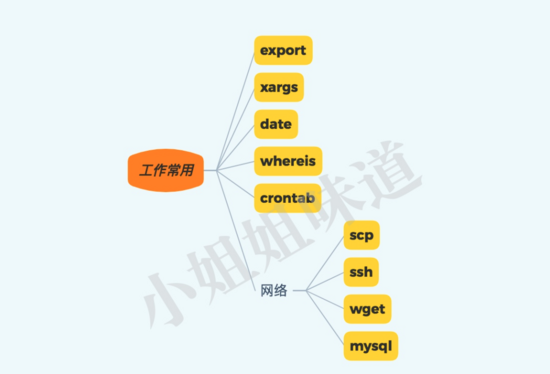

export 

很多安装了jdk的同学找不到java命令， `export` 就可以帮你办到它。export用来设定一些环境变量，env命令能看到当前系统中所有的环境变量。比如，下面设置的就是jdk的。 

```
export PATH=$PATH:/home/xjj/jdk/bin
```

有时候，你想要知道所执行命令的具体路径。那么就可以使用whereis命令，我是假定了你装了多个版本的jdk。

crontab 

这就是linux本地的job工具。不是分布式的，你要不是运维，就不要用了。比如，每10分钟提醒喝茶上厕所。

```
*/10 * * * * /home/xjj/wc10min
```

datedate命令用来输出当前的系统时间，可以使用-s参数指定输出格式。但设置时间涉及到设置硬件，所以有另外一个命令叫做 `hwclock` 。 

xargsxargs读取输入源，然后逐行处理。这个命令非常有用。举个栗子，删除目录中的所有class文件。 

```
find . | grep .class$ | xargs rm -rvf

#把所有的rmvb文件拷贝到目录
ls *.rmvb | xargs -n1 -i cp {} /mount/xiaodianying
```

## 1.7 网络

linux是一个多作业的网络操作系统，所以网络命令有很多很多。工作中，最常和这些打交道。

ssh 

这个，就不啰嗦了。你一定希望了解 `ssh隧道` 是什么。你要是想要详细的输出过程，记得加参数 `-v` 。 

scp 

scp用来进行文件传输。也可以用来传输目录。也有更高级的 `sftp` 命令。 

```
scp a.txt 192.168.0.12:/tmp/a.txt
scp -r a_dir 192.168.0.12:/tmp/
```

wget 

你想要在服务器上安装jdk，不会先在本地下载下来，然后使用scp传到服务器上吧（有时候不得不这样）。wget命令可以让你直接使用命令行下载文件，并支持断点续传。

```
wget -c http://oracle.fuck/jdk2019.bin
```

mysql 

mysql应用广泛，并不是每个人都有条件用上 `navicat` 的。你需要了解mysql的连接方式和基本的操作，在异常情况下才能游刃有余。 

```
mysql -u root -p -h 192.168.1.2
```

不要觉得复杂，命令是有限的，但激情无限；都会也不要骄傲，一个vim就够折腾一辈子。捷径就是总结，深入只有探索。白马过隙，终会行云流水，手到擒来。

物是人非，年华易老。唯有时光，不会辜负。

## 2. 挑选一个Linux发行版

和Linux比较像的还有Unix，但如果你是一个二三十岁的小青年，你接触到可能只有Linux的世界了。从手机，到服务器上广泛使用的 `centos` ，到漂亮的桌面发行版 `ubuntu` ，甚至是风靡全球的 `树莓派` ，到处都是linux的身影。 

## 2.1 你需要知道这些linux历史

知道一点相关操作系统的历史，是能够陶冶情操的。 `GNU/Linux` 是为了抵制一些商业公司的垄断行为而发展起来的，凝结了一代互联网人向往自由的心血。 

和其他Unix比起来，Linux其实很年轻。直到 **1991** 年，一个叫 `Linus Torvalds` 的芬兰年轻人才开始开发我们现在所知道的 `Linux内核` 。 

`Linux` 的吉祥物是企鹅，这个吉祥物直到 **1996** 年才确定，所以你会经常看到一些搞笑的图片。如果你是90后，那这只小企鹅几乎和你一般大，还是个年轻的小伙。 


Linux的发展历程比较的复杂。经过一次次的过关斩将，Linux走到今天确属不易。关于其发展历史，你可以通过下面的链接，查看高清图片。20年的时间，对软件行业来说，是一段非常漫长的时光，有多少的风光已经物是人非。 

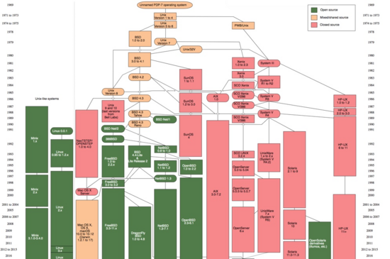

高清见图片(http://1t.click/aUnx) 。可以看到，linux只占了那可怜的一小块。这就像人类的出现，在生命的长河中，微不足道，但却是一个质的飞跃。 

你可能注意到，在前面的描述中，说的是 `GUN/Linux` ，而不仅仅是 `Linux` 。Linux本身只是一个内核，作用有限，只有和 `GNU` 联合起来，拥有完整的生态才会发挥它的作用。 

谈到上面区别的原因，是为了记住 `Richard Stallman` 在1983年发起的 `GNU` 计划。他同时是 `smalltalk` 语言的发明者，被公认的第二个面向对象的语言。我在早些年，还研究过一段时间。哦，他还编写了一个巨无霸编辑器， `Emacs` 。 

只有一个人被捧成神，他才会有能量折磨你。

针对于Linux历史，我们不做过多介绍。下面介绍几个经典的发行版本。

## 2.2 精选版本介绍

现在的Linux发行版本，已经有上千个，你要是喜欢、而且多金，你也可以做一个。如何在这其中，找到最合适的版本，是需要经过一番折腾的。很多发行版本，其实是很小众的。

这不像是哲学领域的某些东西，真理掌握在少数人手中。只有获得良好发展，并得到认可的Linux发行版，才有它的价值，可以说是彻头彻尾的实用主义。

但这东西又像女朋友，刚开始感觉风采迥异，各有千秋，到最后了解到是一样的庸俗不堪。但有人就是喜欢Linux相关的工作，一干就是一辈子...

我可以先说一下自己的历程。刚开始，接触的是红帽 `redhat` ，当时还没有分什么企业版。用了一段时间以后，又切换成更稳定的 `slackware` 。但是slackware上的程序更新实在太慢了，于是又切换成readhat血统的 `fedora` ，这个版本的软件保鲜度很高。其间，又尝试了其他几个linux版本，最终，在2013年前后，换成了滚动升级的 `archlinux` ，直到现在。 

要我个人做个推荐的话：

1、个人用户（技术），桌面版用 `ubuntu` => `archlinux` 。 

2、企业用户，服务器，使用 `centos` 。 

## 2.3 主要起源

这么多Linux版本，其实有两条主线。 `debian` 系列和 `redhat` 系列。很多发行版本，其实是二次翻新，很多就直接拿这两个基础系列进行改造。正所谓： **操作系统千千万，都是帽子和大便。**

### debian

下面这个屎一样的图表，就是debian。呃呃呃，和大便只差一个字母。


`Debian计划` 是一个致力于创建一个自由操作系统的合作组织。它的特点是：稳定、安全，到现在为止，已经发展了20多年了。我们所熟悉的ubuntu，就是基于debian改进的。 

### redhat


红帽是一家商业公司，涉足Linux比较早，现在对个人提供一些 `红帽认证` 之类的证书。现在云主机使用较多的centos，包括红帽公司的 `RHEL` ，占据了大部分服务器市场。近期， `centos 8` 推出了 `centos stream` 滚动版本，看起来更像是一个正常的操作系统。 

## 2.4 典型版本

我们看一下处于不同层次的几个典型版本。从应用方面来说，linux有桌面、服务器、研究用等用途。

### 2.4.1、ubuntu


ubuntu的出现，对Linux的推广有不可磨灭的贡献。它是一个易于安装的桌面版本（也有服务器版本），界面非常漂亮。ubuntu是基于debian系统的unstable分支修改的，包管理软件是 `apt-get` 。 

它的创建者是 `Mark Shuttleworth` ，南非企业家，世界上第二名自资的太空游客。我想，无论是太空还是ubuntu，这都是梦想吧。 

### 2.4.2、centos


centos是目前最流行的服务器版本。它是RHEL源代码再编译的产物，主要是为了绕开一些法律问题。在包管理，甚至稳定性上，与红帽企业版没什么差别。

### 2.4.3、archlinux


archlinux采用 `滚动升级` 的模式进行发行，尽全力提供最新的稳定版本。刚开始安装，arch只提供一个基本的系统，甚至连界面都没有，对初学者不是很友好。 

但是，archlinux是非常干净的系统。很多软件，只有你需要的时候才会安装。它的软件和理念通常都是最新的，定制化非常强，深得许多Linux爱好者的喜爱。

### 2.4.4、gentoo


上面的archlinux，提供了编译后的软件包。用户在安装软件时，只需要下载、解压即可。gentoo将这个过程更近一步，可以说更加的变态。它下载的是软件的源代码，然后在本地进行编译，然后安装。 

这通常非常的蛋疼，因为下载、编译会花费非常长的时间，但它有一个非常大的优点，就是稳定。

这个系统比较底层，对技能要求更多，不太推荐。

### 2.4.5 、LFS


LFS的全拼是“linux from scratch”，意思是从零构建一个linux系统。它有一个非常详细的安装文档，教你怎样编译内核，编译引导程序，编译和配置必要的软件。 

这是一个疯狂而必要的过程。如果你想要自己的Linux之上更上层楼，跟着文档做一遍是受益无穷的。你需要经过多次交叉编译，最终使用chroot命令切换到新系统进行后续操作。

想做一个自己的发行版么？从这开始吧。

### 2.4.6、kali


kali linux是一个非常专业的发行版。如果你在做渗透方面的工作，将是一个非常好的选择。

发行版的安装包非常大，包含了常见的破解工具，渗透工具，攻击工具。这非常的危险，我曾用它暴力破解了非常多的wifi密码，成功的窥视了邻居的隐私。还是非常好用的。

## 3. 安装一个清爽的Linux系统

工欲善其事，必先利其器。你可能会想到买一台云主机练练手，但那毕竟要花点银子，我们可以自己安装一个。我们在上面提到，目前使用最广泛的，就是 `centos` 。不论你是自建机房，还是使用类似于阿里云这样的云端环境，大多数都会提供 `centos` 的安装。 

你可能会找到多种安装虚拟机的方式。本小节，将使用 `虚拟双网卡` 的方式，准备一个纯洁的环境。这一小节，图片很多。 

以阿里云为例，默认第一位就是CentOS，提供了从7.6版本到旧版本的多个镜像。


## 3.1 下载

下面的文章，我们就以 `CentOS 7` 稳定版本为基础环境。centos很流行，所以镜像也有很多。国内，我们从上海交大下载，速度应该会快一些。 

```
http://ftp.sjtu.edu.cn/centos/7/isos/x86_64/CentOS-7-x86_64-Minimal-1908.iso
```

如果交大哪天不维护了。可以从这里找：

```
http://centos.mirror.ndchost.com/7/isos/x86_64/CentOS-7-x86_64-Minimal-1908.iso
```

为了让大家学到更多的知识，我们使用 `最小化` 的系统ISO。最小化的iso不到 `1GB` ，而预装了很多软件的dvd有 `4.3GB` 的大小。我们就用这个减肥版。 

## 3.2 安装Linux

要想快速学习、体验Linux，最便捷的方式，就是使用虚拟机进行安装。目前，最流行的虚拟机，一个是 `VMware` ，一个是 `VirtualBox` 。在MacOS上还有一个 `Parallels Desktop` 。 

其中，VirtualBox免费而且跨平台，能够满足我们的需求。接下来，将一步步引导你进行安装。

#### (1) 点击新建，开启安装旅程。

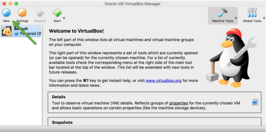

#### (2) 填写名称，版本。然后点击继续。

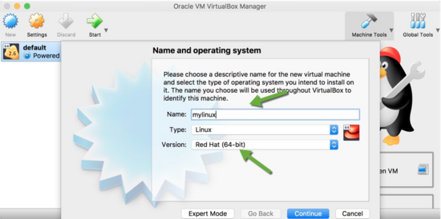

#### (3)按照你的机器配置，选择内存

我的机器是8GB内存的，就分配给虚拟机2GB，这个已经足够用了。

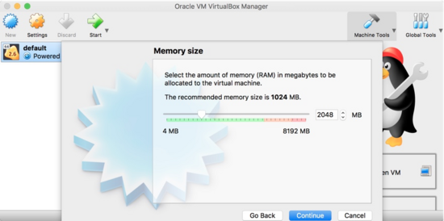

#### (4) 创建一个虚拟磁盘

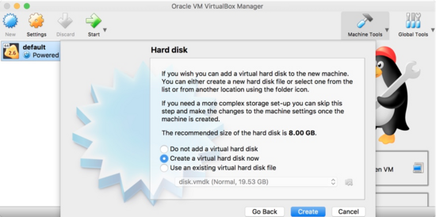

点击继续后，将弹出一个对话框。我们不用多管，一直点继续，知道对话框消失。这非常的粗暴。 

#### (5) 接下来，点击设置。

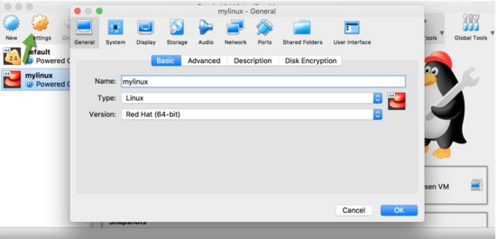

#### (6) 切换到Storage选项，选择我们下载的iso

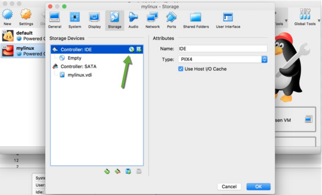

#### (7) 点击启动，开始安装。

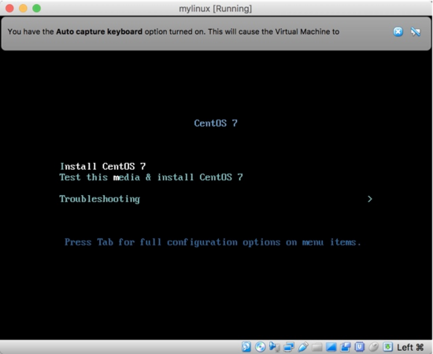

使用方向键切换，使得高亮聚焦在 `Install CentOS 7` 上。点击确定，开始安装。 

#### (8) 弹出一个安装界面

接下来的步骤有点多，如果我们没有特别的介绍，那么直接continue就ok了。


#### (9) 接下来，配置磁盘分区

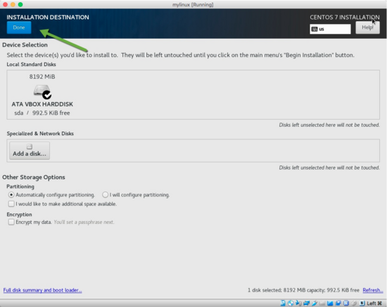

依然保持默认，并按按钮 `Done` 退出。 

#### (10) 配置用户

linux上默认的用户名为 `root` 。接下来我们设置root用户的密码为 `123456` 。由于这是一个弱密码，所以需要点击两次确定退出。 

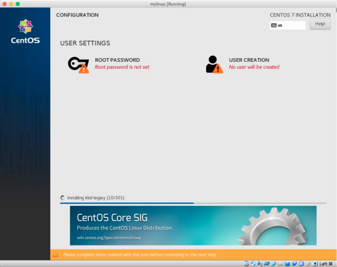

#### (11) 等待安装完毕，进行重启

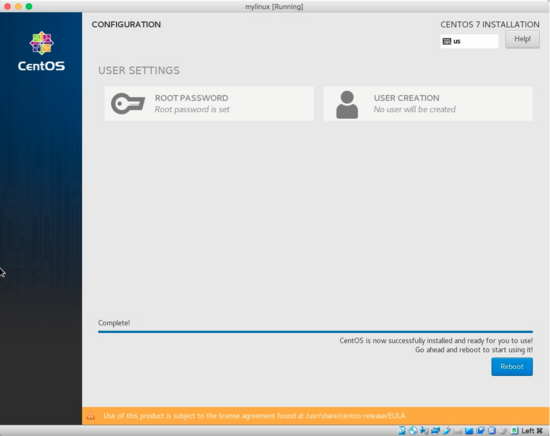

#### (12) 安装成功

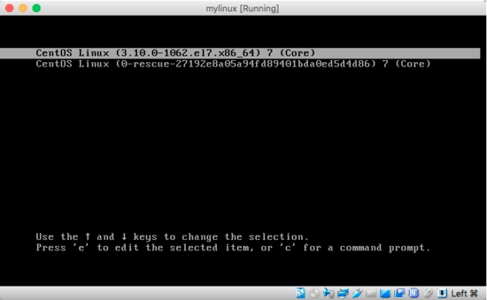

## 3.3 联网

这个时候，我们安装的虚拟机，还不能联网，无法把自己的意念传达出去。由于我们没有对虚拟机进行任何设置，所以使用的是默认的 `NAT` 模式。 

将光标聚焦到命令行窗口，然后输入命令 `dhclient` 。等待几秒钟，执行 `ping baidu.com` 测试以下网络，可以看到能够正常访问网络了。 

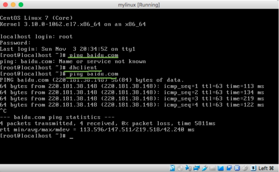

上面黑漆漆的窗口，就是我们现在的Linux界面。有人觉得很丑，就像是在玩dos，但像我这种不可救药的人，却觉得格外的亲切。

接下来的命令，我们不会再截图，而使用高亮的代码块表示。为了不至于让人晕头转向，请先看下图。

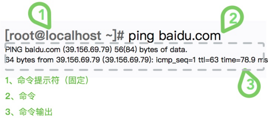

## 3.4 外部访问虚拟机

由于 `NAT` 模式的特点，我们的虚拟机能够访问外网，但无法被外部发现。酒香竟怕巷子深。为了解决这个问题，我们需要再添加一块网卡。 

在做这些更改之前，需要首先关闭虚拟机。可以强制关闭机器，也可以在命令行中输入：

```
shutdown -h now
```

虚拟机关闭后，再次点击设置，切换到网络适配器选项卡。如图，添加一个新的网络适配器，适配器类型为 `Host-only Adapter` 。通过这块网卡，我们的宿主机就能够访问它了。 

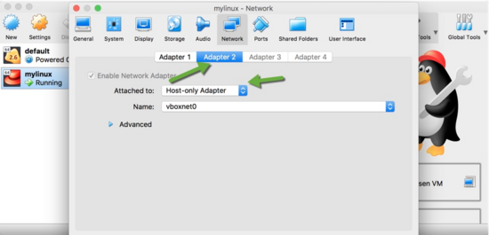

再次启动虚拟机，执行 `dhclient` 命令后，执行 `ip addr` 查看主机的ip地址。可以看到，我们现在有两块网卡，两个ip地址。 

记录下192打头的网络地址，我们会使用外部的程序，比如 `XShell` 、 `SecureCRT` 等，进行连接。比如，我这里的ip地址是： `192.168.99.100` 。不废话，看图。 

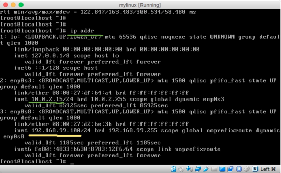

小提示：关于虚拟网卡的网段，如果有差异。你可以在全局设置里，改成和我一样的。

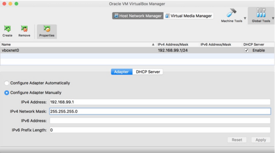

## 3.5 远程连接

你可能已经体验到，通过虚拟机自带的命令行界面进行输入，局限性非常大。通过远程连接，可以把终端界面切换到我们熟悉的操作模式，如果能够显示彩色的终端，那再好不过了。下面介绍几个工具，一般的，使用xshell的居多。

#### Windows

- `XShell` 你可能在公司内，见过你的SRE同事，运指如飞，命令字符如流水一般撒过屏幕。即使非常繁杂，难以记忆的密码，也能瞬间输入。他可能用的就是xshell。 
- `SecureCRT` 比较老的一款产品，使用也较多。 
- `MobaXterm` MobaXterm就是一单文件纯绿色软件，下载过来exe包直接运行即可，不需要任何的安装过程。 

它们都有免费版和专业版之分。无力购买的话，就找找破解版。但是注意，盗版汉化的ssh客户端，有些别有用心的人会在软件中植入木马，窃取你的密码、证书，这种情况已经发生过很多次。

#### MacOS

对于macos用户来说，简单的很。直接使用iTerm，输入命令行即可。比如使用下面的命令连接我们的机器。

```
ssh root@192.168.99.100
```


#### Linux

唔，你都已经是Linux环境了，还折腾个啥虚拟机呢？直接用吧。

推荐使用XShell、SecureCRT、iTerm等工具，通过ssh进行远程连接。对于一些命令拷贝、验证来说，要方便快捷的多。


## 4. 对Linux命令行有个初步了解 

万事开头难。面对黑漆漆的Linux窗口，要勇敢的走出第一步。不要怕输错了什么，系统健壮的很。命令行通常会拥有比图形界面更高的效率，更加重要的是它可以做自动化之类的小工具，这使得生产力产生质的飞跃。

现在，你已经安装好了centos，并远程连接上了它。我们拥有了它，但并不能了解它的脾气。接下来，让我们进入Linux命令行的世界。和我签订契约吧，少年。

本小节会使用非常详细的演进方式，来看一下一个命令，是怎样生成和执行的。

## 4.1、简单尝试

好啦，我们现在就在终端里了。什么叫做终端呢？你在很多黑客电影里，看到的黑漆漆的界面就是，它提供了一个可以输入字符串的交互式界面，至于那些闪光的、扫描机一样的东西，是不存在的。

尝试输入些什么吧。 比如： `jdsjf` 。 

```
[root@localhost ~]# jdsjf
-bash: jdsjf: command not found
```

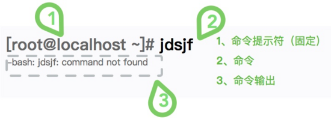

我们再次把这张图贴一下。怎么回事？命令的输出翻译成中文，就是“找不到命令”的意思。什么叫命令？就是我们上面随便输入的字符串 `jdsjf` 。 

然后，我们看下提示中其他一些有用的东西。

↓↓↓↓↓↓

bash代表的是我们所使用的 `shell` ，shell可以认为是一个解释器，将我们的输入解释成一系列可执行的指令。现在的linux发行版，最流行的就是bash解释器，几乎每个都预装了它。 

命令找不到，证明我们的字符串bash解释不了。但是，Linux上一些目录里的文件，是可以被默认找到的，这些目录的集合，就叫 `PATH` 。PATH还是一个环境变量，我们可以通过命令查看它的尊容。 

```
[root@localhost ~]# echo $PATH
/usr/local/sbin:/usr/local/bin:/usr/sbin:/usr/bin:/root/bin
```

想要知道系统中有哪些命令，就可以看下上面这些文件夹中，都有哪些文件。文件非常非常之多，但是大部分我们不会接触。所以，xjjdog才会写这么个东西--聚焦那些最常用，最有用的命令，最常用的参数，最有用的场景。

命令输出后，还有一些额外的东西，比如 `[root@localhost ~]` ，这部分叫做提示符，光标会一直跳动，等待你的输入。这部分是可以定制的，甚至可以定制的十分漂亮。 

## 4.2、Hello World

到现在为止，我们什么都没得到。按照程序员的想法来说，就要实现一个 `hello world` 的程序。在终端shell里，这个过程变得简单，远比写一个java程序简单。 

```
[root@localhost ~]# echo "Hello World"
Hello World
```

如上所示， `echo` 的意思就是输出一些内容。后面的 `Hello World` ，就叫做参数，它们之间以空格分隔，可以接受多个参数。 

```
[root@localhost ~]# echo "Hello World" , "Fuck 996"
Hello World , Fuck 996
```

以上命令能够正常运行，证明echo是我们的终端能够认识的一个命令。那到底这个命令是在什么地方呢？可以使用 `whereis` 命令进行查找。 

```
[root@localhost ~]# whereis echo
echo: /usr/bin/echo /usr/share/man/man1/echo.1.gz
```

命令显示。我们的echo命令全路径，是 `/usr/bin/echo` ，由于它处于PATH目录中，所以能够被识别到。 

## 4.3、将命令加入PATH

接下来，我们把上面的命令，做成一个脚本。然后将这个脚本，放到PATH目录中。不过先等等，我们要先给命令起个名字。

首先需要创建一个文件。在Linux上，创建文件使用 `touch` 命令。 

```
[root@localhost ~]# touch jdsjf
```

命令执行后，什么都没发生，它只是创建了一个空文件。接下来，我们向其中添加一些内容。

```
[root@localhost ~]# echo "echo 'Hello World'" > jdsjf
```

注意符号 `>` ，它的意思是，将前面的输出，重定向到后面的文件中。执行完上面的命令， `jdsjf` 中的内容，就变成了 `echo 'Hello World` 。 

接下来，我们尝试着去执行刚才生成的命令。

```
[root@localhost ~]# ./jdsjf
-bash: ./jdsjf : Permission denied
```

我们通过相对路径的方式，来执行刚刚生成的命令。结果，终端显示我们并没有这个命令的执行权限。

其实，Linux在权限控制这一方面，非常的详细。一个文件，有可读、可写、可执行三种属性。如果想要一个文件能够执行，需要给它添加执行权限，这个过程是由命令 `chmod` 完成的。 

```
[root@localhost ~]# chmod u+x jdsjf
[root@localhost ~]# ./jdsjf
Hello World
```

我们将在后面的章节，来详细介绍权限方面的知识。如上所示，命令已经能正常输出，接下来，我们把命令 `移动` 到PATH中的一个目录。 

```
[root@localhost ~]# mv jdsjf /usr/local/bin/
[root@localhost ~]# jdsjf
Hello World
```

不需要加任何的相对路径，现在，只需要输入jdsjf，就可以正常输出一串数字。我们成功的让一个没有任何意义的字符串，表达了它的想法。虽然我们依然是它的主宰。

你可以想一下下面这三个问题：

1、我可以自定义一个目录，比如 `/root/mybin` ，把它加入到PATH么？ 

2、我可以省略上面的touch命令，直接使用重定向生成文件么？

3、除了放到PATH和相对路径，还有没有其他的命令执行方式？


## 5.  Linux漫游方式

想要了解linux的基本使用方法，就要了解一个基本的事实--linux系统中，一切皆文件。

不管是命令，还是文档，甚至设备，目录，套接字，在linux上对它们的操作都是一致对待的。许多开发驱动程序的小伙伴，会发现使用的一些函数，和读写文件的没什么两样（open、close、read、write、ioctl）。今天我们所说的基本操作，针对的就是普通文件和目录，本小节将详细解释相关命令。

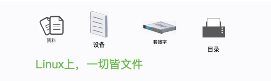

## 5.1、当前路径


到现在为止，我们还不知道自己在系统的什么地方。在浏览器上，我们能够通过导航栏上的url，了解到自己在互联网上的具体坐标。相似的功能，是由 `pwd` 命令提供的，它能够输出当前的工作目录。 

`pwd` 命令是非常非常常用的命令，尤其是在一些 `命令提示符` 设置不太友好的机器上。另外，它也经常用在shell脚本中，用来判断当前的运行目录是否符合需求。 

有很多线上事故，都是由于没有确认当前目录所引起的。比如 `rm -rf *` 这种危险的命令。在执行一些高危命令时，随时确认当前目录，是个好的习惯。 

```
[root@localhost ~]# pwd
/root
```

我们使用root用户默认登陆后，就停留在 `/root` 目录中。Linux中的目录层次，是通过 `/` 进行划分的。 

## 5.2、文件系统用户标准

Linux的文件系统，从一开始就有一个规范标准。它还有一个专有缩写名词，叫做 `FHS` (Filesystem Hierarchy Standard)。FHS经过多年的演进，目录结构也越来越清晰。除了一些标准的要求，还有一些使用者之间的约定。 

接下来，我们大体看一下linux上的默认目录，对其有一个基本的感觉。

| 第1层 | 第二层                                                       | 介绍                                 |
| :---- | :----------------------------------------------------------- | :----------------------------------- |
| /bin  | 目录/usr/bin的软链接                                         |                                      |
| /sbin | 目录/usr/sbin的软链接                                        |                                      |
| /lib  | 目录/usr/lib的软链接                                         |                                      |
| /usr  | /bin                                                         | 存放一些常用的命令                   |
| /usr  | /sbin                                                        | 存放一些管理员常用的命令             |
| /usr  | /lib                                                         | 用来存放动态库和一些模块文件         |
| /sys  | 内核中的数据结构的可视化接口                                 |                                      |
| /proc | 内存映像                                                     |                                      |
| /run  | 内存映像                                                     |                                      |
| /boot | 存放引导程序，内核相关文件                                   |                                      |
| /dev  | 存放一些 `设备文件` ，比如光盘                               |                                      |
| /etc  | 用于存储一些全局的、应用的配置文件                           |                                      |
| /var  | 与/var/run一样，存放的是系统运行时需要的文件，比如mysql的pid等 |                                      |
| /tmp  | 非常特殊的临时文件夹，断电丢失                               |                                      |
| /home | /**                                                          | 用户目录，比如我的目录是/home/xjjdog |
| /root | root用户的home目录                                           |                                      |

- `home` 平常，我们打交道最多的目录，就集中在自己的用户目录，我们可以在里面做任何操作，比如我们现在root用户的 `/root` 目录。一些自己的资料，比如视频、音频、下载的文件，或者做测试用的一些数据资料，就可以自行在这些目录下规划。root用户比较特殊，普通用户的私人目录都是在/home下的。 
- `/etc` etc目录是经常要打交道的目录，存放了一些全局的系统配置文件和应用配置文件。比如你安装了php，或者nginx，它们的配置文件就躺在/etc目录下的某个文件夹里。 
- `/var` var目录存放一些运行中的数据，有必须的，也有非必须的。一些黑客入侵之后，会在这里面的某些文件中留下痕迹，他们会着重进行清理。var目录还是一些应用程序的默认数据存放之地，比如mysql的数据文件。 
- `/tmp` 目录是一个特殊的临时目录，文件在断电以后就消失了。但这个目录，所有的用户，都有写入权限，通常用来做文件交换用。 
- `/proc` 和 `/sys` 目录，是两个神奇的目录。它们两个是一种伪文件系统，可以通过修改其中一些文件的状态和内容，来控制程序的行为（修改后会直接刷到内存上，太酷了）。刚开始的时候，只有proc目录，由于里面内容有多又乱，后面又规划出sys目录，用来控制内核的一些行为。如果你在调优一些系统参数，和这些文件打交道的时间比较多。 
- 还有几个空的目录，我们没有列在上面的表格上。比如 `/srv` 目录，通常会把一些web服务的资料，比如nginx的，放在这里面。但是，这并不是强制要求的，所以我见过的 `/srv` 目录，通常会一直是空的。同样的， `/opt` 目录也是这样一个存在，你就当它不存在就行。这都属于使用者规划的范畴，自定义性非常强。 
- 在使用Linux系统的时候，也可以创建自己的目录。比如，我就喜欢自己创建一个叫做 `/data` 的目录，用来存放一些数据库相关的内容。举个例子， `/data/mysql` 存放mariadb的数据，而 `/data/es/` 存放elasticsearch的索引内容。 

linux上的文件类型有很多，它们大部分都分门别类的存放在相应的目录中，比如/dev目录下，就是一些设备文件；/bin文件下，是一些可以执行命令。通常都好记的很。

## 5.3、查看文件列表

所以，上面的表格内容，我是怎么看到的呢，靠记忆么？ `ls` 命令，能够列出相关目录的文件信息。可以被评为linux下最勤劳的命令标兵。 

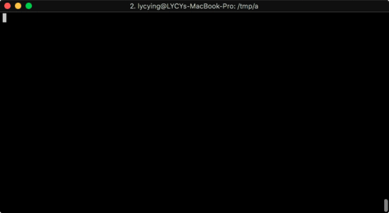

现在的终端，都能够输出彩色的信息，非常的直观。 `oh-my-zsh` 和 `oh-my-bash` 等项目，可以让你的终端更加的漂亮。把它加入到你的研究清单里吧。 

```
[root@localhost /]# ls /
# 注意：ls可以接受路径参数，你不用先跳转，就可以输出相关信息
bin  boot  dev  etc  home  lib  lib64  media  mnt  opt  proc  root  run  sbin  srv  sys  tmp  usr  var
[root@localhost /]# ls -l /
# 带上 -l参数，可以查看一些更加详细的信息。
total 20
lrwxrwxrwx.   1 root root    7 Nov  3 20:24 bin -> usr/bin
dr-xr-xr-x.   5 root root 4096 Nov  3 20:34 boot
drwxr-xr-x.  19 root root 3080 Nov  3 21:19 dev
drwxr-xr-x.  74 root root 8192 Nov  3 20:34 etc
drwxr-xr-x.   2 root root    6 Apr 11  2018 home
lrwxrwxrwx.   1 root root    7 Nov  3 20:24 lib -> usr/lib
lrwxrwxrwx.   1 root root    9 Nov  3 20:24 lib64 -> usr/lib64
drwxr-xr-x.   2 root root    6 Apr 11  2018 media
drwxr-xr-x.   2 root root    6 Apr 11  2018 mnt
drwxr-xr-x.   2 root root    6 Apr 11  2018 opt
dr-xr-xr-x. 108 root root    0 Nov  3 21:19 proc
dr-xr-x---.   2 root root  135 Nov  4 07:53 root
drwxr-xr-x.  24 root root  740 Nov  3 21:20 run
lrwxrwxrwx.   1 root root    8 Nov  3 20:24 sbin -> usr/sbin
drwxr-xr-x.   2 root root    6 Apr 11  2018 srv
dr-xr-xr-x.  13 root root    0 Nov  3 21:19 sys
drwxrwxrwt.   9 root root 4096 Nov  4 03:40 tmp
drwxr-xr-x.  13 root root  155 Nov  3 20:24 usr
drwxr-xr-x.  19 root root  267 Nov  3 20:34 var
```

ls最常用的，就是加参数 `l` 或者参数 `a` 。 

### 5.3.1、详细信息


加上参数 `l` ，能够看到文件的一些权限信息已经更新日期等。但我们还看到了一些更有意思的东西。比如： 

```
lib -> usr/lib
```

上面表示的，是软链接信息。

就如同我们上面表格所展示的一样， `lib` 目录，是 `/usr/lib` 的快捷方式，它们之中的内容，没有什么两样。 

关于 `ls -l` 展示的更加详细的内容，可以参照我下面的这张图。我们将在了解后面小节的内容后，再次对这张图进行回顾。 

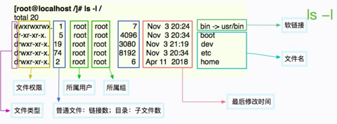

### 5.3.2 隐藏文件 

直接在你的/root目录里，执行 `ls -al` ，你会看到更多东西。这些额外的隐藏文件，都是以 `.`开头，以配置文件居多。这就是参数 `a` 的作用。 

```
[root@localhost ~]# ls -al
total 28
dr-xr-x---.  2 root root  135 Nov  4 07:53 .
dr-xr-xr-x. 17 root root  224 Nov  3 20:28 ..
-rw-------.  1 root root 1273 Nov  3 20:28 anaconda-ks.cfg
-rw-------.  1 root root  246 Nov  4 11:41 .bash_history
-rw-r--r--.  1 root root   18 Dec 28  2013 .bash_logout
-rw-r--r--.  1 root root  176 Dec 28  2013 .bash_profile
-rw-r--r--.  1 root root  176 Dec 28  2013 .bashrc
-rw-r--r--.  1 root root  100 Dec 28  2013 .cshrc
-rw-r--r--.  1 root root  129 Dec 28  2013 .tcshrc
```

细心的同学，应该会注意到两个特殊的目录。 `.` 和 `..` 。前者表示的是当前目录，而后者表示的是上层目录。 

使用 `cd` 命令，将在这些目录中，自由穿梭。 

小技巧：如果你对英文日期阅读困难，可以使用 `ls -al --full-time` 查看可读的日期。 

## 5.4、切换目录


执行cd命令，可以将工作目录切换到目标文件夹。为了展示cd命令的效果。请在root用户下，执行下面的命令，这将创建一个7层的目录。

```
cd
mkdir -p a1/b2/c3/d4/e5/f6/{g7,g8,g9,g10}
```

我们使用cd命令，切换到最后一层。然后，我们使用 `..` 切换到上层目录。 

```
[root@localhost ~]# cd a1/b2/c3/d4/e5/f6/g7
[root@localhost g7]# pwd
/root/a1/b2/c3/d4/e5/f6/g7

[root@localhost g7]# cd ..
[root@localhost f6]# pwd
/root/a1/b2/c3/d4/e5/f6
```

所以，切换到上面n层目录，只需使用多层级的 `../` 即可。有几个特殊的变量，需要说明一下。 

- `../` 指的是上层目录 
- `../../` 指的是上两层目录 
- `./` 指的是当前目录 
- `~` 指的是当前的用户目录，这是一个缩写符号 
- `-` 使用它，可以在最近两次的目录中来回切换 

我们来使用命令把上面这些特殊变量验证一下。

```
# 跳转到用户根目录
[root@localhost tmp]# cd ~
[root@localhost ~]# pwd
/root

# 进入到第三层目录
[root@localhost ~]# cd a1/b2/c3/
[root@localhost c3]# pwd
/root/a1/b2/c3

# 跳回到前三层目录
[root@localhost c3]# cd ../../..
[root@localhost ~]# pwd
/root

# 跳到上次访问的目录
[root@localhost ~]# cd -
/root/a1/b2/c3
[root@localhost c3]# pwd
/root/a1/b2/c3

# 进入当前目录：等于什么都没干
[root@localhost c3]# cd ./
[root@localhost c3]# pwd
/root/a1/b2/c3
```

以上就是cd命令的常用用法。现在，我们返回头来看一下 `mkdir` 。顾名思义，就是创建目录的意思，但一般在工作中，都会加上 `-p` 参数，这样就可以一次性创建多层目录。注意mkdir后面的大括号 `{}` ，可以一次性的指定多个目录进行创建，这通常能节省很多时间。 

## 5.5、文件操作


使用命令行操作文件，是非常方便的。

- `touch` 新建文件 
- `cp` 复制文件 
- `mv` 移动文件 
- `rm` 删除文件 

这四个风骚的命令，主宰着文件资料的去向。我们依然使用上面创建的目录，进行接下来的操作。

```
# 创建三个文件
[root@localhost ~]# touch long-long-long.txt
[root@localhost ~]# touch 996.txt
[root@localhost ~]# touch icu.txt
[root@localhost ~]# ls
996.txt  a1  anaconda-ks.cfg  icu.txt  long-long-long.txt

# 复制一个文件
[root@localhost ~]# cp 996.txt 007.txt
[root@localhost ~]# mv long-long-long.txt short.txt
[root@localhost ~]# ls
007.txt  996.txt  a1  anaconda-ks.cfg  icu.txt  short.txt

# 移动996.txt到a1目录，icu.txt到a1/b2目录
# 删除short.txt
[root@localhost ~]# mv 996.txt a1/
[root@localhost ~]# mv icu.txt a1/b2/
[root@localhost ~]# rm short.txt
rm: remove regular empty file ‘short.txt’? y

# 递归删除a1目录
[root@localhost ~]# rm -rvf a1/
removed directory: ‘a1/b2/c3/d4/e5/f6/g7’
removed directory: ‘a1/b2/c3/d4/e5/f6/g8’
removed directory: ‘a1/b2/c3/d4/e5/f6/g9’
removed directory: ‘a1/b2/c3/d4/e5/f6/g10’
removed directory: ‘a1/b2/c3/d4/e5/f6’
removed directory: ‘a1/b2/c3/d4/e5’
removed directory: ‘a1/b2/c3/d4’
removed directory: ‘a1/b2/c3’
removed ‘a1/b2/icu.txt’
removed directory: ‘a1/b2’
removed ‘a1/996.txt’
removed directory: ‘a1/’

[root@localhost ~]# ls
007.txt   anaconda-ks.cfg
```


经过一番操作以后，只剩下了007了。除了上面基本的操作，接下来我要介绍一些更加重要的功能。

可以看到在使用 `rm` 删除文件的时候，进行了一次提示。这是为了避免误删除一些东西，但有时候，你需要不显示这种提示，就可以加 `-f` 参数。 `f` 参数对于cp、mv等命令来说，同样适用，它是 `force` 的意思。 

```
rm -f file
cp -f file1 file2
mv -f file1 file2
```

另外，还有一个参数 `-r` ，这是递归的意思。我们的目录和文件，通常有多个层次，递归可以把操作全部作用于上面，比如上面的递归删除a1目录。 

```
# 警告：以下命令会造成严重后果
rm -rf /
```

上面的这个命令，你一定经常看到。这不是笑话，已经有很多用户因此丢失了数据，这就是传说中的 `删根` ，最终你将一无所有。那参数 `v` 又是干什么用的呢？加上它之后，可以看到命令详细的执行过程。在平常的操作中，我一般都加上。 

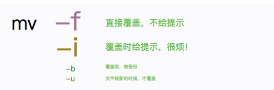

## 6.开始操作文件 


你可能已经了解到， `ll -l` 命令的第一列，能够显示linux的文件类型。请对此有一个大体的印象，因为后面的很多命令，会用到这些知识。 

- `-` 表示普通文件 
- `d` 表示目录文件 
- `l` 表示链接文件，比如快捷方式 
- `s` 套接字文件 
- `c` 字符设备文件，比如 `/dev/` 中的很多文件 
- `b` 表示块设备文件，比如一些磁盘 
- `p` 管道文件 

Linux上的文件可以没有后缀，而且可以创建一些违背直觉的文件。比如后缀是png，但它却是一个压缩文件（通常不会这么做）。大学时，就有聪明的同学这样藏小电影，效果很好。

查看文件的具体类型，可以使用 `file` 命令，它很聪明，能够识别很多文件格式。 

```
[root@localhost ~]# file /etc
/etc: directory
[root@localhost ~]# file /etc/group
/etc/group: ASCII text
[root@localhost ~]# file /dev/log
/dev/log: socket
[root@localhost ~]# file /dev/log
/dev/log: socket
[root@localhost ~]# file /bin
/bin: symbolic link to `usr/bin'
```

本部分的操作，面向的就是 `ASCII text` 类型的，普通文本文件。接下来，我们要创建一些文件。然后写入一些内容到文件里，以便进行后续的操作。 

## 6.1、创建一个文件

### 6.1.1、数字序列


使用重定向符，能够直接生成文件。下面，我要生成10到20的数字，每一个数字单独一行，写入一个叫做 `spring` 的文件。巧的很， `seq` 命令可以完成这个过程。 

```
seq 10 20 >> spring
```

我们在前面提到过 `>` 的意思，是将前面命令的输出，重定向到其他地方。在这里，我们用了两个 `>` ，它依然是重定向的意思，但表示的是，在原来文件的基础上， `追加` 内容。 

也就是编程语言里的 `w+` 和 `a+` 的意思。 

### 6.1.2、查看内容

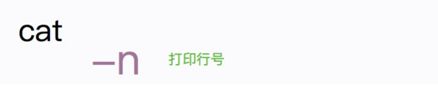

为了查看文件的生成效果，可以使用cat命令检测。cat命令将会把文件的内容，输出打印到终端上。如果加上参数 `n` ，甚至可以打印行号。效果如下： 

```
[root@localhost ~]# cat spring
10
11
12
13
14
15
16
17
18
19
20
[root@localhost ~]# cat -n spring
1 10
2 11
3 12
4 13
5 14
6 15
7 16
8 17
9 18
10 19
11 20
```

除了查看文件内容，cat命令通常用在更多的地方。只有和其他命令联合起来，它才会觉得生活有意义。

```
# 合并a文件和b文件到c文件
cat a  b>> c

# 把a文件的内容作为输入，使用管道处理。我们在后面介绍
cat a | cmd

# 写入内容到指定文件。在shell脚本中非常常用。我们在后面会多次用到这种写法
cat > index.html <<EOF
<html>
    <head><title></title></head>
    <body></body>
</html>
EOF
```

由于我们的文件不大，cat命令没有什么危害。但假如文件有几个 `GB` ，使用cat就危险的多，这只叫做 `猫` 的小命令，会在终端上疯狂的进行输出，你可以通过多次按 `ctrl+c` 来终止它。 

## 6.2、平和的查看文件

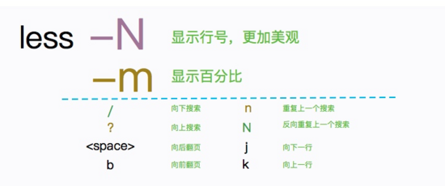

既然cat命令不适合操作大文件，那一定有替换的方案。less和more就是。由于less的加载速度比more快一些，所以现在一般都使用 `less` 。它最主要的用途，是用来分页浏览文件内容，并提供一些快速查找的方式。less是一个 `交互式` 的命令，你需要使用一些快捷键来控制它。 

这次我们使用seq生成 `一千万` 行记录，足足有 `76MB` 大小，然后用less打开它。 

```
[root@localhost ~]# seq 10000000 > spring
[root@localhost ~]# du -h spring
76M spring
[root@localhost ~]# less spring
```

关于less，一般操作如下：

- `空格` 向下滚屏翻页 
- `b` 向上滚屏翻页 
- `/` 进入查找模式，比如 `/1111` 将查找1111字样 
- `q` 退出less 
- `g` 到开头 
- `G` 去结尾 
- `j` 向下滚动 
- `k` 向上滚动，这两个按键和vim的作用非常像 

## 6.3、文件头尾

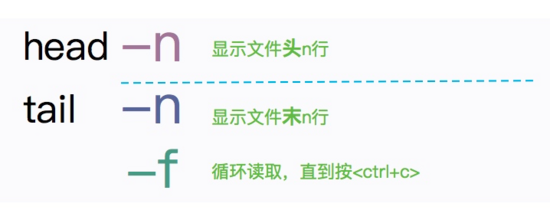

head可以显示文件头，tail可以显示文件尾。它们都可以通过参数 `-n` ，来指定相应的行数。 

```
[root@localhost ~]# head -n 3 spring
1
2
3
[root@localhost ~]# tail -n 3 spring
9999998
9999999
10000000
```

对于部分程序员来说， `tail -f` 或许是最常用的命令之一。它可以在控制终端，实时监控文件的变化，来看一些滚动日志。比如查看nginx或者tomcat日志等等。通常情况下，日志滚动的过快，依然会造成一些困扰，需要配合grep命令达到过滤效果。 

```
# 滚动查看系统日志
tail -f /var/log/messages

# 滚动查看包含info字样的日志信息
tail -f /var/log/messages | grep info
```

对于tail命令来说，还有一个大写的参数 `F` 。这个参数，能够监控到重新创建的文件。比如像一些log4j等日志是按天滚动的， `tail -f` 无法监控到这种变化。 

## 6.4、查找文件

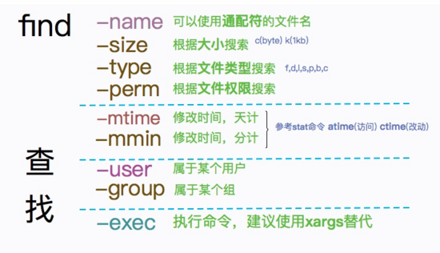

考虑下面这个场景。我们需要找一个叫做 `decorator.py` 的文件，这个文件是个幽灵，可能存在于系统的任何地方。 `find` 命令，能够胜任这次捉鬼行动。 

我们使用 `find` 命令，从根目录找起，由于系统的文件过多，下面的命令可能会花费一段时间。 

```
[root@localhost site-packages]# find / -name decorator.py  -type f
/usr/lib/python2.7/site-packages/decorator.py
```

使用time命令，可以看到具体的执行时间。执行还是挺快的么！秒出！

```
[root@localhost site-packages]# time find / -name decorator.py  -type f
/usr/lib/python2.7/site-packages/decorator.py

real 0m0.228s
user 0m0.098s
sys 0m0.111s
```

find命令会查出一个路径的集合。通常是查询出来之后，进行额外的处理操作，一般配合 `xargs` 命令使用（xargs读取输入，然后逐行处理），至于find的 `exec` 参数？忘了它吧，不好用！ 

```
# 删除当前目录中的所有class文件
find . | grep .class$ | xargs rm -rvf

# 找到/root下一天前访问的文件，type后面的类型参见文章开头
find /root  -atime 1 -type f

# 查找10分钟内更新过的文件
find /root  -cmin  -10

# 找到归属于root用户的文件
find /root -user root

# 找到大于1MB的文件，进行清理
find /root -size  +1024k  -type f | xargs rm -f
```

find的参数非常非常多，记不住怎么办？除了常用的，其实都可以通过 `man` 命令查看。man的操作也和vi非常的类似，输入 `/EXAMPLES` ，会看到很多样例。不过我觉得还是上面列出的这些命令更加的适用。 

### 6.4.1、数据来源

在上图中，你会看到mtime,ctime,atime类似的字样，它们的数据来自于何处呢？接下来我们顺理成章的看一下 `stat` 命令。 

```
[root@localhost ~]# stat spring
  File: ‘spring’
  Size: 78888897   Blocks: 154080     IO Block: 4096   regular file
Device: fd00h/64768d Inode: 8409203     Links: 1
Access: (0644/-rw-r--r--)  Uid: (    0/    root)   Gid: (    0/    root)
Context: unconfined_u:object_r:admin_home_t:s0
Access: 2019-11-04 18:01:46.698635718 -0500
Modify: 2019-11-04 17:59:38.823458157 -0500
Change: 2019-11-04 17:59:38.823458157 -0500
 Birth: -
```

这不就是文件属性么？从文件大小，到文件类型，甚至到最后修改、访问时间，都可以从这里获取。Linux文件系统以块为单位存储信息，为了找到某一个文件所在存储空间的位置，会用 `i节点` (inode) 对每个文件进行索引，你可以认为它是一个文件指针。 

- 文件的字节数

- 文件拥有者user

- 文件所属组group

- 文件的读、写、执行权限

- 文件的时间戳

- - ctime指inode上一次变动的时间
  - mtime指文件内容上一次变动的时间
  - atime指文件上一次打开的时间。

- 链接数，即有多少文件名指向这个inode （ln命令）

- 文件数据block的位置（具体的数据位置）

关于inode是一个比较大的话题，也是比较重要的知识点，有兴趣的可以自行搜索。我们只需要知道这些信息是从这里来的就可以了。

### 6.4.2、小练习

如果我只想获取 `Modify` 这个数值，可以组合使用一下上面学到的命令。首先获取最后三行，然后获取首行。效果如下： 

```
[root@localhost ~]# stat spring | tail -n 3 | head -n 1
Modify: 2019-11-04 17:59:38.823458157 -0500
```

下面几个命令，效果是与上面等价的，输出结果也是一模一样。正所谓条条大路通罗马，接下来，我们首先介绍一下出现频率较高的 `grep` 。另外，我们在上面的这些命令中，多次使用了 `|` ，这是Linux中非常重要的管道概念，下面也会着重介绍。 

```
stat spring | head -n 7 | tail -n 1
stat spring | grep Modify
stat spring | sed -n '7p'
stat spring | awk 'NR==7'
```

## 6.5、字符串匹配


grep用来对内容进行过滤，带上 `--color` 参数，可以在支持的终端可以打印彩色，参数 `n` 则用来输出具体的行数，用来快速定位。这是一个必须要熟练使用的命令。 

比如：查看nginx日志中的POST请求。

```
grep -rn --color POST access.log
```

推荐每次都使用这样的参数。

如果我想要看某个异常前后相关的内容，就可以使用ABC参数。它们是几个单词的缩写，经常被使用。

- A  after  内容后n行
- B  before  内容前n行
- C  内容前后n行

就像是这样：

```
# 查看Exception关键字的前2行和后10行
grep -rn --color Exception -A10 -B2   error.log

#查找/usr/下所有import关键字，已经它们所在的文件和行数
grep -rn --color import /usr/
```

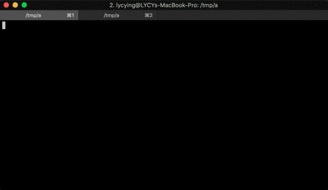

## 6.6、管道

在上面的命令中，我们多次用到了 `|` ，这貌似可以完成一些神奇的事情。 `|` 是 `pipe` 的意思，它可以把多个命令联系起来。通常，命令有下面的关联方式： 

- `;` 顺序执行，如 `mkdir a;rmdir a`
- `&&` 条件执行，如 `mkdir a && rmdir a`
- `||` 条件执行，如 `mkdir a || rmdir a` ，后面的命令将不执行 
- `|` 管道，前面命令的输出，将作为后面命令的输入 

前三种的命令关联，是非常简单有逻辑的，非常的好理解。而管道，却有自己的特点。

接触过编程语言的都知道 `stdin` 、 `stdout` 、 `stderr` 的概念。让我们重新组织一下针对于管道的定义：前面命令的输出(stdin)，将作为后面命令的输入(stdout)。 

我们拿一行命令来说明。

```
seq 20 100 | head -n 50 | tail -n 1
```

上面命令，将输出69。69是个神奇的数字，它是怎么办到的呢？我们来一张小图，一切就豁然开朗了。

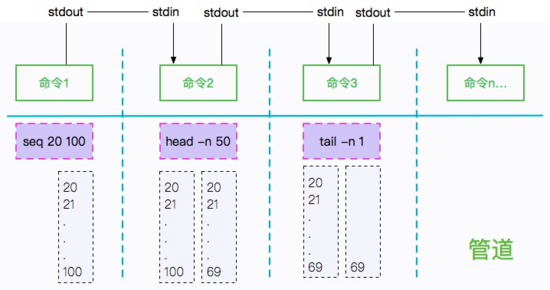

关于输入输出和错误，linux使用一个 `数字` 进行缩写，这在一些脚本中，甚至在一些安装文件中，会经常用到。 

- 0 表示stdin标准输入
- 1 表示stdout标准输出
- 2 表示stderr标准错误

通过类似 `2>&1` 的语法，可以把错误信息定向到标准输出。我们用命令来证明一下。 

```
# 错误信息无法输出到文件
[root@localhost ~]# cat aaaaaaaaa > b
cat: aaaaaaaaa: No such file or directory
[root@localhost ~]# cat b

# 错误信息被重定向了
[root@localhost ~]# cat aaaaaaaaa > b 2>&1
[root@localhost ~]# cat b
cat: aaaaaaaaa: No such file or directory
```

## 6.7、排序


在了解管道的工作原理之后，就可以介绍一下sort命令了。它通常可以和uniq（去重）命令联合，完成一些排序、去重的操作。首先使用cat命令，生成如下内容的文件。 

```
cat > sort.txt <<EOF
1 11
3 22
2 44
4 33
5 55
6 66
6 66
EOF
​```bash
接下来让这两个命令上台表演一下。sort可以使用-t指定分隔符，使用-k指定要排序的列。但是空格，是不需要做这些画蛇添足的指定的。
​```bash
# 根据第一列倒序排序
[root@localhost ~]# cat sort.txt | sort  -n -k1 -r
6 66
6 66
5 55
4 33
3 22
2 44
1 11

# 统计每一行出现的次数，并根据出现次数倒序排序
# 此时，行数由7变成了6
[root@localhost ~]# cat sort.txt | sort  | uniq -c  | sort -n -k1 -r
2 6 66
1 5 55
1 4 33
1 3 22
1 2 44
1 1 11
```

注意：uniq命令，一般用在已经经过排序的结果集上。所以，很多情况需要首先使用sort命令进行排序后，再使用uniq命令。新手经常会忘记第一步，造成命令不能正常运行。

## 6.8、小练习

本部分，我们从文件的属性开始说起，了解了几个对文件操作的常用命令。并顺便介绍了管道的概念。下面，我们来练习一下。

#### 找到系统中所有的 `grub.cfg` 文件，并输出它的行数。 

分析：首先需要使用find命令，找到这些文件。然后使用xargs逐行处理。最后，使用wc命令，统计确切的行数。

```
[root@localhost grub2]# find / | grep grub.cfg | xargs wc -l
141 /boot/grub2/grub.cfg
```

#### 输出系统的group列表

```
cat /etc/group | awk -F ':' '{print $1}'
```

#### 下面这个命令输出nginx日志的ip和每个ip的pv，pv最高的前10

```
# 2019-06-26T10:01:57+08:00|nginx001.server.ops.pro.dc|100.116.222.80|10.31.150.232:41021|0.014|0.011|0.000|200|200|273|-|/visit|sign=91CD1988CE8B313B8A0454A4BBE930DF|-|-|http|POST|112.4.238.213

awk -F"|" '{print $3}' access.log | sort | uniq -c | sort -nk1 -r | head -n10
```

## 6.9、思考&扩展

1、Linux的终端，是如何实现彩色的文字的？我要如何输出一个绿色的 `Hello World` ? 

2、软链接与硬链接有什么区别？

3、了解几个偏门但又不是非常偏的命令。

- `cut` 有了awk，几乎不怎么会用cut了 
- tr
- col
- paste
- join
- split

## 7. 正则和高级用法

你可能遇到一些棘手的问题，通过搜索得到想要的结果，但下次还是要通过搜索解决问题，这种低效的手段不是我们所想要的。典型的就是一个线上运维工程师，当问题来临时，不会给你留太多的 `现场学习` 时间。 

为了达到更高效的训练，我们要做两件事情：第一，总结归纳；第二，触类旁通。Linux的命令也是如此，一个问题，通常会有多种解决方式，要通过变化找出其中的共性。

这涉及到一些设计者对于规范约定俗成的遵守。一般的，你只需要掌握一小部分命令，然后对大批命令达到了解的程度，就可以在命令行的世界里游刃有余。举个例子，你知道 `ls` 是列出文件目录，你就会联想到 `lscpu` 是列出cpu信息； `lsmem` 是列出内存信息; `lsblk` 是磁盘信息等。这种共性很多，比如 `top` 系列， `stat` 系列。 


## 7.1、辅助信息

### 7.1.1、Linux文件格式

在Linux上工作，是非常非常排斥二进制这种格式的，几乎什么都是可以读写的文本内容。大多数命令生成的结果，也都是文本文件。这些文件有一些特点，通常列与列都是通过空格或者 `<TAB>` 键分隔的。比如下面 `lsmem` 的结果，这种有规律的，有章可循的文件，是非常容易被处理的。 

```
[root@localhost ~]# lsmem  
RANGE                                  SIZE  STATE REMOVABLE BLOCK
0x0000000000000000-0x0000000007ffffff  128M online        no     0
0x0000000008000000-0x000000000fffffff  128M online       yes     1
0x0000000010000000-0x0000000017ffffff  128M online        no     2
0x0000000018000000-0x0000000027ffffff  256M online       yes   3-4
0x0000000028000000-0x000000004fffffff  640M online        no   5-9
0x0000000050000000-0x000000005fffffff  256M online       yes 10-11
0x0000000060000000-0x000000007fffffff  512M online        no 12-15

Memory block size:       128M
Total online memory:       2G
Total offline memory:      0B
```

有一大批针对于行操作的命令，同样有一批针对于列操作的命令。然后，有两个集大成者，叫做 `sed` 、 `awk` 。由于这两个命令的内容非常多，我们将其列为单独的章节。 

### 7.1.2、命令记不住怎么办？

通常linux命令都十分简单，但是有些还是有些复杂度的。比如 `find` ， `ps` 这种命令，如果要照顾到所有的场合，可能需要非常巨大的篇幅。但是，万一用到这种偏门的场合怎么办？ 

全面了解一下是非常有必要的，以便在使用的时候能够唤起记忆中最浅显的印象。然后剩下的，就可以交给类似于 `man` 的这种命令了。Linux上的每一个命令，都会有配套的帮助文件，这远比网络上那些转来转去的信息，正确的多。 

正式介绍一下下面的两个命令：

- `man` 用来显示某个命令的文档信息。比如： `man ls`
- `info` 你可以认为和man是一样的，虽然有一些能够互补的内容。它们会在内容中进行提示的 
- `--help` 很多命令通过参数 `--help` 提供非常简短的帮助信息。这通常是最有用最快捷的用例展示。如果你根本就记不住一个非常拗口的单词，那就找找这些地方吧 

注意：这些帮助信息，仅集中在命令的作用域本身。对于它的组合使用场景，并没有过多信息。也就是说，它教会了你怎么用，但并没有告诉你用它能够来做什么。

这些帮助命令，一般会通过高亮关键字，增加阅读的体验。但我们可以更近一步，把帮助文件变成彩色的。在root用户下，执行下面的命令。然后， **重新登录虚拟机** 。 

```
cat >> ~/.bashrc <<EOF
function man()
{
    env \\
    LESS_TERMCAP_mb=\$(printf "\e[1;31m") \\
    LESS_TERMCAP_md=\$(printf "\e[1;31m") \\
    LESS_TERMCAP_me=\$(printf "\e[0m") \\
    LESS_TERMCAP_se=\$(printf "\e[0m") \\
    LESS_TERMCAP_so=\$(printf "\e[1;44;33m") \\
    LESS_TERMCAP_ue=\$(printf "\e[0m") \\
    LESS_TERMCAP_us=\$(printf "\e[1;32m") \\
    man "\$@"
}
EOF
```

再次执行man命令，就可以看到彩色的信息了。

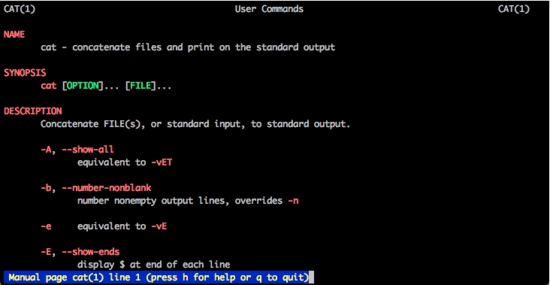

### 7.1.3、TAB补全 

现在，在终端里，输入 `ca` ，然后快速按2次 `<TAB>` 键盘，命令行会进入补全模式，显示以ca打头的所有命令。 

```
[root@localhost ~]# ca
cacertdir_rehash     cache_dump           cache_repair         cache_writeback      ca-legacy            capsh                case                 catchsegv
cache_check          cache_metadata_size  cache_restore        cal                  caller               captoinfo            cat                  catman
```

如果你对某个命令，只有模糊的印象，只记得前面的几个字母，这个功能是极好的，命令范围会一步步缩减。

## 7.2、正则表达式

为了开始下面的内容，我们首先介绍一下正则表达式。在前面的一些命令中，也可以使用这些正则表达式，比如less、grep等。

有些书籍，能够把正则表达式写成一本书，我们这里仅作简单的介绍，但足够用了。一般的，正则表达式能用在匹配上，还能够把匹配的内容拿来做二次利用。关于后者，我们在 `sed` 命令中介绍。 

| 标志    | 意义                                           |
| :------ | :--------------------------------------------- |
| `^`     | 行首                                           |
| `$`     | 行尾                                           |
| `.`     | 任意单个字符                                   |
| `*`     | 匹配0个或者多个前面的字符                      |
| `+`     | 1个或者多个匹配                                |
| `?`     | 0个或者1个匹配                                 |
| `{m}`   | 前面的匹配重复m次                              |
| `{m,n}` | 前面的匹配重复m到n次                           |
| `[]`    | 匹配一个指定范围内的字符                       |
| `[^]`   | 匹配指定范围外的任意单个字符                   |
| `\`     | 转义字符                                       |
| `[0-9]` | 匹配括号中的任何一个字符,or的作用              |
| `|`     | or，或者                                       |
| `\b`    | 匹配一个单词。比如 `\blucky\b` 只匹配单词lucky |

使用下面的命令创建一个文件，我们练习一下grep命令加上 `E` 参数后的正则表现。 

```
cat > 996 <<EOF
996: 996 is a funcking thing . which make woman as man , man as ass .
we all on the bus , bus bus on the way . 996
way to icu. icuuuuuu......
The greedy green boss rides on the pity programmer
EOF
```

在终端执行下面命令，注意高亮的部分即为匹配到的字符串。

```
# 匹配996开头的行
[root@localhost ~]# cat 996 | grep -E ^996
996: 996 is a funcking thing . which make woman as man , man as ass .

# 匹配996结尾的行
[root@localhost ~]# cat 996 | grep -E 996$
we all on the bus , bus bus on the way . 996

# 匹配到icu和icuuuuuu
[root@localhost ~]# cat 996 | grep -E icu+
way to icu. icuuuuuu......

# 再次匹配到996
[root@localhost ~]# cat 996 | grep -E [0-9]
996: 996 is a funcking thing . which make woman as man , man as ass .
we all on the bus , bus bus on the way . 996

[root@localhost ~]# cat 996 | grep -E ^[\^0-9]
we all on the bus , bus bus on the way . 996
way to icu. icuuuuuu......
The greedy green boss rides on the pity programmer

# 匹配所有不包含996的行，良心命令，泪奔
[root@localhost ~]# cat 996 | grep -E -v [0-9]{3}
way to icu. icuuuuuu......
The greedy green boss rides on the pity programmer

# 匹配boss和icu
[root@localhost ~]# cat 996 | grep -E boss\|icu
way to icu. icuuuuuu......
The greedy green boss rides on the pity programmer

# 匹配所有行
[root@localhost ~]# cat 996 | grep -E .
996: 996 is a funcking thing . which make woman as man , man as ass .
we all on the bus , bus bus on the way . 996
way to icu. icuuuuuu......
The greedy green boss rides on the pity programmer
```

正则表达式非常的重要，在一些sed脚本中，awk脚本中，甚至是vim编辑器中，都会简化你的操作。以上内容应该熟记，达到不需要查找文档的地步。

下面有6个小问题，可以思考一下。

1、回过头去，执行一下 `man cat` ，是否发现了一个叫做 `tac` 的命令？它是干什么的？ 

2、上面提到的 `stat` 系列，你能想象 `iostat` 大体是干什么用的么？ 

3、 `grep -v` 是什么意思？ 

4、了解一下和mv非常像的 `rename` 命令来批量修改文件，看能否使用上面的正则。 

5、有些命令如果拼写错误，如何快速修正？靠搜索么？了解一下 `fuck` 命令。我没有说错。 

6、下面哪种写法表示如果cmd1成功执行，则执行cmd2命令？

- A. cmd1&&cmd2
- B. cmd1|cmd2
- C. cmd1;cmd2
- D. cmd1||cmd2

## 8. Linux下的压缩

压缩，是一件非常神奇的事情。

很久很久之前，就接触过一些 **64KB** 大小的电影，你花 **半小时** 都看不完。事实上，这些动画的真实容量是 **15GB** ，Warez组织把它压缩了 **25万倍** 。 

你要是Windows系统，可以在这里下载体验一下。但我们现在讲的是Linux，很打脸是不是？

```
链接: https://pan.baidu.com/s/12YJQ4jsbtRr7RxoLpARTyQ 
提取码: r7sp
```

压缩是件神奇的事。它能大能小，能伸能缩，在现实中很难找到这样的东西。


为了减小传输文件的大小，或者为了传输方便，一般都会开启压缩。linux下常见的压缩文件有tar、bzip2、zip、rar等，7z这种用的相对较少。压缩之后的文件，非常适合在网络环境上传输。甚至，你可以认为iso文件为一种特殊的压缩方式。 

`.tar` 使用tar命令压缩或解压 `.bz2` 使用bzip2命令操作 `.gz` 使用gzip命令操作 `.zip` 使用unzip命令解压 `.rar` 使用unrar命令解压 `.Z` 使用compress,uncompress 

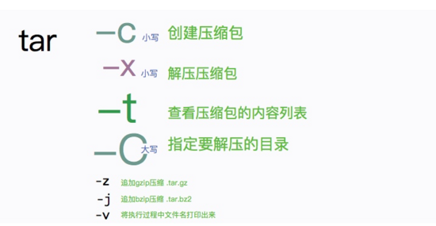

准备工作：使用下面的命令，复制1000个文件。 

```
cd ~
mkdir files
cd files
seq 1000 | xargs -I {} cp  /etc/group  {}
```

使用ls，就可以看到我们刚才创建的1000个文件。接下来，我们使用压缩命令将它打包成一个。

```
# 查看1000个文件的总大小
[root@localhost files]# du -h .
4.0M .

# 切换到root目录
cd ~

# 使用tar进行压缩，压缩后的文件不到1MB
[root@localhost ~]# tar cvf files.tar files

[root@localhost ~]# du -h files.tar
1012K files.tar

# 使用gizp提高压缩比，压缩后的文件只有12KB
[root@localhost ~]# gzip files.tar
[root@localhost ~]# du -h files.tar.gz
12K files.tar.gz
```

tar和gzip一般是联合使用的。tar命令提供了一种特殊的功能，就是可以在打包解包的同时调用其他的压缩程序，比如：gzip，bzip2等。

下面的命令，与上面执行两次命令后是等同的。所以，一般使用下面的方式进行操作。

```
[root@localhost ~]# tar cvfz files2.tar.gz files
[root@localhost ~]# du -h files2.tar.gz
12K files2.tar.gz
```

与之对应的，就是解压操作。我们只需要改动命令行中的一个字母即可： `c` -> `x` 。但其实，参数 `v` 和 `z` 也是可以省略的。 

```
[root@localhost ~]# tar xvfz files2.tar.gz
```

我们更加常用的方式，是加上参数 `C` ，指定一个要解压的目录。比如下面的命令，把压缩内容解压到/opt目录中。 

```
[root@localhost ~]# tar xvfz files2.tar.gz -C /opt/
```

那如果我仅仅想要看下压缩文件中包含哪些文件呢？这就要使用参数 `t` 。 

- `c` 压缩 
- `x` 解压 
- `t` 查看列表 

#### 安装其他的

我们来看一下常用的zip和rar解压程序有没有安装。

```
[root@localhost ~]# which unzip
/usr/bin/which: no unzip in (/usr/local/sbin:/usr/local/bin:/usr/sbin:/usr/bin:/root/bin)
[root@localhost ~]# which unrar
/usr/bin/which: no unrar in (/usr/local/sbin:/usr/local/bin:/usr/sbin:/usr/bin:/root/bin)
```

所以，我们的系统并没有安装这两个应用。那我就使用centos的包管理工具 `yum` 安装一下。java中的jar命令也是与zip类似的，可自行探索。 

```
[root@localhost ~]# yum install -y zip unzip rar unrar
Loaded plugins: fastestmirror
Loading mirror speeds from cached hostfile
 * base: mirrors.aliyun.com
 * extras: mirrors.tuna.tsinghua.edu.cn
 * updates: mirrors.aliyun.com
...
```

rar不能安装成功，所以rar文件并不能被解压。没关系，我们在后面的章节把它安装上。

现在，你会在Linux安装tomcat了么？

接下来，我们思考一下：

1、 经过zip压缩的文件，再使用gzip压缩，容量还会减少么？

为了验证这个过程，可以使用 `dd` 命令，生成一个 `69MB` 大小的随机文件。 `dd` 命令也是个神奇哦。 

```
[root@localhost ~]# dd if=/dev/urandom  of=test bs=1M count=69
69+0 records in
69+0 records out
72351744 bytes (72 MB) copied, 0.446161 s, 162 MB/s


[root@localhost ~]# du -h test
69M test
```

所以，回到文章最上面，我们可以随机生成一批文件，让压缩效果更有意义一点。

```
seq 1000 | xargs -i dd if=/dev/zero of={}.xjj bs=1k count=256
```

2、如果已经有了文件，tar命令是如何做到强制覆盖的？

## 9. Linux的权限体系


我们在最最最上面，刚接触命令行的时候，就使用 `chmod` 命令，给普通文本文件，赋予了执行权限。本小节将看一下 `用户权限` 和 `文件权限` 这两个息息相关的概念， 

## 9.1、添加用户

到现在为止，我们的系统中，还孤零零的只有这一个用户，是时候学学女娲，捏几个小泥人了。

首先创建两个用户：张三（zhang3）、李四（li4）。

```
[root@localhost ~]# useradd zhang3
```

查看下面命令的三个输出结果。

```
# 系统中多了一个叫做zhang3的组，group文件保存了系统的组信息
[root@localhost ~]# tail -n1 /etc/group
zhang3:x:1000:

# 系统中多了一个叫做zhang3的用户，shadow文件保存了它们的密码。很多安全渗透就是为了拿到它进行暴力破解
[root@localhost ~]# tail -n1 /etc/shadow
zhang3:!!:18207:0:99999:7:::

# home目录中，多了一个叫做zhang3的目录
[root@localhost ~]# ll /home --full-time
total 0
drwx------. 2 zhang3 zhang3 83 2019-11-06 22:09:33.357165082 -0500 zhang3
```

接下来，给我们刚刚建立的用户，使用 `passwd` 设置一个密码。密码需要输入两次进行确认。如果想要更改密码，可以使用 `chpasswd` 命令。 

```
[root@localhost ~]# passwd zhang3
Changing password for user zhang3.
New password:
BAD PASSWORD: The password is shorter than 8 characters
Retype new password:
passwd: all authentication tokens updated successfully.
```

那么如何删除一个现有的用户呢？这是通过 `userdel` 命令实现的。加上参数 `f` ，会在其他用户使用系统的时候，强制退出。 

```
userdel -f zhang3
```

## 9.2、文件权限说明

从上面的命令执行结果中，我们发现了有两件非常有意思的东西。添加用户后，除了在密码文件 `shadow` 中增加了一些内容，同时还在 `group` 文件中添加了信息。这涉及到用户的两个属性：用户名，组名。 

一个用户只有一个名称代号，但是可以有多个组。下面命令创建一个密码为123的用户 `li4` ，并给它追加一个叫做 `zhang3` 的组。可以看到 `/etc/group` 文件中的信息变更。 

```
[root@localhost ~]# useradd  -G zhang3 -p 123 li4
[root@localhost ~]# tail -n 2 /etc/group
zhang3:x:1000:li4
li4:x:1001:
```

好啦，接下来切换到我们的文件权限上面。为了进行下面命令的验证，我们首先创建一个名字叫 `confirm777.sh` 的脚本文件。为了让脚本对所有用户可见，我们把它创建在/tmp目录下。 

```
cat > /tmp/confirm777.sh <<EOF
echo $USER
id
EOF
```

使用 `ll` 命令查看文件信息。 

```
[root@localhost ~]# ll /tmp/confirm777.sh --full-time
-rw-r--r--. 1 root root 13 2019-11-07 04:25:55.418254935 -0500 confirm777.sh
```


从 `ll` 的命令可以看出，文件的所有者是root用户，文件所属的组，也是root组，它的权限是 `rw-r--r--` 。文件权限分为三部分。 

- ```
  所有者权限
  u
  rw-
  ```

- ```
  组用户权限
  g
  r--
  ```

- ```
  其他用户权限
  o
  r--
  ```

- `全部` ，缩写为 `a` ，表示对上面三类用户集体操作。 

那rw-这些东西是什么意思呢？

- `r` 表示可读权限。read。 
- `w` 表示可写权限。write。 
- `x` 表示可执行权限。execute。 
- `-` 权限占位符，表示没有当前权限。 

注意：一个用户拥有文件的w权限，并不代表就可以删除文件。w仅仅针对于文件内容来说的。

一个文件，有3类用户，每类用户，有3种权限。使用最简单的小学乘法，我们能够得出，一个文件的权限位，需要 `3x3=9` 个标志位表示。 

我们的文件名称，叫做confirm777.sh，这个名字是随便起的么？当然不是， `777` 在linux代表特殊的含义，它代表文件对所有用户具有可读、可写、可执行的权限。可以想象，如果每个文件都有这样的权限，系统将无安全可言。那这一串数字是怎么来的呢？可以看下面的对照表。 

- `r` `4` 读 
- `w` `2` 写 
- `x` `1` 执行 

对以上三个属性进行任意组合，可以得到：

- `4` `r--` 4+0+0 
- `6` `rw-` 4+2+0 
- `5` `r-x` 4+0+1 
- `2` `-w-` 0+2+0 
- `3` `-wx` 0+2+1 
- `1` `--x` 0+0+1 
- `7` `rwx` 4+2+1 

## 9.3、文件权限更改

下面介绍三个文件权限相关的命令。一般常用的，就是chown和chmod。

`chown` 更改文件的所有者。 `chgrp` 更改文件的组。 `chmod` 更改文件权限。 

接下来，我们把 `confirm777.sh` 的所有者和组，修改成刚刚创建的用户 `zhang3` 。 

```
cd /tmp
[root@localhost tmp]# chown zhang3:zhang3 confirm777.sh
[root@localhost tmp]# ll confirm777.sh
-rw-r--r--. 1 zhang3 zhang3 13 Nov  7 04:25 confirm777.sh
```

给文件所有者增加执行权限。然后分别切换到 `zhang3` ， `li4` 用户执行一下。 

通过 `su` 命令，可以切换到其他用户，一般使用 `su -` 进行环境变量的清理；而命令 `id` ，能够看到当前正在执行的用户信息。 

```
[root@localhost tmp]# chmod u+x confirm777.sh
[root@localhost tmp]# su li4
[li4@localhost tmp]$ ./confirm777.sh
bash: ./confirm777.sh: Permission denied
[li4@localhost tmp]$ exit
exit

[root@localhost tmp]# su zhang3
[zhang3@localhost tmp]$ ./confirm777.sh
root
uid=1000(zhang3) gid=1000(zhang3) groups=1000(zhang3) context=unconfined_u:unconfined_r:unconfined_t:s0-s0:c0.c1023
```

可以看到，文件所有者zhang3可以执行文件，但不相关的li4，提示没有权限。接下来，我们验证用户组相关的权限位。

```
# 去掉zhang3的执行权限
root@localhost tmp]# chmod u-x confirm777.sh
[root@localhost tmp]# ll confirm777.sh
-rw-r--r--. 1 zhang3 zhang3 13 Nov  7 04:25 confirm777.sh

# 增加zhang3组的执行权限，由于li4在zhang3组里，它拥有权限
[root@localhost tmp]# chmod g+x confirm777.sh
[root@localhost tmp]# ll confirm777.sh
-rw-r-xr--. 1 zhang3 zhang3 13 Nov  7 04:25 confirm777.sh

# 切换到zhang3进行执行
[root@localhost tmp]# su - zhang3
[zhang3@localhost tmp]$ ./confirm777.sh
bash: ./confirm777.sh: Permission denied
[zhang3@localhost tmp]$ exit
exit

# 切换到li4进行执行
[root@localhost tmp]# su - li4
[li4@localhost tmp]$ ./confirm777.sh
root
uid=1001(li4) gid=1001(li4) groups=1001(li4),1000(zhang3) context=unconfined_u:unconfined_r:unconfined_t:s0-s0:c0.c1023
```

从命令的执行结果可以看出。这次，li4能够执行文件，相反的，zhang3却不能。

我们使用chmod命令来修改文件权限，使用的是类似于 `a+x` 这样的英文字母。拿第一个脚本来说，初始的权限是 `rw-r--r--` ，也就是 `644` ，在这种情况下，下面的两个脚本等效。 

```
chmod u+x confirm777.sh
chmod 744 confirm777.sh
```

可以看到，第二个命令，使用的是数字样式的权限位，多了一步人脑转换过程。这在日常的使用中，是非常不方便的。所以，使用符号法的表示方式，能够更加直观，非常推荐。

为了更直观的表现这个过程，我专门制作了一张图。

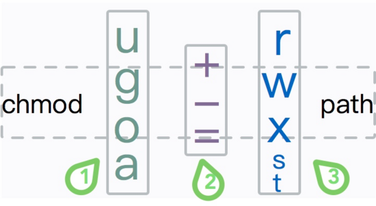

## 9.4、目录权限

这里有一个非常有意思的地方。把文件设置成可执行，可以把普通文件变成脚本，目录文件的可执行权限是什么鬼？有什么意义？对文件夹来说：

- `r` 表示允许读取目录中的文件名，但不能进入该目录 
- `w` 表示允许用户修改目录，可以创建、迁移、删除、更名目录下的文件 
- `x` 可以获得目录下文件的列表，以及进入目录，执行cd命令 

关于r和x的区别，可以看下面的命令结果，仔细感受一下它们的区别。一般的，几乎所有的目录，都拥有 `执行` 权限，不要随意对其进行设置。 

```
[root@localhost tmp]# su - li4
[li4@localhost ~]$ cd /tmp

[li4@localhost tmp]$ mkdir nox
[li4@localhost tmp]$ touch nox/{a,b,c,d}
[li4@localhost tmp]$ chmod a-x nox
[li4@localhost tmp]$ ls nox
ls: cannot access nox/a: Permission denied
ls: cannot access nox/b: Permission denied
ls: cannot access nox/c: Permission denied
ls: cannot access nox/d: Permission denied
a  b  c  d
[li4@localhost tmp]$ cat nox/a
cat: nox/a: Permission denied

[li4@localhost tmp]$ chmod a+x nox
[li4@localhost tmp]$ chmod a-r nox
[li4@localhost tmp]$ ls nox
ls: cannot open directory nox: Permission denied
```

## 9.5、sticky bit

接下来，我们介绍一个比较烧脑的粘贴位。

假如你要删除一个文件，你可以没有这个文件的写权限，但是你必须要拥有这个文件上级目录的写权限。如何创建一个目录，可以让任何人些人文件，但是又不能删除其他用户的文件？这就是stick bit的作用。粘贴位一般只用于目录上，对文件来说并没有什么用处。粘贴位一般使用 `t` 表示。 

我们可以看一个典型的目录 `/tmp`

```
[root@localhost tmp]#  ls -dl /tmp
drwxrwxrwt. 9 root root 4096 Nov  7 06:27 /tmp
```


可以看到，最后一位，显示的是t，而不是x，意思是普通用户不能删除其他用户的文件。所有用户在/tmp目录中，都可以随意创建文件，但是却删除不了其他人的文件，即使文件的权限是 `777` 。 

```
[root@localhost tmp]# touch /tmp/stick
[root@localhost tmp]# chown li4:li4 /tmp/stick
[root@localhost tmp]# chmod 777 /tmp/stick
[root@localhost tmp]# su - zhang3
[zhang3@localhost ~]$ rm /tmp/stick
rm: cannot remove ‘/tmp/stick’: Operation not permitted
```

我们在上面创建了两个用户zhang3和li4，并拿它们测试了chown和chmod命令，最后介绍了粘贴位。linux比较安全的原因，就是因为有比较详尽的权限划分。但权限是枚双刃剑，超权用户一个命令就可以搞垮系统，许多隐藏的木马，通过提权运行在不为人知的地方。

权限相关的几个命令会经常被使用，下面举几个例子。

```
# 设置/var/lib/mysql的用户和组为mysql
chown -R mysql:mysql /var/lib/mysql

# 设置目录可读可写，能够上传文件
chmod  777 /var/www/uploads

# 增加本目录下所有sh的执行权限
chomd a+x *.sh

# 变更file为可读可写可执行
chmod u=rwx,g=rwx,o=rwx file
```

下面依然是思考时间：

1、下面这个命令，执行以后，会发生什么情况？警告：不要执行，哪怕把000改成其他数字。

```
# R遍历子目录的意思
chmod -R 000 /
```

2、有一天，我看到一个命令 `chmod u+s file` ，文中并没有介绍 `s` 是什么意思，这是什么意思？ 

3、如何删除一个用户的组？

## 10. 如何对磁盘进行操作？

下面的场景非常的恐怖，对有些程序员来说可以是一场噩梦。

一大早刚刚去上班，煎饼果子刚啃了一半，几个全副武装的警察就闯进了公司。二话不说控制住了工作人员，并守株待兔的等着鱼儿来上班。

原因就是：公司涉嫌存储和扩散非法文件，需要查封所有的服务器进行彻查。

这些文件，有的简单的放在磁盘上，有的放在文件存储服务器上，有的，被切成了多片放在了不同的廉价机器上。

接下来会发生什么，要看技术人员的水平，但估计结果并不会太好。


在上一小节，我们创建了两个普通用户，这两个用户没什么本事，和默认的用户 `root` 比起来，它们的权限就小得多。除了自己目录下的文件，其他的，它几乎都没有权限去修改。 

这些文件，肯定是要存在磁盘上的。对磁盘的管理，有非常多的命令，这一小节的内容，对于系统管理员来说，经常使用；但对于开发来说，就要求比较低一些。因为开发只需要知道小电影存在什么地方了，不需要知道小电影是怎么存的。

那定罪的时候，运维和程序员，到底是谁的锅更大一些？其实是个悖论。运维人员在发呆的时候，脑子里回忆起了下面的知识。

## 10.1.添加新硬盘

你要是一个系统管理员，甚至是一个上了云的系统管理员，现在买了一块 `aws` 的扩展盘，它是不能被使用的。需要经过格式化挂载以后，才能投入生产。 

还记得在安装系统的时候么？其中有一步，需要对虚拟机的磁盘，进行划分，我们直接采用默认的方式。不过现在已经改不了了，它已经是过去式了。

为了模拟对磁盘的管理，我们需要首先给虚拟机新加一块虚拟磁盘。首先，使用 `shutdown -h now` 命令关闭机器，进行下面的操作。 

1、进入settings选项，然后切换到storage，添加磁盘 

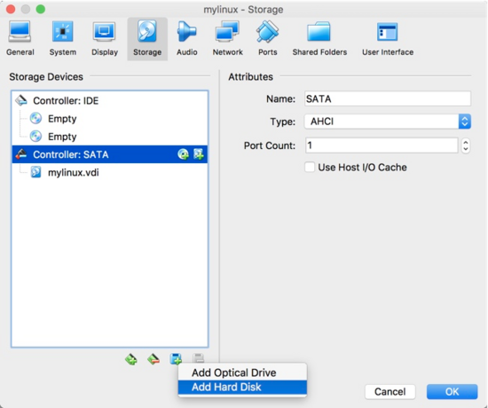

2、点击创建一块磁盘 

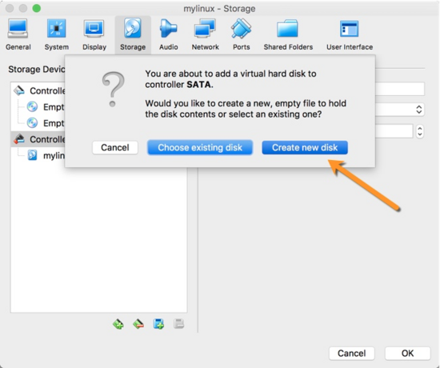

3、选择VDI 

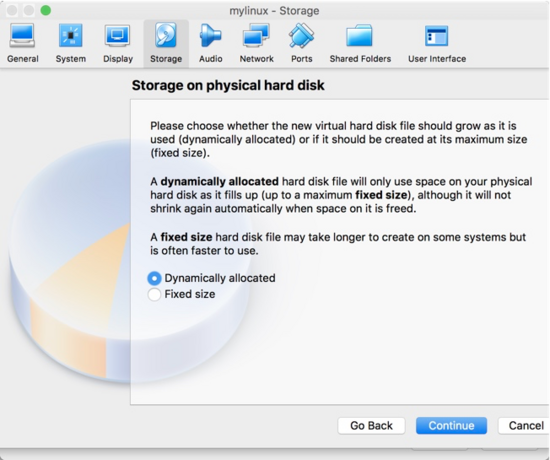

4、动态扩容，用多少扩多少 


5、我们创建一块2GB大的，叫做disk2的磁盘 

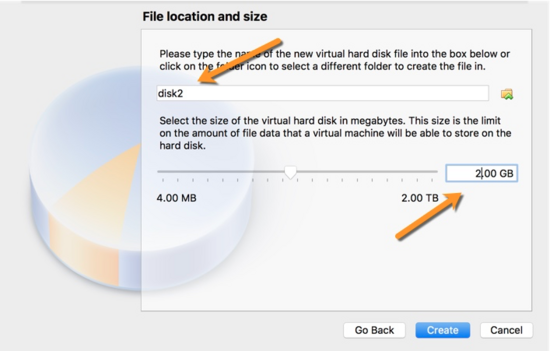

启动机器。远程连接192的ip，别忘了执行 `dhclient` 命令。 

首先使用 `fdisk` 看一下目前的磁盘状况。 

```
root@localhost ~]# fdisk -l

Disk /dev/sda: 8589 MB, 8589934592 bytes, 16777216 sectors
Units = sectors of 1 * 512 = 512 bytes
Sector size (logical/physical): 512 bytes / 512 bytes
I/O size (minimum/optimal): 512 bytes / 512 bytes
Disk label type: dos
Disk identifier: 0x000c2410

   Device Boot      Start         End      Blocks   Id  System
/dev/sda1   *        2048     2099199     1048576   83  Linux
/dev/sda2         2099200    16777215     7339008   8e  Linux LVM

Disk /dev/sdb: 2147 MB, 2147483648 bytes, 4194304 sectors
Units = sectors of 1 * 512 = 512 bytes
Sector size (logical/physical): 512 bytes / 512 bytes
I/O size (minimum/optimal): 512 bytes / 512 bytes


Disk /dev/mapper/centos-root: 6652 MB, 6652166144 bytes, 12992512 sectors
Units = sectors of 1 * 512 = 512 bytes
Sector size (logical/physical): 512 bytes / 512 bytes
I/O size (minimum/optimal): 512 bytes / 512 bytes


Disk /dev/mapper/centos-swap: 859 MB, 859832320 bytes, 1679360 sectors
Units = sectors of 1 * 512 = 512 bytes
Sector size (logical/physical): 512 bytes / 512 bytes
I/O size (minimum/optimal): 512 bytes / 512 bytes
```

从命令的结果，我们看到了有两块磁盘。 `/dev/sda` 和 `/dev/sdb` ，其中 `sda` 已经被分配，已经被我们的文件系统所占用。现在，回忆一下 `/dev` 目录的用途，在这个目录下，存放了一些设备文件，假如我们再添加一块磁盘，它的句柄就应该是 `sdc` (sd*)。 

在这整块磁盘能够被使用之前，我们需要对它进行三次操作。

1. 磁盘分区
2. 磁盘格式化
3. 磁盘挂载

## 10.2.分区

对磁盘分区依然是 `fdisk` 命令，以下命令，将进入交互模式。在交互模式中，输入 `n` 新建分区。由于我们的磁盘只有2GB，所以只创建一个分区就好。根据向导，一路确定向下，最后，输入 `w` 确定写入分区表，同时退出命令交互。 

再次执行 `fdisk -l` ，可以看到已经多了一块 `2gb` 大小的分区。 

```
[root@localhost ~]# fdisk /dev/sdb
...
[root@localhost ~]# fdisk -l
...
   Device Boot      Start         End      Blocks   Id  System
/dev/sdb1            2048     4194303     2096128   83  Linux
...
```

## 10.3.格式化

在命令行，输入 `mkfs` ，然后按 `<TAB>` 进行补全，将会显示一批命令。 

```
[root@localhost ~]# mkfs.
mkfs.btrfs   mkfs.cramfs  mkfs.ext2    mkfs.ext3    mkfs.ext4    mkfs.minix   mkfs.xfs
```

这批命令，都可以对磁盘进行格式化。目前，最常用的磁盘格式是 `ext4` 。但我们并没有找到windows操作系统的 `FAT` 以及 `NTFS` 等格式，但它们在概念上是等同的。 

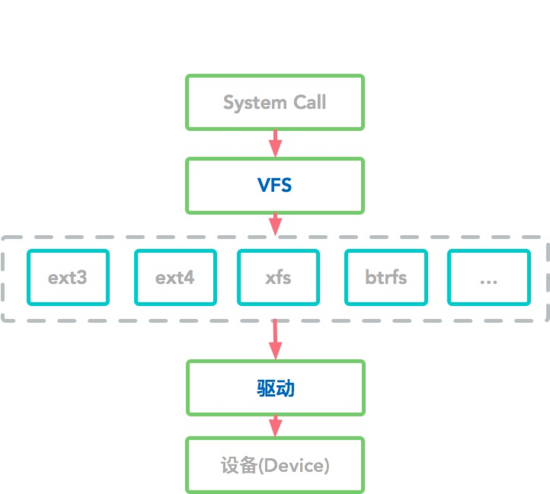

下面介绍一下Linux下常用的磁盘格式。 

- `btrfs` GPL授权。是为了替换ext系统而发起的。不熟悉，不过多评价。 
- `cramfs` 门针对闪存设计的只读压缩的文件系统，其容量上限为256M,采用zlib压缩，很少用 
- `ext2` ext的早先版本。 
- `ext3` ext2的改进。 
- `ext4` 使用最多。如果对其他的不熟悉，老老实实用ext4吧。 
- `minix` 比较古老，也不常用。 
- `xfs` XFS 文件系统是扩展文件系统的一个扩展，是 64 位高性能日志文件系统。centos7.0开始的默认文件系统。 

我们就录乡随俗，将磁盘给格式化成xfs。

```
[root@localhost ~]# mkfs.xfs /dev/sdb1
```

注意：如果想要把磁盘格式化成 `fat32` 的格式，需要安装一个软件。 

```
 yum install dosfstools -y
```

## 10.4.挂载

最后一步，是使用 `mount` 命令挂载磁盘。我们把它挂载到 `/data` 目录。 

`df` 命令能够看到系统的磁盘使用状况，参数 `h` 是 `human` 的意思，以比较容易读的方式展现信息； `lsblk` 则以另一个角度查看系统磁盘挂载情况。 

```
[root@localhost ~]# mkdir /data
[root@localhost ~]# mount /dev/sdb1 /data
[root@localhost ~]# df -h
Filesystem               Size  Used Avail Use% Mounted on
devtmpfs                 908M     0  908M   0% /dev
tmpfs                    920M     0  920M   0% /dev/shm
tmpfs                    920M  8.6M  911M   1% /run
tmpfs                    920M     0  920M   0% /sys/fs/cgroup
/dev/mapper/centos-root  6.2G  1.4G  4.9G  22% /
/dev/sda1               1014M  149M  866M  15% /boot
tmpfs                    184M     0  184M   0% /run/user/0
/dev/sdb1                2.0G   33M  2.0G   2% /data

root@localhost ~]# lsblk  -f
NAME            FSTYPE      LABEL UUID                                   MOUNTPOINT
sda
├─sda1          xfs               ac3a3ce8-6ab1-4c0b-91c8-b4e617f0dfb4   /boot
└─sda2          LVM2_member       3GzmOd-TUc1-p2ZN-wT5q-ttky-to9l-PF495o
  ├─centos-root xfs               9f86f663-060a-4450-90f9-3005ad9c5d92   /
  └─centos-swap swap              cf8709b0-b0ab-4d44-a23e-ad76f85efad6   [SWAP]
sdb
└─sdb1          xfs               0a7c861c-1a31-45b3-bf37-c72229f35704   /data
```

为了能够在开机的时候加载磁盘，我们需要修改 `/etc/fstab` 文件。这种文件修改的时候一定要小心，否则会造成系统无法启动。 

```
[root@localhost ~]# echo "/dev/sdb1  xfs defaults 0 0" >> /etc/fstab
[root@localhost ~]# cat /etc/fstab
/dev/mapper/centos-root / xfs defaults        0 0
UUID=ac3a3ce8-6ab1-4c0b-91c8-b4e617f0dfb4 /boot  xfs     defaults        0 0
/dev/mapper/centos-swap swap    swap    defaults        0 0
/dev/sdb1                       xfs     defaults        0 0
```

## 10.5.交换分区

由于内存的容量有限，现在的操作系统，都会使用磁盘模拟一个 `虚拟内存` 区域，用于缓冲一些数据。由于磁盘的速度和内存不可同日而语，通常会造成应用程序的卡顿。卡归卡，应用进程却可以因此苟延残喘，续命。 

`swap` 分区，即交换区，系统在物理内存不够时，与 `swap` 进行交换。即当系统的物理内存不够用时，把硬盘中一部分空间释放出来，以供当前运行的程序使用。当那些程序要运行时，再从 `swap` 分区中恢复保存的数据到内存中。 

现代互联网公司，一般对接口的响应时间有比较高的要求， `swap` 分区一般是禁用的。关于 `swap` ，有下面几个相关的命令。 

```
# 制作交换分区
[root@localhost ~]# mkswap /dev/sdb1

# 禁用所有交换分区
[root@localhost ~]# swapoff -a

# 启用交换分区
[root@localhost ~]# swapon
```

## 10.6 使用dd命令进行备份

下面的命令，将直接备份磁盘A到磁盘B。

```
# dd if=/dev/sda of=/dev/sdb
```

在上面的命令中， `if` 代表输入的文件， `of` 代表输出的文件。根据Linux下一切皆文件的原理，这里的文件指的就是设备。 

`dd` 命令还可以将整个磁盘打包成一个镜像文件。比如下面的命令。 

```
# dd if=/dev/hda of=~/hdadisk.img
```

当然，恢复磁盘的时候，也是相当简单的，我们只需要逆向操作就可以了。

```
# dd if=hdadisk.img of=/dev/hda
```

## End

这篇文章有6万字，经历了多个版本的整理，有小伙伴已经拿着它作为了公司的培训资料。到现在为止，你已经对Linux的命令行有了比较客观的了解。但我这里还有很多可以让你更上一层楼的文章，比如vim、sed、awk的使用。下面是几个扩展阅读，同样采用xjjdog专用的命令行三段解析法，希望对你有所帮助。

`最常用` 系列，快速掌握三贱客↓ 

[最常用的一套“Vim“技巧](https://mp.weixin.qq.com/s?__biz=MzA4MTc4NTUxNQ==&mid=2650518612&idx=1&sn=125c2cb9ee6d76a6817fb0ebc5a3c5e4&scene=21#wechat_redirect)

[最常用的一套“Sed“技巧](http://mp.weixin.qq.com/s?__biz=MzA4MTc4NTUxNQ==&mid=2650519751&idx=1&sn=adef39cb108277731608069960692c77&chksm=8780bf03b0f73615adbb3da1fcbd342be465cc80ec6cb06a412714e474748003c3ff319e02e5&scene=21#wechat_redirect)

[最常用的一套“AWK“技巧](http://mp.weixin.qq.com/s?__biz=MzA4MTc4NTUxNQ==&mid=2650519843&idx=1&sn=fe4a5c405a35b42a850054eb4283ff40&chksm=8780bee7b0f737f194d356c155b67d19be574454adcb8ce0d16c84e6246a718c9cf29c223512&scene=21#wechat_redirect)

#### 荒岛余生系列

`荒岛余生` 系列，快速掌握故障排查↓ 

[Linux之《荒岛余生》（一）准备篇](https://mp.weixin.qq.com/s?__biz=MzA4MTc4NTUxNQ==&mid=2650519137&idx=1&sn=8922471455cef842b1acbd24db405bca&scene=21#wechat_redirect)

[Linux之《荒岛余生》（二）CPU篇](https://mp.weixin.qq.com/s?__biz=MzA4MTc4NTUxNQ==&mid=2650519172&idx=1&sn=e8cade4652e257e8836f52e71d6d9a68&scene=21#wechat_redirect)

[Linux之《荒岛余生》（三）内存篇](https://mp.weixin.qq.com/s?__biz=MzA4MTc4NTUxNQ==&mid=2650519204&idx=1&sn=b367c1987fb8c985e83a6cb90f5436a6&scene=21#wechat_redirect)

[Linux之《荒岛余生》（四）I/O篇](https://mp.weixin.qq.com/s?__biz=MzA4MTc4NTUxNQ==&mid=2650519238&idx=1&sn=7a479485c3ea7b8d61f101ceefdab05b&scene=21#wechat_redirect)

[Linux之《荒岛余生》（五）网络篇](https://mp.weixin.qq.com/s?__biz=MzA4MTc4NTUxNQ==&mid=2650519279&idx=1&sn=dcb57c5e7d303383280984f40d6dc356&scene=21#wechat_redirect)

欢迎加我的好友xjjdog0，一块入群增加buff值。

作者简介： **小姐姐味道** (xjjdog)，一个不允许程序员走弯路的公众号。聚焦基础架构和Linux。十年架构，日百亿流量，与你探讨高并发世界，给你不一样的味道。我的个人微信xjjdog0，欢迎添加好友，进一步交流。 

加我好友，一起起飞吧。 

